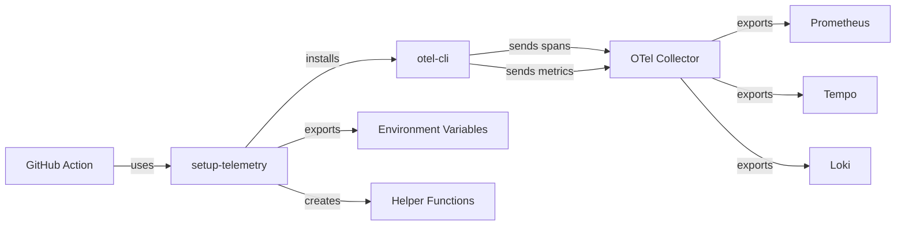

# Setup Telemetry Action

Reusable GitHub Action that initializes OpenTelemetry instrumentation for workflow executions.

## Overview

This action installs and configures the OpenTelemetry CLI (`otel-cli`) and sets up environment variables for distributed tracing and metrics collection across GitHub Actions workflows.

## Features

- 📊 **Distributed Tracing**: Automatic span creation for workflow execution
- 📈 **Metrics Collection**: Export custom metrics to Prometheus via OTel Collector
- 🔗 **Context Propagation**: W3C Trace Context for cross-workflow correlation
- 🏷️ **GitHub Metadata**: Automatic tagging with workflow, PR, commit info
- 🛠️ **Helper Functions**: Easy-to-use bash functions for instrumentation

## Inputs

| Input | Description | Required | Default |
|-------|-------------|----------|---------|
| `service-name` | Service name for telemetry | No | `${{ github.workflow }}` |
| `otel-endpoint` | OpenTelemetry Collector OTLP endpoint | No | `http://otel-collector.observability.svc.cluster.local:4317` |
| `trace-enabled` | Enable distributed tracing | No | `true` |
| `metrics-enabled` | Enable metrics collection | No | `true` |

## Outputs

| Output | Description |
|--------|-------------|
| `trace-id` | Generated trace ID for this workflow execution |
| `service-name` | Resolved service name |

## Usage

### Basic Usage

```yaml
steps:
  - uses: actions/checkout@v4

  - name: Setup Telemetry
    uses: ./.github/actions/setup-telemetry

  - name: Run Build
    run: |
      source $OTEL_HELPERS_PATH
      otel_exec "npm-build" npm run build
```

### Custom Service Name

```yaml
- name: Setup Telemetry
  uses: ./.github/actions/setup-telemetry
  with:
    service-name: 'frontend-ci'
```

### Using Helper Functions

After running the action, three helper functions are available:

#### 1. `otel_exec` - Wrap command with span

```bash
source $OTEL_HELPERS_PATH
otel_exec "test-execution" npm test
```

#### 2. `otel_span_step` - Create manual span

```bash
source $OTEL_HELPERS_PATH
otel_span_step "deployment" "success"
```

#### 3. `otel_metric` - Export metrics

```bash
source $OTEL_HELPERS_PATH

# Counter metric
otel_metric "build.count" 1 "counter"

# Gauge metric
otel_metric "build.duration_seconds" 42.5 "gauge"
```

## Environment Variables Set

The action exports the following environment variables:

- `OTEL_SERVICE_NAME`: Service identifier
- `OTEL_EXPORTER_OTLP_ENDPOINT`: Collector endpoint
- `OTEL_EXPORTER_OTLP_PROTOCOL`: Protocol (grpc)
- `OTEL_TRACES_EXPORTER`: Trace exporter (otlp)
- `OTEL_METRICS_EXPORTER`: Metrics exporter (otlp)
- `OTEL_LOGS_EXPORTER`: Logs exporter (otlp)
- `OTEL_RESOURCE_ATTRIBUTES`: GitHub context attributes
- `OTEL_TRACE_ID`: Generated trace ID
- `OTEL_HELPERS_PATH`: Path to helper functions script

## Resource Attributes

The action automatically adds these resource attributes:

### Standard Attributes
- `service.name`: Workflow or custom service name
- `service.version`: Git commit SHA
- `deployment.environment`: Always `ci`

### GitHub-Specific Attributes
- `github.workflow`: Workflow name
- `github.run_id`: Unique run identifier
- `github.run_number`: Run sequence number
- `github.run_attempt`: Retry attempt number
- `github.actor`: User who triggered workflow
- `github.repository`: Repository full name
- `github.ref`: Git reference
- `github.sha`: Commit SHA

### Pull Request Attributes (when available)
- `github.pr.number`: PR number
- `github.pr.head_ref`: PR head branch
- `github.pr.base_ref`: PR base branch

## Example Workflows

### Full Instrumentation Example

```yaml
name: Frontend CI

on:
  pull_request:
    paths:
      - 'frontend/**'

jobs:
  build-and-test:
    runs-on: ubuntu-latest
    steps:
      - uses: actions/checkout@v4

      - name: Setup Telemetry
        id: telemetry
        uses: ./.github/actions/setup-telemetry
        with:
          service-name: 'frontend-ci'

      - name: Setup Node.js
        uses: actions/setup-node@v4
        with:
          node-version: '20'

      - name: Install Dependencies
        run: |
          source $OTEL_HELPERS_PATH
          otel_exec "npm-install" npm ci

      - name: Run Linter
        run: |
          source $OTEL_HELPERS_PATH
          START_TIME=$(date +%s)
          otel_exec "npm-lint" npm run lint
          DURATION=$(($(date +%s) - START_TIME))
          otel_metric "lint.duration_seconds" $DURATION "gauge"

      - name: Run Tests
        run: |
          source $OTEL_HELPERS_PATH
          otel_exec "npm-test" npm run test:coverage

          # Export test metrics
          TESTS_PASSED=$(jq '.numPassedTests' coverage/coverage-summary.json)
          TESTS_FAILED=$(jq '.numFailedTests' coverage/coverage-summary.json)
          COVERAGE=$(jq '.total.lines.pct' coverage/coverage-summary.json)

          otel_metric "tests.passed" $TESTS_PASSED "counter"
          otel_metric "tests.failed" $TESTS_FAILED "counter"
          otel_metric "coverage.percentage" $COVERAGE "gauge"

      - name: Build Application
        run: |
          source $OTEL_HELPERS_PATH
          otel_exec "npm-build" npm run build

          # Export build size
          BUILD_SIZE=$(du -sb dist | cut -f1)
          otel_metric "build.size_bytes" $BUILD_SIZE "gauge"

      - name: Report Results
        if: always()
        run: |
          source $OTEL_HELPERS_PATH
          STATUS="${{ job.status }}"
          otel_span_step "workflow-complete" "$STATUS"
          echo "Trace ID: ${{ steps.telemetry.outputs.trace-id }}"
```

## Integration with Grafana

Traces and metrics exported by this action can be visualized in Grafana:

1. **Traces**: View in Grafana → Explore → Tempo datasource
   - Search by trace ID: `${{ steps.telemetry.outputs.trace-id }}`
   - Filter by service: `service.name="frontend-ci"`
   - Query by PR: `github.pr.number="123"`

2. **Metrics**: View in Grafana → Explore → Prometheus datasource
   ```promql
   # Build duration
   histogram_quantile(0.95, rate(build_duration_seconds_bucket[5m]))

   # Test success rate
   sum(rate(tests_passed[5m])) / sum(rate(tests_passed[5m]) + rate(tests_failed[5m]))
   ```

## Troubleshooting

### Connection Issues

If workflows can't reach the OTel Collector:

1. Verify collector is running:
   ```bash
   kubectl get pods -n observability | grep otel-collector
   ```

2. Check service endpoint:
   ```bash
   kubectl get svc -n observability otel-collector
   ```

3. Override endpoint if needed:
   ```yaml
   - uses: ./.github/actions/setup-telemetry
     with:
       otel-endpoint: 'http://custom-endpoint:4317'
   ```

### Helper Functions Not Available

If `otel_exec` or other helpers are not found:

```bash
# Ensure you source the helpers script
source $OTEL_HELPERS_PATH

# Verify it exists
ls -la $OTEL_HELPERS_PATH
```

### Spans Not Appearing

1. Check trace export is enabled:
   ```yaml
   - uses: ./.github/actions/setup-telemetry
     with:
       trace-enabled: 'true'
   ```

2. Verify otel-cli is working:
   ```bash
   otel-cli --version
   ```

3. Test manual span creation:
   ```bash
   otel-cli span \
     --service test \
     --name test-span \
     --endpoint $OTEL_EXPORTER_OTLP_ENDPOINT
   ```

## Performance Impact

- **Installation time**: ~2-3 seconds
- **Initialization time**: <1 second
- **Runtime overhead**: <1% (spans are sent asynchronously)

## Architecture



## References

- [OpenTelemetry CLI](https://github.com/equinix-labs/otel-cli)
- [OpenTelemetry Specification](https://opentelemetry.io/docs/specs/otel/)
- [W3C Trace Context](https://www.w3.org/TR/trace-context/)
- [OTLP Protocol](https://opentelemetry.io/docs/specs/otlp/)
