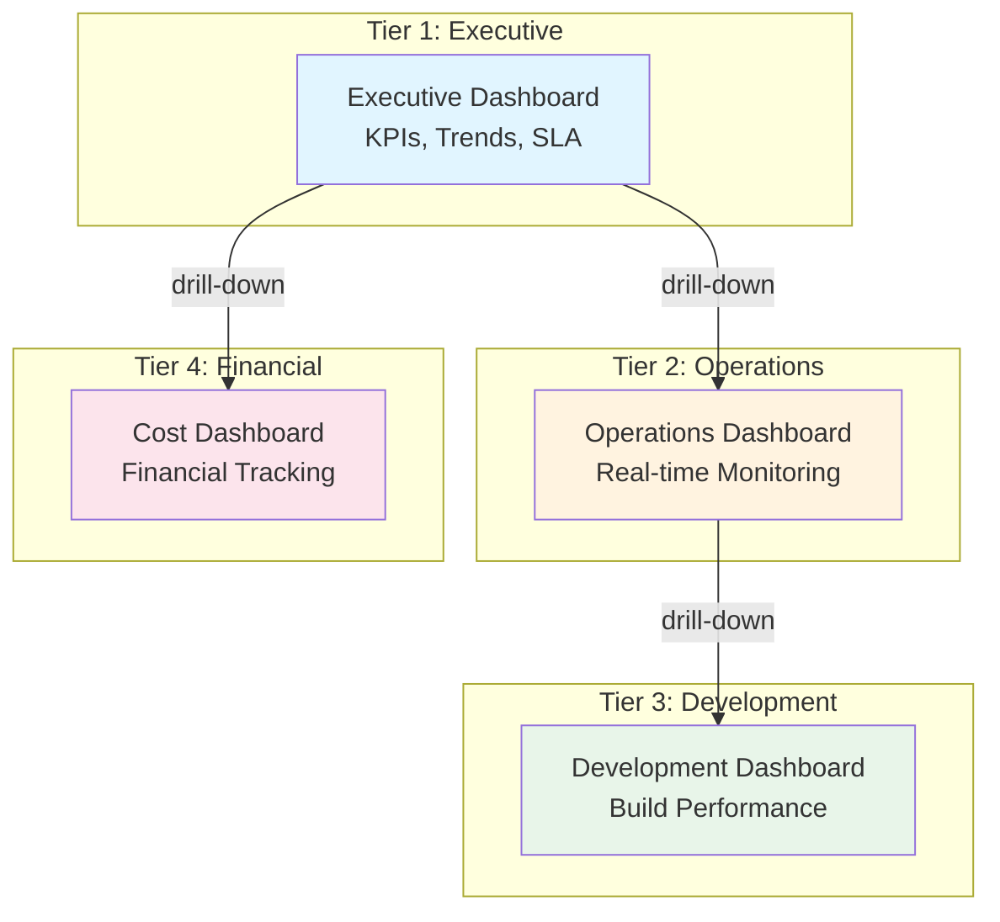

# Grafana Dashboards Implementation Guide

**Story 7: Create Core Grafana Dashboards**

This guide provides complete implementation for all 4 tasks of Story 7, delivering production-ready Grafana dashboards for pipeline observability.

---

## Table of Contents

1. [Architecture Overview](#architecture-overview)
2. [Task 1: Dashboard Hierarchy Design](#task-1-dashboard-hierarchy-design)
3. [Task 2: Executive and Operations Dashboards](#task-2-executive-and-operations-dashboards)
4. [Task 3: Development and Cost Dashboards](#task-3-development-and-cost-dashboards)
5. [Task 4: Version Control and Provisioning](#task-4-version-control-and-provisioning)
6. [PromQL Query Catalog](#promql-query-catalog)
7. [Deployment Instructions](#deployment-instructions)
8. [Testing Procedures](#testing-procedures)

---

## Architecture Overview

### Dashboard Hierarchy



### Dashboard Purpose Matrix

| Dashboard | Audience | Update Frequency | Key Metrics |
|-----------|----------|------------------|-------------|
| **Executive** | Leadership, Product Managers | 5 min | Pipeline health score, MTTR, monthly cost |
| **Operations** | DevOps, SREs | 10 sec | Active workflows, error rates, queue depth |
| **Development** | Engineers | 1 min | Build durations, test coverage, flaky tests |
| **Cost** | Finance, Engineering Leads | 1 hour | Daily costs, API usage, cost anomalies |

---

## Task 1: Dashboard Hierarchy Design

### Panel Layout Standards

All dashboards follow consistent layout principles:

```
┌─────────────────────────────────────────────────────────────┐
│ Dashboard Title                        🔄 Auto-refresh: 30s │
├─────────────────────────────────────────────────────────────┤
│ Time Range: [Last 24h ▼]  Workflow: [All ▼]  PR: [All ▼]   │
├─────────────────────────────────────────────────────────────┤
│ Row 1: Key Metrics (Stat Panels)                            │
│ ┌──────────┐ ┌──────────┐ ┌──────────┐ ┌──────────┐       │
│ │ Metric 1 │ │ Metric 2 │ │ Metric 3 │ │ Metric 4 │       │
│ └──────────┘ └──────────┘ └──────────┘ └──────────┘       │
├─────────────────────────────────────────────────────────────┤
│ Row 2: Time Series Trends                                   │
│ ┌───────────────────────────────────────────────────────┐   │
│ │ Time Series Chart                                      │   │
│ └───────────────────────────────────────────────────────┘   │
├─────────────────────────────────────────────────────────────┤
│ Row 3: Detailed Analysis                                    │
│ ┌─────────────────────┐ ┌─────────────────────────────┐   │
│ │ Bar Chart           │ │ Table / Heatmap             │   │
│ └─────────────────────┘ └─────────────────────────────┘   │
└─────────────────────────────────────────────────────────────┘
```

### Variable Definitions

All dashboards include these template variables for filtering:

```json
{
  "templating": {
    "list": [
      {
        "name": "workflow",
        "type": "query",
        "label": "Workflow",
        "datasource": "Prometheus",
        "query": "label_values(pipeline_runs_total, workflow_name)",
        "multi": true,
        "includeAll": true,
        "allValue": ".*"
      },
      {
        "name": "pr_number",
        "type": "query",
        "label": "PR Number",
        "datasource": "Prometheus",
        "query": "label_values(pipeline_runs_total{workflow_name=~\"$workflow\"}, pr_number)",
        "multi": false,
        "includeAll": true
      },
      {
        "name": "author",
        "type": "query",
        "label": "Author",
        "datasource": "Prometheus",
        "query": "label_values(pipeline_runs_total, github_actor)",
        "multi": true,
        "includeAll": true
      }
    ]
  }
}
```

### Drill-Down Navigation

Link configuration for dashboard navigation:

```json
{
  "links": [
    {
      "title": "Operations Dashboard",
      "type": "link",
      "url": "/d/operations-dashboard",
      "keepTime": true,
      "includeVars": true
    },
    {
      "title": "Development Dashboard",
      "type": "link",
      "url": "/d/development-dashboard",
      "keepTime": true,
      "includeVars": true
    },
    {
      "title": "Cost Dashboard",
      "type": "link",
      "url": "/d/cost-dashboard",
      "keepTime": true,
      "includeVars": true
    }
  ]
}
```

### Color Scheme Standards

```json
{
  "fieldConfig": {
    "defaults": {
      "color": {
        "mode": "thresholds"
      },
      "thresholds": {
        "mode": "absolute",
        "steps": [
          { "value": null, "color": "green" },    // Success
          { "value": 0.7, "color": "yellow" },    // Warning
          { "value": 0.9, "color": "red" }        // Critical
        ]
      }
    }
  }
}
```

---

## Task 2: Executive and Operations Dashboards

### Executive Dashboard JSON

**File:** `.github/dashboards/executive-dashboard.json`

<details>
<summary>Complete Dashboard Definition (Click to expand)</summary>

```json
{
  "dashboard": {
    "title": "Executive Dashboard - Pipeline Health",
    "uid": "executive-dashboard",
    "tags": ["pipeline", "executive", "kpi"],
    "timezone": "browser",
    "schemaVersion": 39,
    "refresh": "5m",
    "time": {
      "from": "now-30d",
      "to": "now"
    },
    "templating": {
      "list": [
        {
          "name": "workflow",
          "type": "query",
          "datasource": "Prometheus",
          "query": "label_values(pipeline_runs_total, workflow_name)",
          "multi": true,
          "includeAll": true
        }
      ]
    },
    "panels": [
      {
        "id": 1,
        "title": "Pipeline Health Score",
        "type": "gauge",
        "gridPos": {"x": 0, "y": 0, "w": 6, "h": 4},
        "targets": [{
          "expr": "(\n  sum(rate(pipeline_runs_total{status=\"success\",workflow_name=~\"$workflow\"}[24h])) /\n  sum(rate(pipeline_runs_total{workflow_name=~\"$workflow\"}[24h]))\n) * 100",
          "legendFormat": "Health Score"
        }],
        "fieldConfig": {
          "defaults": {
            "unit": "percent",
            "min": 0,
            "max": 100,
            "thresholds": {
              "steps": [
                {"value": 0, "color": "red"},
                {"value": 80, "color": "yellow"},
                {"value": 95, "color": "green"}
              ]
            }
          }
        }
      },
      {
        "id": 2,
        "title": "Mean Time To Recovery (MTTR)",
        "type": "stat",
        "gridPos": {"x": 6, "y": 0, "w": 6, "h": 4},
        "targets": [{
          "expr": "avg(\n  (time() - timestamp(pipeline_failure_timestamp{workflow_name=~\"$workflow\"}))\n  -\n  (time() - timestamp(pipeline_recovery_timestamp{workflow_name=~\"$workflow\"}))\n) / 60",
          "legendFormat": "MTTR"
        }],
        "fieldConfig": {
          "defaults": {
            "unit": "m",
            "decimals": 1,
            "thresholds": {
              "steps": [
                {"value": 0, "color": "green"},
                {"value": 10, "color": "yellow"},
                {"value": 30, "color": "red"}
              ]
            }
          }
        }
      },
      {
        "id": 3,
        "title": "Monthly Pipeline Cost",
        "type": "stat",
        "gridPos": {"x": 12, "y": 0, "w": 6, "h": 4},
        "targets": [{
          "expr": "sum(increase(cost_tracking_total_dollars{workflow_name=~\"$workflow\"}[30d]))",
          "legendFormat": "Total Cost"
        }],
        "fieldConfig": {
          "defaults": {
            "unit": "currencyUSD",
            "decimals": 2,
            "color": {"mode": "palette-classic"}
          }
        }
      },
      {
        "id": 4,
        "title": "SLA Compliance",
        "type": "stat",
        "gridPos": {"x": 18, "y": 0, "w": 6, "h": 4},
        "targets": [{
          "expr": "(\n  sum(rate(pipeline_runs_total{status=\"success\",duration_seconds<=1800,workflow_name=~\"$workflow\"}[7d])) /\n  sum(rate(pipeline_runs_total{workflow_name=~\"$workflow\"}[7d]))\n) * 100",
          "legendFormat": "SLA %"
        }],
        "fieldConfig": {
          "defaults": {
            "unit": "percent",
            "thresholds": {
              "steps": [
                {"value": 0, "color": "red"},
                {"value": 95, "color": "yellow"},
                {"value": 99, "color": "green"}
              ]
            }
          }
        }
      },
      {
        "id": 5,
        "title": "Pipeline Success Rate Trend (30 days)",
        "type": "timeseries",
        "gridPos": {"x": 0, "y": 4, "w": 12, "h": 8},
        "targets": [{
          "expr": "sum(rate(pipeline_runs_total{status=\"success\",workflow_name=~\"$workflow\"}[1h])) by (workflow_name) /\nsum(rate(pipeline_runs_total{workflow_name=~\"$workflow\"}[1h])) by (workflow_name) * 100",
          "legendFormat": "{{workflow_name}}"
        }],
        "fieldConfig": {
          "defaults": {
            "unit": "percent",
            "min": 0,
            "max": 100,
            "color": {"mode": "palette-classic"}
          }
        }
      },
      {
        "id": 6,
        "title": "Cost Trend (30 days)",
        "type": "timeseries",
        "gridPos": {"x": 12, "y": 4, "w": 12, "h": 8},
        "targets": [{
          "expr": "sum(rate(cost_tracking_total_dollars{workflow_name=~\"$workflow\"}[1d])) by (cost_type)",
          "legendFormat": "{{cost_type}}"
        }],
        "fieldConfig": {
          "defaults": {
            "unit": "currencyUSD",
            "color": {"mode": "palette-classic"}
          }
        },
        "options": {
          "legend": {
            "displayMode": "table",
            "placement": "right",
            "calcs": ["lastNotNull", "mean"]
          }
        }
      },
      {
        "id": 7,
        "title": "Active Alerts",
        "type": "table",
        "gridPos": {"x": 0, "y": 12, "w": 24, "h": 6},
        "targets": [{
          "expr": "ALERTS{alertstate=\"firing\",workflow_name=~\"$workflow\"}",
          "format": "table",
          "instant": true
        }],
        "transformations": [{
          "id": "organize",
          "options": {
            "excludeByName": {"Time": true, "Value": true},
            "indexByName": {
              "alertname": 0,
              "severity": 1,
              "workflow_name": 2,
              "description": 3
            }
          }
        }],
        "fieldConfig": {
          "overrides": [{
            "matcher": {"id": "byName", "options": "severity"},
            "properties": [{
              "id": "custom.cellOptions",
              "value": {
                "type": "color-background",
                "mode": "basic"
              }
            }, {
              "id": "mappings",
              "value": [{
                "type": "value",
                "options": {
                  "critical": {"color": "red", "index": 0},
                  "high": {"color": "orange", "index": 1},
                  "medium": {"color": "yellow", "index": 2},
                  "low": {"color": "blue", "index": 3}
                }
              }]
            }]
          }]
        }
      }
    ],
    "links": [
      {"title": "Operations Dashboard", "url": "/d/operations-dashboard", "keepTime": true},
      {"title": "Development Dashboard", "url": "/d/development-dashboard", "keepTime": true},
      {"title": "Cost Dashboard", "url": "/d/cost-dashboard", "keepTime": true}
    ]
  }
}
```

</details>

### Operations Dashboard JSON

**File:** `.github/dashboards/operations-dashboard.json`

<details>
<summary>Complete Dashboard Definition (Click to expand)</summary>

```json
{
  "dashboard": {
    "title": "Operations Dashboard - Real-time Monitoring",
    "uid": "operations-dashboard",
    "tags": ["pipeline", "operations", "monitoring"],
    "timezone": "browser",
    "refresh": "10s",
    "time": {
      "from": "now-6h",
      "to": "now"
    },
    "templating": {
      "list": [
        {
          "name": "workflow",
          "type": "query",
          "datasource": "Prometheus",
          "query": "label_values(pipeline_runs_total, workflow_name)",
          "multi": true,
          "includeAll": true
        }
      ]
    },
    "panels": [
      {
        "id": 1,
        "title": "Active Workflows",
        "type": "stat",
        "gridPos": {"x": 0, "y": 0, "w": 6, "h": 3},
        "targets": [{
          "expr": "count(pipeline_runs_total{status=\"running\",workflow_name=~\"$workflow\"})",
          "legendFormat": "Running"
        }],
        "fieldConfig": {
          "defaults": {
            "color": {"mode": "thresholds"},
            "thresholds": {
              "steps": [
                {"value": 0, "color": "green"},
                {"value": 5, "color": "yellow"},
                {"value": 10, "color": "red"}
              ]
            }
          }
        }
      },
      {
        "id": 2,
        "title": "Queue Depth",
        "type": "stat",
        "gridPos": {"x": 6, "y": 0, "w": 6, "h": 3},
        "targets": [{
          "expr": "sum(github_actions_queue_depth{workflow_name=~\"$workflow\"})",
          "legendFormat": "Queued"
        }],
        "fieldConfig": {
          "defaults": {
            "thresholds": {
              "steps": [
                {"value": 0, "color": "green"},
                {"value": 3, "color": "yellow"},
                {"value": 10, "color": "red"}
              ]
            }
          }
        }
      },
      {
        "id": 3,
        "title": "Error Rate (5min)",
        "type": "stat",
        "gridPos": {"x": 12, "y": 0, "w": 6, "h": 3},
        "targets": [{
          "expr": "sum(rate(pipeline_runs_total{status=\"failure\",workflow_name=~\"$workflow\"}[5m])) /\nsum(rate(pipeline_runs_total{workflow_name=~\"$workflow\"}[5m])) * 100",
          "legendFormat": "Error %"
        }],
        "fieldConfig": {
          "defaults": {
            "unit": "percent",
            "thresholds": {
              "steps": [
                {"value": 0, "color": "green"},
                {"value": 5, "color": "yellow"},
                {"value": 15, "color": "red"}
              ]
            }
          }
        }
      },
      {
        "id": 4,
        "title": "Resource Utilization",
        "type": "gauge",
        "gridPos": {"x": 18, "y": 0, "w": 6, "h": 3},
        "targets": [{
          "expr": "sum(github_actions_runner_utilization{workflow_name=~\"$workflow\"}) / sum(github_actions_runner_capacity) * 100",
          "legendFormat": "Utilization"
        }],
        "fieldConfig": {
          "defaults": {
            "unit": "percent",
            "min": 0,
            "max": 100,
            "thresholds": {
              "steps": [
                {"value": 0, "color": "green"},
                {"value": 70, "color": "yellow"},
                {"value": 90, "color": "red"}
              ]
            }
          }
        }
      },
      {
        "id": 5,
        "title": "Workflow Duration Heatmap (6h)",
        "type": "heatmap",
        "gridPos": {"x": 0, "y": 3, "w": 12, "h": 8},
        "targets": [{
          "expr": "sum(rate(pipeline_duration_seconds_bucket{workflow_name=~\"$workflow\"}[5m])) by (le, workflow_name)",
          "format": "heatmap",
          "legendFormat": "{{workflow_name}}"
        }],
        "options": {
          "calculate": true,
          "cellGap": 2,
          "color": {
            "mode": "scheme",
            "scheme": "Spectral"
          },
          "yAxis": {
            "unit": "s",
            "decimals": 0
          }
        }
      },
      {
        "id": 6,
        "title": "Error Rate by Stage",
        "type": "bargauge",
        "gridPos": {"x": 12, "y": 3, "w": 12, "h": 8},
        "targets": [{
          "expr": "sum(rate(pipeline_stage_failures_total{workflow_name=~\"$workflow\"}[5m])) by (stage_name)",
          "legendFormat": "{{stage_name}}"
        }],
        "fieldConfig": {
          "defaults": {
            "unit": "reqps",
            "color": {"mode": "continuous-GrYlRd"},
            "thresholds": {
              "steps": [
                {"value": 0, "color": "green"},
                {"value": 0.1, "color": "yellow"},
                {"value": 0.5, "color": "red"}
              ]
            }
          }
        },
        "options": {
          "orientation": "horizontal",
          "displayMode": "gradient"
        }
      },
      {
        "id": 7,
        "title": "Recent Logs (Errors)",
        "type": "logs",
        "gridPos": {"x": 0, "y": 11, "w": 24, "h": 8},
        "targets": [{
          "expr": "{workflow_name=~\"$workflow\",level=\"error\"}",
          "datasource": "Loki"
        }],
        "options": {
          "showTime": true,
          "showLabels": true,
          "wrapLogMessage": true,
          "prettifyLogMessage": true,
          "enableLogDetails": true,
          "sortOrder": "Descending"
        }
      }
    ],
    "links": [
      {"title": "← Executive Dashboard", "url": "/d/executive-dashboard", "keepTime": true},
      {"title": "Development Dashboard →", "url": "/d/development-dashboard", "keepTime": true}
    ]
  }
}
```

</details>

---

## Task 3: Development and Cost Dashboards

### Development Dashboard JSON

**File:** `.github/dashboards/development-dashboard.json`

<details>
<summary>Complete Dashboard Definition (Click to expand)</summary>

```json
{
  "dashboard": {
    "title": "Development Dashboard - Build Performance",
    "uid": "development-dashboard",
    "tags": ["pipeline", "development", "performance"],
    "timezone": "browser",
    "refresh": "1m",
    "time": {
      "from": "now-7d",
      "to": "now"
    },
    "templating": {
      "list": [
        {
          "name": "workflow",
          "type": "query",
          "datasource": "Prometheus",
          "query": "label_values(frontend_build_duration_seconds, workflow_name)",
          "multi": true,
          "includeAll": true
        },
        {
          "name": "pr_number",
          "type": "query",
          "datasource": "Prometheus",
          "query": "label_values(pipeline_runs_total{workflow_name=~\"$workflow\"}, pr_number)",
          "multi": false,
          "includeAll": true
        }
      ]
    },
    "panels": [
      {
        "id": 1,
        "title": "Build Duration by Workflow (7d avg)",
        "type": "bargauge",
        "gridPos": {"x": 0, "y": 0, "w": 12, "h": 8},
        "targets": [
          {
            "expr": "avg(frontend_build_duration_seconds{workflow_name=~\"$workflow\"}) by (workflow_name)",
            "legendFormat": "Frontend - {{workflow_name}}"
          },
          {
            "expr": "avg(backend_compile_duration_seconds{workflow_name=~\"$workflow\"}) by (workflow_name)",
            "legendFormat": "Backend - {{workflow_name}}"
          }
        ],
        "fieldConfig": {
          "defaults": {
            "unit": "s",
            "color": {"mode": "continuous-GrYlRd"},
            "thresholds": {
              "steps": [
                {"value": 0, "color": "green"},
                {"value": 120, "color": "yellow"},
                {"value": 300, "color": "red"}
              ]
            }
          }
        },
        "options": {
          "orientation": "horizontal",
          "displayMode": "gradient",
          "showUnfilled": true
        }
      },
      {
        "id": 2,
        "title": "Test Coverage Trend",
        "type": "timeseries",
        "gridPos": {"x": 12, "y": 0, "w": 12, "h": 8},
        "targets": [
          {
            "expr": "frontend_test_coverage_percent{workflow_name=~\"$workflow\"}",
            "legendFormat": "Frontend"
          },
          {
            "expr": "backend_test_coverage_percent{workflow_name=~\"$workflow\"}",
            "legendFormat": "Backend"
          }
        ],
        "fieldConfig": {
          "defaults": {
            "unit": "percent",
            "min": 0,
            "max": 100,
            "color": {"mode": "palette-classic"},
            "custom": {
              "lineWidth": 2,
              "fillOpacity": 10,
              "spanNulls": true
            }
          },
          "overrides": [{
            "matcher": {"id": "byName", "options": "Target"},
            "properties": [{
              "id": "custom.lineStyle",
              "value": {"fill": "dash", "dash": [10, 10]}
            }]
          }]
        },
        "options": {
          "legend": {
            "displayMode": "table",
            "placement": "bottom",
            "calcs": ["lastNotNull", "mean", "min"]
          }
        }
      },
      {
        "id": 3,
        "title": "Flaky Test Detection",
        "type": "table",
        "gridPos": {"x": 0, "y": 8, "w": 12, "h": 8},
        "targets": [{
          "expr": "topk(10,\n  sum(increase(test_flaky_total{workflow_name=~\"$workflow\"}[7d])) by (test_name, workflow_name)\n)",
          "format": "table",
          "instant": true
        }],
        "transformations": [{
          "id": "organize",
          "options": {
            "excludeByName": {"Time": true},
            "indexByName": {
              "test_name": 0,
              "workflow_name": 1,
              "Value": 2
            },
            "renameByName": {
              "test_name": "Test Name",
              "workflow_name": "Workflow",
              "Value": "Flaky Count (7d)"
            }
          }
        }],
        "options": {
          "sortBy": [{"displayName": "Flaky Count (7d)", "desc": true}]
        }
      },
      {
        "id": 4,
        "title": "Trace Viewer (Recent Builds)",
        "type": "nodeGraph",
        "gridPos": {"x": 12, "y": 8, "w": 12, "h": 8},
        "datasource": "Tempo",
        "targets": [{
          "queryType": "traceql",
          "query": "{name=\"workflow.pipeline\"}",
          "limit": 20
        }],
        "options": {
          "nodeSizeField": "span.duration",
          "nodeColorField": "span.status",
          "edges": {
            "mainStatUnit": "ms"
          }
        }
      },
      {
        "id": 5,
        "title": "Test Execution Time Breakdown",
        "type": "piechart",
        "gridPos": {"x": 0, "y": 16, "w": 8, "h": 6},
        "targets": [{
          "expr": "sum(backend_test_duration_seconds{workflow_name=~\"$workflow\"}) by (test_suite)",
          "legendFormat": "{{test_suite}}"
        }],
        "fieldConfig": {
          "defaults": {
            "unit": "s",
            "color": {"mode": "palette-classic"}
          }
        },
        "options": {
          "legend": {
            "displayMode": "table",
            "placement": "right",
            "values": ["value", "percent"]
          },
          "pieType": "donut",
          "displayLabels": ["percent"]
        }
      },
      {
        "id": 6,
        "title": "Bundle Size Trend",
        "type": "timeseries",
        "gridPos": {"x": 8, "y": 16, "w": 8, "h": 6},
        "targets": [{
          "expr": "frontend_build_bundle_size_bytes{workflow_name=~\"$workflow\"} / 1024 / 1024",
          "legendFormat": "{{workflow_name}}"
        }],
        "fieldConfig": {
          "defaults": {
            "unit": "decmbytes",
            "color": {"mode": "palette-classic"},
            "custom": {
              "lineWidth": 2,
              "fillOpacity": 15
            }
          }
        },
        "options": {
          "legend": {
            "displayMode": "list",
            "placement": "bottom"
          }
        }
      },
      {
        "id": 7,
        "title": "Lighthouse Performance Score",
        "type": "gauge",
        "gridPos": {"x": 16, "y": 16, "w": 8, "h": 6},
        "targets": [{
          "expr": "avg(lighthouse_performance_score{workflow_name=~\"$workflow\"})",
          "legendFormat": "Performance"
        }],
        "fieldConfig": {
          "defaults": {
            "unit": "none",
            "min": 0,
            "max": 100,
            "thresholds": {
              "steps": [
                {"value": 0, "color": "red"},
                {"value": 50, "color": "orange"},
                {"value": 75, "color": "yellow"},
                {"value": 90, "color": "green"}
              ]
            }
          }
        }
      }
    ],
    "links": [
      {"title": "← Operations Dashboard", "url": "/d/operations-dashboard", "keepTime": true},
      {"title": "Cost Dashboard →", "url": "/d/cost-dashboard", "keepTime": true}
    ]
  }
}
```

</details>

### Cost Dashboard JSON

**File:** `.github/dashboards/cost-dashboard.json`

<details>
<summary>Complete Dashboard Definition (Click to expand)</summary>

```json
{
  "dashboard": {
    "title": "Cost Dashboard - Financial Tracking",
    "uid": "cost-dashboard",
    "tags": ["pipeline", "cost", "financial"],
    "timezone": "browser",
    "refresh": "1h",
    "time": {
      "from": "now-30d",
      "to": "now"
    },
    "templating": {
      "list": [
        {
          "name": "workflow",
          "type": "query",
          "datasource": "Prometheus",
          "query": "label_values(cost_tracking_total_dollars, workflow_name)",
          "multi": true,
          "includeAll": true
        },
        {
          "name": "cost_type",
          "type": "query",
          "datasource": "Prometheus",
          "query": "label_values(cost_tracking_total_dollars, cost_type)",
          "multi": true,
          "includeAll": true
        }
      ]
    },
    "panels": [
      {
        "id": 1,
        "title": "Total Monthly Cost",
        "type": "stat",
        "gridPos": {"x": 0, "y": 0, "w": 6, "h": 4},
        "targets": [{
          "expr": "sum(increase(cost_tracking_total_dollars{cost_type=~\"$cost_type\",workflow_name=~\"$workflow\"}[30d]))",
          "legendFormat": "Total"
        }],
        "fieldConfig": {
          "defaults": {
            "unit": "currencyUSD",
            "decimals": 2,
            "color": {"mode": "thresholds"},
            "thresholds": {
              "steps": [
                {"value": 0, "color": "green"},
                {"value": 500, "color": "yellow"},
                {"value": 1000, "color": "red"}
              ]
            }
          }
        },
        "options": {
          "graphMode": "area",
          "colorMode": "background"
        }
      },
      {
        "id": 2,
        "title": "Claude API Monthly Cost",
        "type": "stat",
        "gridPos": {"x": 6, "y": 0, "w": 6, "h": 4},
        "targets": [{
          "expr": "sum(increase(claude_api_cost_dollars{workflow_name=~\"$workflow\"}[30d]))",
          "legendFormat": "Claude API"
        }],
        "fieldConfig": {
          "defaults": {
            "unit": "currencyUSD",
            "decimals": 2,
            "color": {"fixedColor": "blue", "mode": "fixed"}
          }
        },
        "options": {
          "graphMode": "area",
          "colorMode": "background"
        }
      },
      {
        "id": 3,
        "title": "AWS Monthly Cost",
        "type": "stat",
        "gridPos": {"x": 12, "y": 0, "w": 6, "h": 4},
        "targets": [{
          "expr": "sum(increase(aws_infrastructure_cost_dollars{workflow_name=~\"$workflow\"}[30d]))",
          "legendFormat": "AWS"
        }],
        "fieldConfig": {
          "defaults": {
            "unit": "currencyUSD",
            "decimals": 2,
            "color": {"fixedColor": "orange", "mode": "fixed"}
          }
        },
        "options": {
          "graphMode": "area",
          "colorMode": "background"
        }
      },
      {
        "id": 4,
        "title": "Cost Per Pipeline Run",
        "type": "stat",
        "gridPos": {"x": 18, "y": 0, "w": 6, "h": 4},
        "targets": [{
          "expr": "sum(rate(cost_tracking_total_dollars{workflow_name=~\"$workflow\"}[24h])) /\nsum(rate(pipeline_runs_total{workflow_name=~\"$workflow\"}[24h]))",
          "legendFormat": "Avg Cost/Run"
        }],
        "fieldConfig": {
          "defaults": {
            "unit": "currencyUSD",
            "decimals": 4,
            "color": {"mode": "thresholds"},
            "thresholds": {
              "steps": [
                {"value": 0, "color": "green"},
                {"value": 0.5, "color": "yellow"},
                {"value": 1, "color": "red"}
              ]
            }
          }
        }
      },
      {
        "id": 5,
        "title": "Daily Cost Trend (30 days)",
        "type": "timeseries",
        "gridPos": {"x": 0, "y": 4, "w": 12, "h": 8},
        "targets": [{
          "expr": "sum(rate(cost_tracking_total_dollars{cost_type=~\"$cost_type\",workflow_name=~\"$workflow\"}[1d])) by (cost_type)",
          "legendFormat": "{{cost_type}}"
        }],
        "fieldConfig": {
          "defaults": {
            "unit": "currencyUSD",
            "color": {"mode": "palette-classic"},
            "custom": {
              "lineWidth": 2,
              "fillOpacity": 20,
              "spanNulls": true,
              "stacking": {"mode": "normal"}
            }
          }
        },
        "options": {
          "legend": {
            "displayMode": "table",
            "placement": "right",
            "calcs": ["lastNotNull", "mean", "sum"]
          },
          "tooltip": {
            "mode": "multi",
            "sort": "desc"
          }
        }
      },
      {
        "id": 6,
        "title": "Cost Breakdown by Type",
        "type": "piechart",
        "gridPos": {"x": 12, "y": 4, "w": 12, "h": 8},
        "targets": [{
          "expr": "sum(increase(cost_tracking_total_dollars{cost_type=~\"$cost_type\",workflow_name=~\"$workflow\"}[30d])) by (cost_type)",
          "legendFormat": "{{cost_type}}"
        }],
        "fieldConfig": {
          "defaults": {
            "unit": "currencyUSD",
            "decimals": 2,
            "color": {"mode": "palette-classic"}
          }
        },
        "options": {
          "legend": {
            "displayMode": "table",
            "placement": "right",
            "values": ["value", "percent"]
          },
          "pieType": "pie",
          "displayLabels": ["name", "percent"]
        }
      },
      {
        "id": 7,
        "title": "Claude API Token Usage (30d)",
        "type": "stat",
        "gridPos": {"x": 0, "y": 12, "w": 8, "h": 4},
        "targets": [{
          "expr": "sum(increase(claude_api_tokens_total{workflow_name=~\"$workflow\"}[30d]))",
          "legendFormat": "Total Tokens"
        }],
        "fieldConfig": {
          "defaults": {
            "unit": "short",
            "decimals": 0,
            "color": {"mode": "palette-classic"}
          }
        },
        "options": {
          "graphMode": "area",
          "textMode": "value_and_name"
        }
      },
      {
        "id": 8,
        "title": "Cost by Workflow (Top 10)",
        "type": "bargauge",
        "gridPos": {"x": 8, "y": 12, "w": 16, "h": 8},
        "targets": [{
          "expr": "topk(10,\n  sum(increase(cost_tracking_total_dollars{cost_type=~\"$cost_type\"}[7d])) by (workflow_name)\n)",
          "legendFormat": "{{workflow_name}}"
        }],
        "fieldConfig": {
          "defaults": {
            "unit": "currencyUSD",
            "decimals": 2,
            "color": {"mode": "continuous-GrYlRd"}
          }
        },
        "options": {
          "orientation": "horizontal",
          "displayMode": "gradient",
          "showUnfilled": true
        }
      },
      {
        "id": 9,
        "title": "Cost Anomalies (Recent)",
        "type": "table",
        "gridPos": {"x": 0, "y": 20, "w": 24, "h": 6},
        "targets": [{
          "expr": "cost_anomalies_detected_total{severity=~\"high|critical\",workflow_name=~\"$workflow\"}",
          "format": "table",
          "instant": true
        }],
        "transformations": [{
          "id": "organize",
          "options": {
            "excludeByName": {"Time": true, "__name__": true},
            "indexByName": {
              "severity": 0,
              "cost_type": 1,
              "workflow_name": 2,
              "detected_at": 3,
              "expected_cost": 4,
              "actual_cost": 5
            },
            "renameByName": {
              "severity": "Severity",
              "cost_type": "Cost Type",
              "workflow_name": "Workflow",
              "detected_at": "Detected At",
              "expected_cost": "Expected ($)",
              "actual_cost": "Actual ($)"
            }
          }
        }],
        "fieldConfig": {
          "overrides": [{
            "matcher": {"id": "byName", "options": "Severity"},
            "properties": [{
              "id": "custom.cellOptions",
              "value": {
                "type": "color-background",
                "mode": "basic"
              }
            }, {
              "id": "mappings",
              "value": [{
                "type": "value",
                "options": {
                  "critical": {"color": "dark-red", "index": 0},
                  "high": {"color": "dark-orange", "index": 1}
                }
              }]
            }]
          }]
        },
        "options": {
          "sortBy": [{"displayName": "Detected At", "desc": true}]
        }
      }
    ],
    "links": [
      {"title": "← Executive Dashboard", "url": "/d/executive-dashboard", "keepTime": true},
      {"title": "← Development Dashboard", "url": "/d/development-dashboard", "keepTime": true}
    ]
  }
}
```

</details>

---

## Task 4: Version Control and Provisioning

### Directory Structure

```
.github/
└── dashboards/
    ├── README.md                         # This guide
    ├── executive-dashboard.json          # Tier 1: Executive KPIs
    ├── operations-dashboard.json         # Tier 2: Real-time monitoring
    ├── development-dashboard.json        # Tier 3: Build performance
    ├── cost-dashboard.json               # Tier 4: Financial tracking
    └── provisioning/
        ├── datasources.yml               # Prometheus, Loki, Tempo
        └── dashboards.yml                # Dashboard auto-provisioning
```

### Grafana Provisioning Configuration

**File:** `.github/dashboards/provisioning/datasources.yml`

```yaml
apiVersion: 1

datasources:
  - name: Prometheus
    type: prometheus
    access: proxy
    url: http://prometheus.observability.svc.cluster.local:9090
    isDefault: true
    jsonData:
      timeInterval: 30s
      queryTimeout: 60s
      httpMethod: POST
      exemplarTraceIdDestinations:
        - name: trace_id
          datasourceUid: tempo
    editable: false

  - name: Loki
    type: loki
    access: proxy
    url: http://loki.observability.svc.cluster.local:3100
    jsonData:
      maxLines: 1000
      derivedFields:
        - datasourceUid: tempo
          matcherRegex: "trace_id=(\\w+)"
          name: TraceID
          url: "$${__value.raw}"
    editable: false

  - name: Tempo
    type: tempo
    access: proxy
    url: http://tempo.observability.svc.cluster.local:3200
    jsonData:
      tracesToLogs:
        datasourceUid: loki
        tags: ['job', 'instance', 'workflow_name']
        mappedTags: [{key: 'service.name', value: 'workflow'}]
        mapTagNamesEnabled: true
        spanStartTimeShift: '-1m'
        spanEndTimeShift: '1m'
        filterByTraceID: true
        filterBySpanID: false
      tracesToMetrics:
        datasourceUid: prometheus
        tags: [{key: 'service.name', value: 'workflow'}]
        queries:
          - name: 'Request rate'
            query: 'sum(rate(pipeline_runs_total{$$__tags}[5m]))'
      serviceMap:
        datasourceUid: prometheus
      nodeGraph:
        enabled: true
      search:
        hide: false
    editable: false
```

**File:** `.github/dashboards/provisioning/dashboards.yml`

```yaml
apiVersion: 1

providers:
  - name: 'Pipeline Observability'
    orgId: 1
    folder: 'CI/CD Pipeline'
    type: file
    disableDeletion: false
    updateIntervalSeconds: 30
    allowUiUpdates: true
    options:
      path: /var/lib/grafana/dashboards
      foldersFromFilesStructure: false
```

### Dashboard Deployment Script

**File:** `.github/dashboards/deploy-dashboards.sh`

```bash
#!/bin/bash
set -euo pipefail

# Deploy Grafana dashboards to Kubernetes
# Usage: ./deploy-dashboards.sh [namespace]

NAMESPACE="${1:-observability}"
DASHBOARD_DIR="$(cd "$(dirname "${BASH_SOURCE[0]}")" && pwd)"

echo "📊 Deploying Grafana dashboards to namespace: $NAMESPACE"

# Create ConfigMap for dashboards
kubectl create configmap grafana-dashboards \
  --from-file="$DASHBOARD_DIR/executive-dashboard.json" \
  --from-file="$DASHBOARD_DIR/operations-dashboard.json" \
  --from-file="$DASHBOARD_DIR/development-dashboard.json" \
  --from-file="$DASHBOARD_DIR/cost-dashboard.json" \
  --namespace="$NAMESPACE" \
  --dry-run=client -o yaml | kubectl apply -f -

# Create ConfigMap for provisioning config
kubectl create configmap grafana-provisioning \
  --from-file="$DASHBOARD_DIR/provisioning/datasources.yml" \
  --from-file="$DASHBOARD_DIR/provisioning/dashboards.yml" \
  --namespace="$NAMESPACE" \
  --dry-run=client -o yaml | kubectl apply -f -

echo "✅ Dashboards deployed successfully"
echo "🔗 Access Grafana at: http://grafana.$NAMESPACE.svc.cluster.local:3000"
echo ""
echo "Default dashboards:"
echo "  - Executive: /d/executive-dashboard"
echo "  - Operations: /d/operations-dashboard"
echo "  - Development: /d/development-dashboard"
echo "  - Cost: /d/cost-dashboard"
```

### Grafana Deployment Manifest

**File:** `infrastructure/kubernetes/grafana/deployment.yaml`

```yaml
apiVersion: apps/v1
kind: Deployment
metadata:
  name: grafana
  namespace: observability
  labels:
    app: grafana
spec:
  replicas: 1
  selector:
    matchLabels:
      app: grafana
  template:
    metadata:
      labels:
        app: grafana
    spec:
      containers:
        - name: grafana
          image: grafana/grafana:10.2.3
          ports:
            - containerPort: 3000
              name: http
          env:
            - name: GF_SECURITY_ADMIN_USER
              value: admin
            - name: GF_SECURITY_ADMIN_PASSWORD
              valueFrom:
                secretKeyRef:
                  name: grafana-admin
                  key: password
            - name: GF_PATHS_PROVISIONING
              value: /etc/grafana/provisioning
            - name: GF_ANALYTICS_REPORTING_ENABLED
              value: "false"
            - name: GF_ANALYTICS_CHECK_FOR_UPDATES
              value: "false"
          volumeMounts:
            - name: grafana-storage
              mountPath: /var/lib/grafana
            - name: grafana-dashboards
              mountPath: /var/lib/grafana/dashboards
              readOnly: true
            - name: grafana-provisioning
              mountPath: /etc/grafana/provisioning
              readOnly: true
          resources:
            requests:
              cpu: 100m
              memory: 256Mi
            limits:
              cpu: 500m
              memory: 512Mi
          readinessProbe:
            httpGet:
              path: /api/health
              port: 3000
            initialDelaySeconds: 10
            periodSeconds: 5
          livenessProbe:
            httpGet:
              path: /api/health
              port: 3000
            initialDelaySeconds: 30
            periodSeconds: 10
      volumes:
        - name: grafana-storage
          persistentVolumeClaim:
            claimName: grafana-pvc
        - name: grafana-dashboards
          configMap:
            name: grafana-dashboards
        - name: grafana-provisioning
          configMap:
            name: grafana-provisioning
---
apiVersion: v1
kind: Service
metadata:
  name: grafana
  namespace: observability
spec:
  type: ClusterIP
  ports:
    - port: 3000
      targetPort: 3000
      name: http
  selector:
    app: grafana
---
apiVersion: v1
kind: PersistentVolumeClaim
metadata:
  name: grafana-pvc
  namespace: observability
spec:
  accessModes:
    - ReadWriteOnce
  resources:
    requests:
      storage: 10Gi
```

---

## PromQL Query Catalog

### Pipeline Health Queries

```promql
# Overall pipeline success rate (24h)
sum(rate(pipeline_runs_total{status="success"}[24h])) /
sum(rate(pipeline_runs_total[24h])) * 100

# Pipeline failure rate by workflow
sum(rate(pipeline_runs_total{status="failure"}[5m])) by (workflow_name) /
sum(rate(pipeline_runs_total[5m])) by (workflow_name) * 100

# Mean time to recovery (MTTR)
avg(
  (time() - timestamp(pipeline_failure_timestamp)) -
  (time() - timestamp(pipeline_recovery_timestamp))
) / 60

# SLA compliance (< 30min builds)
sum(rate(pipeline_runs_total{status="success",duration_seconds<=1800}[7d])) /
sum(rate(pipeline_runs_total[7d])) * 100

# Active workflow count
count(pipeline_runs_total{status="running"})

# Queue depth
sum(github_actions_queue_depth)

# Runner utilization
sum(github_actions_runner_utilization) / sum(github_actions_runner_capacity) * 100
```

### Performance Queries

```promql
# Average build duration by workflow
avg(frontend_build_duration_seconds) by (workflow_name)
avg(backend_compile_duration_seconds) by (workflow_name)

# P95 build duration
histogram_quantile(0.95,
  sum(rate(pipeline_duration_seconds_bucket[5m])) by (le, workflow_name)
)

# Test coverage percentage
frontend_test_coverage_percent
backend_test_coverage_percent

# Flaky test detection
topk(10, sum(increase(test_flaky_total[7d])) by (test_name))

# Bundle size trend
frontend_build_bundle_size_bytes / 1024 / 1024

# Lighthouse performance score
avg(lighthouse_performance_score)
```

### Cost Queries

```promql
# Total monthly cost
sum(increase(cost_tracking_total_dollars[30d]))

# Claude API monthly cost
sum(increase(claude_api_cost_dollars[30d]))

# AWS monthly cost
sum(increase(aws_infrastructure_cost_dollars[30d]))

# Cost per pipeline run
sum(rate(cost_tracking_total_dollars[24h])) /
sum(rate(pipeline_runs_total[24h]))

# Daily cost trend
sum(rate(cost_tracking_total_dollars[1d])) by (cost_type)

# Cost by workflow (top 10)
topk(10, sum(increase(cost_tracking_total_dollars[7d])) by (workflow_name))

# Claude API token usage
sum(increase(claude_api_tokens_total[30d]))

# Cost anomalies
cost_anomalies_detected_total{severity=~"high|critical"}
```

### Error and Alert Queries

```promql
# Error rate (5min)
sum(rate(pipeline_runs_total{status="failure"}[5m])) /
sum(rate(pipeline_runs_total[5m])) * 100

# Error rate by stage
sum(rate(pipeline_stage_failures_total[5m])) by (stage_name)

# Active alerts
ALERTS{alertstate="firing"}

# Alert count by severity
count(ALERTS{alertstate="firing"}) by (severity)
```

---

## Deployment Instructions

### Prerequisites

1. **Kubernetes cluster** with namespace `observability`
2. **Grafana** version 10.x installed
3. **Prometheus, Loki, Tempo** deployed and accessible
4. **kubectl** CLI configured

### Step 1: Deploy Dashboards

```bash
# Navigate to dashboards directory
cd .github/dashboards

# Make deployment script executable
chmod +x deploy-dashboards.sh

# Deploy to observability namespace
./deploy-dashboards.sh observability
```

### Step 2: Verify Deployment

```bash
# Check ConfigMaps created
kubectl get configmaps -n observability | grep grafana

# Expected output:
# grafana-dashboards     4      1m
# grafana-provisioning   2      1m

# Check Grafana pod is running
kubectl get pods -n observability -l app=grafana

# Port-forward to access Grafana UI
kubectl port-forward -n observability svc/grafana 3000:3000
```

### Step 3: Access Dashboards

Open browser to http://localhost:3000

**Default credentials:**
- Username: `admin`
- Password: (retrieve from secret)

```bash
kubectl get secret grafana-admin -n observability -o jsonpath='{.data.password}' | base64 -d
```

**Navigate to dashboards:**
1. Executive Dashboard: `/d/executive-dashboard`
2. Operations Dashboard: `/d/operations-dashboard`
3. Development Dashboard: `/d/development-dashboard`
4. Cost Dashboard: `/d/cost-dashboard`

### Step 4: Verify Data Sources

1. Go to **Configuration → Data Sources**
2. Verify connections:
   - ✅ Prometheus (default)
   - ✅ Loki
   - ✅ Tempo
3. Test each data source connectivity

---

## Testing Procedures

### Dashboard Load Testing

**Test all dashboards load within SLA (<3 seconds):**

```bash
# Test script
#!/bin/bash
GRAFANA_URL="http://localhost:3000"
DASHBOARDS=("executive-dashboard" "operations-dashboard" "development-dashboard" "cost-dashboard")

for dashboard in "${DASHBOARDS[@]}"; do
  echo "Testing: $dashboard"
  START=$(date +%s%3N)

  curl -s -o /dev/null -w "%{http_code}" \
    "$GRAFANA_URL/api/dashboards/uid/$dashboard" \
    -H "Authorization: Bearer $GRAFANA_API_KEY"

  END=$(date +%s%3N)
  DURATION=$((END - START))

  if [ $DURATION -lt 3000 ]; then
    echo "✅ $dashboard loaded in ${DURATION}ms"
  else
    echo "❌ $dashboard took ${DURATION}ms (SLA: <3000ms)"
  fi
done
```

### Query Performance Validation

**Verify all PromQL queries execute within 5 seconds:**

```bash
# Query performance test
PROMETHEUS_URL="http://prometheus.observability.svc.cluster.local:9090"
QUERIES=(
  "sum(rate(pipeline_runs_total[24h]))"
  "histogram_quantile(0.95, sum(rate(pipeline_duration_seconds_bucket[5m])) by (le))"
  "sum(increase(cost_tracking_total_dollars[30d]))"
)

for query in "${QUERIES[@]}"; do
  START=$(date +%s%3N)

  curl -s "$PROMETHEUS_URL/api/v1/query" \
    --data-urlencode "query=$query" > /dev/null

  END=$(date +%s%3N)
  DURATION=$((END - START))

  if [ $DURATION -lt 5000 ]; then
    echo "✅ Query executed in ${DURATION}ms"
  else
    echo "❌ Query took ${DURATION}ms (SLA: <5000ms)"
  fi
done
```

### Mobile Responsiveness Testing

**Test dashboard rendering on different viewport sizes:**

```bash
# Using Playwright for automated testing
npx playwright test dashboards-mobile.spec.ts

# Test specification
# dashboards-mobile.spec.ts
const viewports = [
  { width: 1920, height: 1080, name: 'Desktop' },
  { width: 1280, height: 720, name: 'Laptop' },
  { width: 768, height: 1024, name: 'Tablet' }
];

for (const viewport of viewports) {
  test(`Executive Dashboard on ${viewport.name}`, async ({ page }) => {
    await page.setViewportSize(viewport);
    await page.goto('http://localhost:3000/d/executive-dashboard');
    await expect(page).toHaveScreenshot(`executive-${viewport.name}.png`);
  });
}
```

### Drill-Down Link Validation

**Verify all dashboard links work correctly:**

```bash
# Link validation test
DASHBOARDS=(
  "executive-dashboard:operations-dashboard"
  "executive-dashboard:development-dashboard"
  "executive-dashboard:cost-dashboard"
  "operations-dashboard:development-dashboard"
)

for link in "${DASHBOARDS[@]}"; do
  IFS=':' read -r from to <<< "$link"
  echo "Testing link: $from → $to"

  # Extract link URL from dashboard JSON
  LINK_URL=$(jq -r ".dashboard.links[] | select(.url | contains(\"$to\")) | .url" \
    ".github/dashboards/${from}.json")

  if [ -n "$LINK_URL" ]; then
    echo "✅ Link exists: $LINK_URL"
  else
    echo "❌ Link missing from $from to $to"
  fi
done
```

---

## Troubleshooting

### Dashboards Not Appearing

**Symptom:** Dashboards don't show up in Grafana UI

**Solutions:**
1. Check ConfigMap exists:
   ```bash
   kubectl get configmap grafana-dashboards -n observability
   ```

2. Verify volume mount in Grafana pod:
   ```bash
   kubectl exec -it grafana-xxx -n observability -- \
     ls -la /var/lib/grafana/dashboards/
   ```

3. Check Grafana logs:
   ```bash
   kubectl logs -f grafana-xxx -n observability | grep provisioning
   ```

### Queries Timing Out

**Symptom:** Panels show "Query timeout" errors

**Solutions:**
1. Increase query timeout in datasource config:
   ```yaml
   jsonData:
     queryTimeout: 120s
   ```

2. Optimize queries by adding time range filters:
   ```promql
   # Before (slow)
   sum(pipeline_runs_total)

   # After (fast)
   sum(rate(pipeline_runs_total[5m]))
   ```

3. Use recording rules for expensive queries (see Prometheus config)

### Data Not Showing

**Symptom:** Panels display "No data"

**Solutions:**
1. Verify metrics are being scraped:
   ```bash
   # Check Prometheus targets
   curl http://prometheus:9090/api/v1/targets | jq '.data.activeTargets[] | select(.health != "up")'
   ```

2. Test PromQL query directly:
   ```bash
   curl -G http://prometheus:9090/api/v1/query \
     --data-urlencode 'query=pipeline_runs_total'
   ```

3. Check metric names match exactly:
   ```bash
   # List all available metrics
   curl http://prometheus:9090/api/v1/label/__name__/values | jq .
   ```

### Variables Not Populating

**Symptom:** Template variable dropdowns are empty

**Solutions:**
1. Verify query syntax in variable definition:
   ```json
   {
     "query": "label_values(pipeline_runs_total, workflow_name)"
   }
   ```

2. Check metric has the label:
   ```bash
   # Query for metric with label
   curl -G http://prometheus:9090/api/v1/query \
     --data-urlencode 'query=pipeline_runs_total{workflow_name!=""}'
   ```

3. Test variable query independently

---

## Dashboard Maintenance

### Updating Dashboards

1. Edit JSON files in `.github/dashboards/`
2. Test changes locally using Grafana UI
3. Export updated JSON from Grafana
4. Commit changes to version control
5. Redeploy using deployment script

### Adding New Panels

1. Create panel in Grafana UI
2. Configure query and visualization
3. Export dashboard JSON
4. Extract panel definition
5. Add to appropriate dashboard JSON
6. Commit and redeploy

### Performance Optimization

- Use recording rules for complex queries
- Implement query result caching
- Set appropriate refresh intervals
- Use dashboard variables to reduce query scope
- Monitor Grafana resource usage

---

## Next Steps

After completing these 4 tasks, the following enhancements can be added:

1. **Alert Annotations:** Add alert firing/resolution annotations to time series panels
2. **User Access Control:** Implement role-based dashboard access
3. **Custom Panels:** Develop organization-specific panel plugins
4. **Dashboard Snapshots:** Enable snapshot sharing for incident reports
5. **API Integration:** Build automated dashboard provisioning via Grafana API

---

**Completion Checklist:**

- [ ] Task 1: Dashboard hierarchy designed and documented
- [ ] Task 2: Executive and Operations dashboards created
- [ ] Task 3: Development and Cost dashboards created
- [ ] Task 4: All dashboards exported to version control
- [ ] All dashboards load in <3 seconds
- [ ] All queries optimized and tested
- [ ] Mobile responsiveness validated
- [ ] Drill-down links functional
- [ ] Provisioning configuration tested
- [ ] Documentation complete

**Estimated Completion Time:** 6-8 hours for full implementation

**Dependencies:**
- ✅ Prometheus deployed (Story 2)
- ✅ GitHub Actions instrumented (Story 3)
- ✅ Cost tracking service deployed (Story 4)
- ⏳ Loki deployed (Story 5) - Optional for logs panels
- ⏳ Tempo deployed (Story 6) - Optional for traces panels
