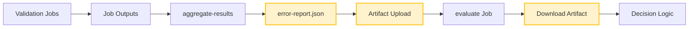
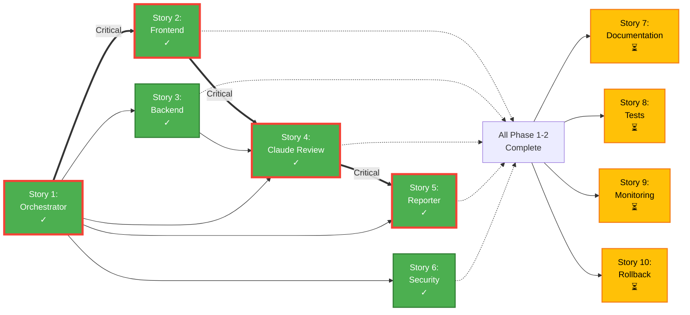
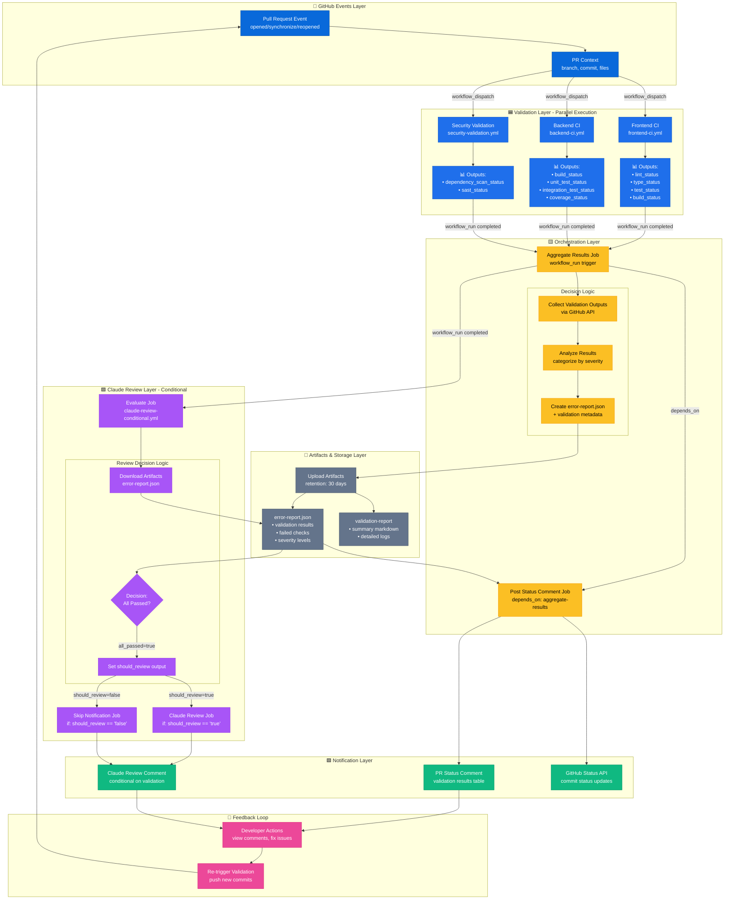
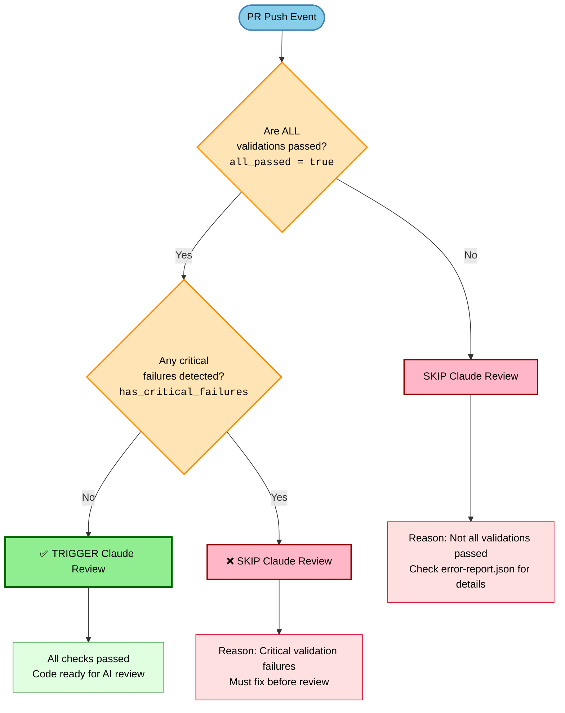

# CI/CD Workflows

This directory contains GitHub Actions workflows for automated testing, security scanning, and deployment.

## 🚀 Validation Orchestrator System

### Complete Pipeline Flow Diagram

The validation orchestrator system ensures code quality by running all validations in parallel before triggering Claude Code review. This optimizes resource usage and provides faster feedback to developers.

```mermaid
graph TB
    %% Start Event
    START([PR Created/Updated]) --> TRIGGER[validation-orchestrator.yml Triggered]

    %% Parallel Validation Jobs
    TRIGGER --> PARALLEL{Execute Parallel<br/>Validation Jobs}

    %% Frontend Validation Branch
    PARALLEL -->|Job 1| FE_START[Frontend CI Workflow]
    FE_START --> FE_LINT[Lint Check]
    FE_LINT -->|Pass| FE_TYPE[Type Check]
    FE_LINT -->|Fail| FE_FAIL[Frontend Failed]
    FE_TYPE -->|Pass| FE_TEST[Unit Tests]
    FE_TYPE -->|Fail| FE_FAIL
    FE_TEST -->|Pass| FE_BUILD[Build]
    FE_TEST -->|Fail| FE_FAIL
    FE_BUILD -->|Pass| FE_SUCCESS[Frontend Success]
    FE_BUILD -->|Fail| FE_FAIL

    %% Backend Validation Branch
    PARALLEL -->|Job 2| BE_START[Backend CI Workflow]
    BE_START --> BE_COMPILE[Compile/Build]
    BE_COMPILE -->|Pass| BE_UNIT[Unit Tests]
    BE_COMPILE -->|Fail| BE_FAIL[Backend Failed]
    BE_UNIT -->|Pass| BE_INT[Integration Tests]
    BE_UNIT -->|Fail| BE_FAIL
    BE_INT -->|Pass| BE_COV[Coverage Check]
    BE_INT -->|Fail| BE_FAIL
    BE_COV -->|Pass| BE_SUCCESS[Backend Success]
    BE_COV -->|Fail| BE_FAIL

    %% Security Validation Branch
    PARALLEL -->|Job 3| SEC_START[Security Validation Workflow]
    SEC_START --> SEC_DEP[Dependency Scan]
    SEC_DEP -->|Pass| SEC_SAST[SAST Analysis]
    SEC_DEP -->|Fail| SEC_FAIL[Security Failed]
    SEC_SAST -->|Pass| SEC_SUCCESS[Security Success]
    SEC_SAST -->|Fail| SEC_FAIL

    %% Aggregate Results Job
    FE_SUCCESS --> AGG_WAIT[Wait for All Jobs]
    FE_FAIL --> AGG_WAIT
    BE_SUCCESS --> AGG_WAIT
    BE_FAIL --> AGG_WAIT
    SEC_SUCCESS --> AGG_WAIT
    SEC_FAIL --> AGG_WAIT

    AGG_WAIT --> AGG_JOB[aggregate-results Job]
    AGG_JOB --> AGG_COLLECT[Collect Job Outputs]
    AGG_COLLECT --> AGG_ANALYZE{Analyze Results}

    %% Aggregation Logic
    AGG_ANALYZE -->|All Pass| AGG_ALL_PASS[Set: all_passed=true<br/>has_critical_failures=false]
    AGG_ANALYZE -->|Critical Failures| AGG_CRITICAL[Set: all_passed=false<br/>has_critical_failures=true]
    AGG_ANALYZE -->|Non-Critical Failures| AGG_NON_CRITICAL[Set: all_passed=false<br/>has_critical_failures=false]

    %% Create Artifacts
    AGG_ALL_PASS --> CREATE_ARTIFACT[Create error-report.json Artifact]
    AGG_CRITICAL --> CREATE_ARTIFACT
    AGG_NON_CRITICAL --> CREATE_ARTIFACT

    CREATE_ARTIFACT --> POST_STATUS[post-status-comment Job]

    %% Post Status Comment
    POST_STATUS --> GEN_COMMENT[Generate PR Comment]
    GEN_COMMENT --> POST_COMMENT[Post Comment to PR]
    POST_COMMENT --> ORCHESTRATOR_COMPLETE[Orchestrator Complete]

    %% Claude Review Conditional Workflow
    ORCHESTRATOR_COMPLETE -.->|workflow_run completed| CLAUDE_TRIGGER[claude-review-conditional.yml Triggered]

    CLAUDE_TRIGGER --> EVAL_JOB[evaluate Job]
    EVAL_JOB --> DOWNLOAD_ART[Download error-report.json Artifact]
    DOWNLOAD_ART --> READ_RESULTS[Read Validation Results]
    READ_RESULTS --> DECISION{Decision Logic}

    %% Decision Logic Paths
    DECISION -->|all_passed=true| SHOULD_REVIEW[Set: should_review=true]
    DECISION -->|has_critical_failures=true| SKIP_CRITICAL[Set: should_review=false<br/>Reason: Critical Failures]
    DECISION -->|all_passed=false<br/>no critical failures| SKIP_NON_CRITICAL[Set: should_review=false<br/>Reason: Non-Critical Issues]

    %% Claude Review Execution
    SHOULD_REVIEW --> CLAUDE_JOB[claude-review Job]
    CLAUDE_JOB --> SETUP_CLAUDE[Setup Claude Code]
    SETUP_CLAUDE --> RUN_REVIEW[Run Claude Code Review]
    RUN_REVIEW --> REVIEW_COMPLETE[Claude Review Complete]
    REVIEW_COMPLETE --> END_SUCCESS([Pipeline Complete:<br/>Review Posted])

    %% Skip Notification
    SKIP_CRITICAL --> SKIP_JOB[skip-notification Job]
    SKIP_NON_CRITICAL --> SKIP_JOB
    SKIP_JOB --> POST_SKIP[Post Skip Comment to PR]
    POST_SKIP --> END_SKIP([Pipeline Complete:<br/>Review Skipped])

    %% Styling
    classDef successStyle fill:#d4edda,stroke:#28a745,stroke-width:3px,color:#000
    classDef failureStyle fill:#f8d7da,stroke:#dc3545,stroke-width:3px,color:#000
    classDef warningStyle fill:#fff3cd,stroke:#ffc107,stroke-width:3px,color:#000
    classDef processStyle fill:#d1ecf1,stroke:#0c5460,stroke-width:2px,color:#000
    classDef decisionStyle fill:#e2e3e5,stroke:#6c757d,stroke-width:2px,color:#000
    classDef startEndStyle fill:#cfe2ff,stroke:#084298,stroke-width:3px,color:#000

    %% Apply Styles
    class FE_SUCCESS,BE_SUCCESS,SEC_SUCCESS,AGG_ALL_PASS,SHOULD_REVIEW,REVIEW_COMPLETE,END_SUCCESS successStyle
    class FE_FAIL,BE_FAIL,SEC_FAIL,AGG_CRITICAL failureStyle
    class AGG_NON_CRITICAL,SKIP_CRITICAL,SKIP_NON_CRITICAL,SKIP_JOB,POST_SKIP,END_SKIP warningStyle
    class FE_START,BE_START,SEC_START,AGG_JOB,POST_STATUS,CLAUDE_TRIGGER,EVAL_JOB,CLAUDE_JOB processStyle
    class PARALLEL,AGG_ANALYZE,DECISION decisionStyle
    class START,END_SUCCESS,END_SKIP startEndStyle
```



### Pipeline Execution Paths

**Path 1: Success Flow (All Validations Pass)**

```
PR Trigger → Parallel Validations (All Pass) → Aggregate Results (all_passed=true)
→ Post Status Comment → Claude Review Triggered → Evaluate (should_review=true)
→ Run Claude Review → Review Posted
```

**Path 2: Critical Failure Flow**

```
PR Trigger → Parallel Validations (Critical Failures) → Aggregate Results (has_critical_failures=true)
→ Post Status Comment → Claude Review Triggered → Evaluate (should_review=false)
→ Skip Notification → Review Skipped
```

**Path 3: Non-Critical Failure Flow**

```
PR Trigger → Parallel Validations (Non-Critical Failures) → Aggregate Results (all_passed=false)
→ Post Status Comment → Claude Review Triggered → Evaluate (should_review=false)
→ Skip Notification → Review Skipped
```

### Color Legend

- 🟢 **Green (Success)**: Successful validations and review execution
- 🔴 **Red (Failure)**: Failed validations and critical errors
- 🟡 **Yellow (Warning/Skip)**: Non-critical issues and skipped reviews
- 🔵 **Blue (Process)**: Workflow jobs and execution steps
- ⚪ **Gray (Decision)**: Decision points and conditional logic
- 🔷 **Light Blue (Start/End)**: Pipeline entry and exit points

### Decision Logic

The Claude review is triggered **ONLY** when:

```
all_passed = true AND has_critical_failures = false
```

The Claude review is skipped when:

```
has_critical_failures = true OR all_passed = false
```

### Artifact Flow



### Validation Orchestrator Workflows

- **validation-orchestrator.yml** - Main orchestrator coordinating all validations
- **claude-review-conditional.yml** - Conditional Claude Code review trigger
- **generate-status-comment.js** - Status reporter script

### Epic Story Dependency Graph

This epic was implemented in 10 user stories across 3 phases. The diagram below shows the dependencies and critical path.



**Critical Path**: Story 1 → Story 2 → Story 4 → Story 5

**Legend:**

- **Green (✓)**: Completed stories
- **Yellow (⏳)**: In-progress stories
- **Thick Arrow (==>)**: Critical path
- **Solid Arrow (-->)**: Direct dependency
- **Dotted Arrow (-.->)**: Phase completion dependency

### System Architecture

The diagram below shows the complete system architecture with all layers and data flow.



**Architecture Layers:**

- **🔷 GitHub Events**: PR triggers and context
- **🟦 Validation**: Parallel workflow execution (Frontend, Backend, Security)
- **🟨 Orchestration**: Result aggregation and decision logic
- **💾 Artifacts**: Persistent storage for validation data
- **🟪 Claude Review**: Conditional AI-powered code review
- **🟩 Notifications**: PR comments and status updates
- **🔄 Feedback**: Developer actions and iteration loop

### Claude Review Decision Logic

The diagram below shows exactly when Claude Code review triggers versus skips based on validation results.



**Decision Rules:**

✅ **TRIGGER Review** when:

- `all_passed = true` AND `has_critical_failures = false`

❌ **SKIP Review** when:

- `all_passed = false` OR `has_critical_failures = true`

**Critical Validations** (failure blocks Claude review):

- Frontend: Type check, Tests, Build
- Backend: Build, Unit tests, Integration tests
- Security: Dependency scan, SAST

**Non-Critical Validations** (failure still blocks review):

- Frontend: Linting
- Backend: Coverage threshold

---

## Workflows Overview

### 1. Frontend CI (`frontend-ci.yml`)

**Triggers:** Push/PR to main/develop with frontend changes

**Jobs:**

- **test**: Build, lint, type-check, and test frontend
  - Node.js 20 with npm caching
  - ESLint, TypeScript, Vitest
  - Build artifact upload (7 days)
  - Bundle size reporting
- **security**: Snyk vulnerability scanning
  - Dependency vulnerability detection
  - SARIF upload to GitHub Security
- **code-quality**: ESLint analysis with reports
- **notify**: Auto-create issues on failure

**Required Secrets:**

- `SNYK_TOKEN`: Snyk API token for security scanning

### 2. Backend CI (`backend-ci.yml`)

**Triggers:** Push/PR to main/develop with backend changes

**Jobs:**

- **test**: Build and test backend
  - Java 21 (Temurin) with Maven caching
  - PostgreSQL 15 service container
  - Test results and JAR artifact upload
- **coverage**: JaCoCo code coverage
  - Codecov integration
  - Coverage report generation
- **security**: Multi-tool security scanning
  - Snyk for dependency vulnerabilities
  - OWASP Dependency Check
- **code-quality**: SonarQube analysis
  - Code quality metrics
  - Technical debt analysis
- **notify**: Auto-create issues on failure

**Required Secrets:**

- `SNYK_TOKEN`: Snyk API token
- `SONAR_TOKEN`: SonarQube authentication token
- `SONAR_HOST_URL`: SonarQube server URL

### 3. Docker Build & Push (`docker-build-push.yml`)

**Triggers:**

- Push to main with Docker-related changes
- Release published
- Manual workflow dispatch

**Jobs:**

- **build-frontend**: Build and push frontend image
  - Multi-platform (amd64, arm64)
  - GitHub Container Registry (ghcr.io)
  - Trivy vulnerability scanning
  - Automatic tagging (semantic versioning)
- **build-backend**: Build and push backend image
  - Multi-platform (amd64, arm64)
  - GitHub Container Registry
  - Trivy vulnerability scanning
  - Automatic tagging
- **release-summary**: Generate release notes
  - Pull commands for new images
  - Vulnerability scan status
- **notify**: Auto-create issues on failure

**Required Permissions:**

- `packages: write` - Push to GitHub Container Registry
- `security-events: write` - Upload security scan results
- `contents: read` - Checkout repository

**Automatic Tagging:**

Images are tagged with:

- `latest` - Latest main branch build
- `<semver>` - Semantic version (from release)
- `<branch>-<sha>` - Branch + commit SHA
- `<major>.<minor>` - Major.minor version

## Setup Instructions

### 1. Configure Secrets

Go to **Settings → Secrets and variables → Actions** and add:

#### Required Secrets

- **SNYK_TOKEN**: Get from [Snyk Dashboard](https://app.snyk.io/account)
  ```bash
  # Test locally
  snyk auth
  snyk test
  ```

#### Optional Secrets

- **SONAR_TOKEN** + **SONAR_HOST_URL**: For SonarQube analysis

  ```bash
  # Self-hosted SonarQube
  SONAR_HOST_URL=https://sonarqube.example.com
  ```

- **CODECOV_TOKEN**: For Codecov.io (optional, works without token for public repos)

### 2. Enable Permissions

Go to **Settings → Actions → General**:

- ✅ Allow GitHub Actions to create pull requests
- ✅ Workflow permissions: Read and write
- ✅ Allow GitHub Actions to approve pull requests

### 3. Container Registry Access

GitHub Container Registry (ghcr.io) is enabled by default. Images are published to:

```
ghcr.io/<owner>/<repo>/frontend:latest
ghcr.io/<owner>/<repo>/backend:latest
```

Make packages public: **Packages → Package settings → Change visibility**

### 4. Pull Images

```bash
# Login to GitHub Container Registry
echo $GITHUB_TOKEN | docker login ghcr.io -u USERNAME --password-stdin

# Pull images
docker pull ghcr.io/<owner>/<repo>/frontend:latest
docker pull ghcr.io/<owner>/<repo>/backend:latest
```

## Workflow Features

### Performance Optimizations

- **Dependency Caching**: Maven and npm dependencies cached
- **Build Caching**: Docker layer caching with GitHub Actions cache
- **Concurrency Control**: Cancel stale workflow runs
- **Path Filtering**: Only run when relevant files change

### Security Features

- **Snyk**: Dependency vulnerability scanning
- **Trivy**: Container image vulnerability scanning
- **OWASP**: Dependency security checks
- **SonarQube**: Code quality and security analysis
- **SARIF Upload**: Security findings in GitHub Security tab

### Monitoring & Notifications

- **GitHub Summary**: Build reports in workflow summary
- **Artifact Upload**: Test results, coverage, security reports
- **Auto-issue Creation**: Failed workflows create GitHub issues
- **Status Badges**: Add to README.md

## Status Badges

Add these to your README.md:

```markdown


```

## Troubleshooting

### Workflow Fails: "Resource not accessible by integration"

**Solution**: Enable workflow permissions in Settings → Actions → General

### Snyk Fails: "Missing SNYK_TOKEN"

**Solution**: Add SNYK_TOKEN secret, or set `continue-on-error: true` to make it optional

### Docker Push Fails: "denied: permission_denied"

**Solution**: Check that `packages: write` permission is enabled in workflow

### PostgreSQL Service Fails to Start

**Solution**: Increase health check timeout or verify service configuration

### Maven Build Fails: "Cannot resolve dependencies"

**Solution**: Clear Maven cache or check internet connectivity

## Local Testing

### Test Workflows Locally with Act

```bash
# Install act
brew install act

# Run frontend CI
act -j test -W .github/workflows/frontend-ci.yml

# Run backend CI with PostgreSQL
act -j test -W .github/workflows/backend-ci.yml --container-daemon-socket -
```

### Validate Workflow Syntax

```bash
# Using GitHub CLI
gh workflow view frontend-ci.yml

# Using actionlint
brew install actionlint
actionlint .github/workflows/*.yml
```

## Best Practices

1. **Keep workflows fast**: Use caching, path filtering, and concurrency control
2. **Fail fast**: Run quick checks (lint, type-check) before slow tests
3. **Secure secrets**: Never commit secrets, use GitHub Secrets
4. **Monitor costs**: GitHub Actions minutes are limited on free tier
5. **Test locally**: Use act or Docker Compose before pushing
6. **Update dependencies**: Keep actions up to date (Dependabot)

## Next Steps

- Story 6: Observability Stack (Prometheus, Grafana, Jaeger)
- Story 8: Technical Documentation (architecture diagrams)
