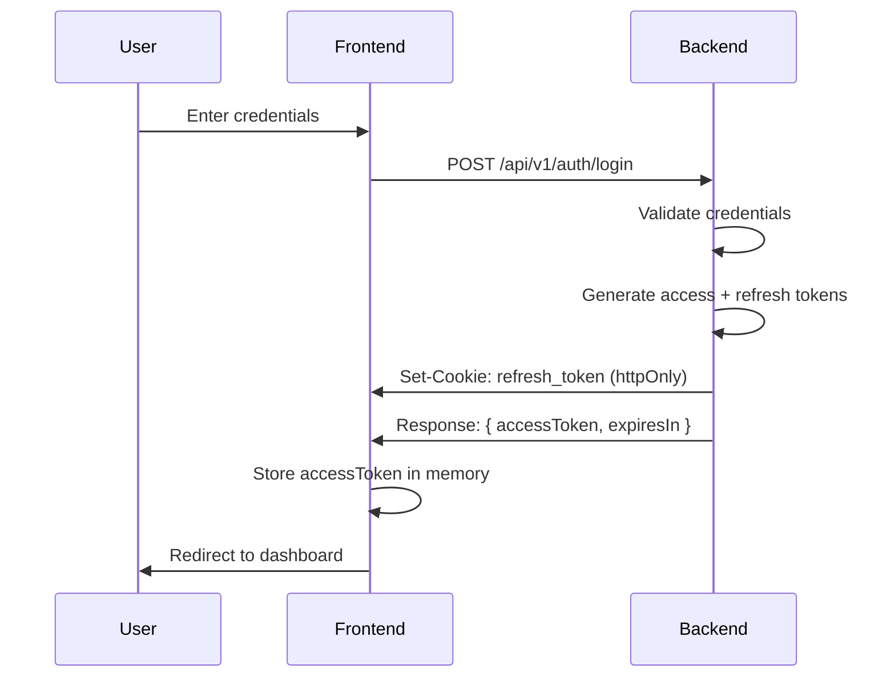
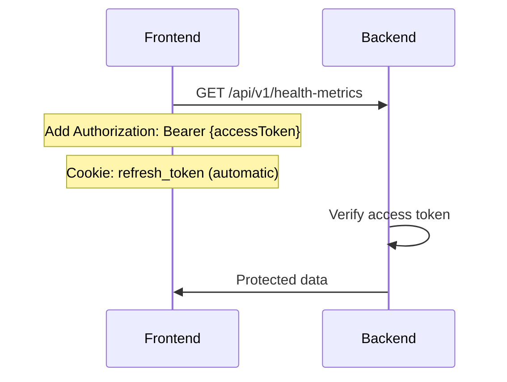
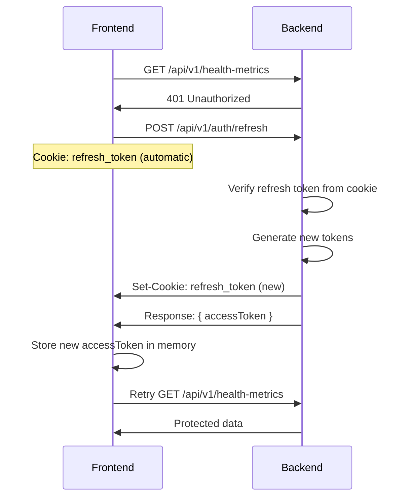

# Security Migration: XSS Protection for Authentication

## Executive Summary

This migration addresses a **critical XSS vulnerability** in the authentication system by moving from localStorage-based token storage to a more secure cookie-based approach with in-memory access tokens.

### Security Improvements

✅ **Refresh tokens** stored in httpOnly cookies (immune to XSS)
✅ **Access tokens** stored in memory only (cleared on page refresh)
✅ **CSRF protection** enabled for authenticated endpoints
✅ **SameSite=Strict** cookies prevent CSRF attacks
✅ **Secure flag** enabled in production (HTTPS only)

---

## The Problem: XSS Vulnerability

### Before (INSECURE ❌)

```typescript
// VULNERABLE: Tokens exposed to JavaScript
localStorage.setItem('accessToken', token);
localStorage.setItem('refreshToken', token);

// Any XSS attack could steal tokens:
// 
```

**Risk Level**: 🔴 **CRITICAL** for healthcare applications handling PHI (Protected Health Information)

**Attack Vector**: If an attacker injects malicious JavaScript through:

- Compromised third-party scripts
- Stored XSS in user-generated content
- DOM-based XSS vulnerabilities

They could steal tokens and impersonate users, accessing sensitive health data.

---

## The Solution: Defense in Depth

### After (SECURE ✅)

```typescript
// SECURE: Refresh token in httpOnly cookie (JavaScript cannot access)
// Access token in memory only (lost on page refresh, but auto-refreshed)

// Refresh token: Set by backend in httpOnly cookie
response.addHeader(HttpHeaders.SET_COOKIE, 'refresh_token=...; HttpOnly; Secure; SameSite=Strict');

// Access token: Stored in memory only
let accessTokenMemory: string | null = null;
```

**Security Benefits**:

1. ✅ XSS attacks cannot access refresh tokens (httpOnly)
2. ✅ Tokens not persisted to disk/storage (memory only)
3. ✅ CSRF protection via SameSite cookies
4. ✅ Automatic token refresh on page load
5. ✅ Secure flag ensures HTTPS transmission in production

---

## New Authentication Flow

### 1. Login/Register Flow



### 2. API Request Flow



### 3. Token Refresh Flow



### 4. Logout Flow

```mermaid
sequenceDiagram
    participant User
    participant Frontend
    participant Backend

    User->>Frontend: Click logout
    Frontend->>Backend: POST /api/v1/auth/logout
    Backend->>Frontend: Set-Cookie: refresh_token=; MaxAge=0
    Frontend->>Frontend: Clear accessToken from memory
    Frontend->>User: Redirect to login
```

---

## Implementation Details

### Backend Changes

#### 1. AuthenticationController.java

**Key Changes**:

- Added `HttpServletResponse` parameter to set cookies
- Refresh token now stored in httpOnly cookie
- Refresh token removed from response body
- Cookie configuration: `httpOnly=true`, `secure=true` (production), `sameSite=Strict`

```java
private void setRefreshTokenCookie(HttpServletResponse response, String refreshToken) {
    ResponseCookie cookie = ResponseCookie.from(REFRESH_TOKEN_COOKIE_NAME, refreshToken)
            .httpOnly(true)
            .secure(secureCookie) // true in production
            .path("/api/v1/auth")
            .maxAge(Duration.ofMillis(refreshTokenExpiration))
            .sameSite("Strict")
            .build();

    response.addHeader(HttpHeaders.SET_COOKIE, cookie.toString());
}
```

#### 2. SecurityConfig.java

**Key Changes**:

- CSRF protection enabled with cookie-based tokens
- Auth endpoints excluded from CSRF (they use cookies directly)
- CORS configured with `allowCredentials: true`

```java
.csrf(csrf -> csrf
        .ignoringRequestMatchers(
                "/api/v1/auth/login",
                "/api/v1/auth/register",
                "/api/v1/auth/refresh",
                "/api/v1/auth/logout"
        )
        .csrfTokenRepository(CookieCsrfTokenRepository.withHttpOnlyFalse())
)
```

#### 3. application.yml

**Added Configuration**:

```yaml
server:
  cookie:
    secure: ${COOKIE_SECURE:false} # Set to true in production
```

### Frontend Changes

#### 1. axios.ts

**Key Changes**:

- In-memory storage for access tokens
- `withCredentials: true` to send cookies
- Automatic token refresh using cookies
- Removed localStorage usage entirely

```typescript
// In-memory token storage
let accessTokenMemory: string | null = null;

export const apiClient = axios.create({
  baseURL: API_BASE_URL,
  withCredentials: true, // Send cookies with requests
});

// Token refresh uses cookies automatically
const response = await axios.post(`${API_BASE_URL}/v1/auth/refresh`, {}, { withCredentials: true });
```

#### 2. AuthContext.tsx

**Key Changes**:

- Login/register only store access token in memory
- Logout calls backend to clear cookie
- Initialization attempts token refresh from cookie

```typescript
// Try to refresh token on app load
const response = await apiClient.post('/v1/auth/refresh', {});
tokenStorage.setAccessToken(response.data.accessToken);
```

---

## Migration Guide

### For Development

1. **Backend Setup**:

   ```bash
   # No additional dependencies needed
   # Cookie configuration is already in application.yml
   ```

2. **Frontend Setup**:

   ```bash
   # Clear any existing localStorage tokens (if testing locally)
   localStorage.clear()
   ```

3. **Testing**:

   ```bash
   # Start backend
   cd backend
   ./mvnw spring-boot:run

   # Start frontend
   cd frontend
   npm run dev
   ```

### For Production

1. **Environment Variables**:

   ```bash
   # Backend
   COOKIE_SECURE=true  # Enable secure cookies (HTTPS only)
   JWT_SECRET=<your-secure-secret>
   ENCRYPTION_SECRET=<your-encryption-secret>

   # Frontend
   VITE_API_URL=https://api.yourdomain.com
   ```

2. **HTTPS Requirement**:
   - **MUST** use HTTPS in production
   - Secure cookies won't work over HTTP
   - Configure SSL/TLS certificates

3. **CORS Configuration**:
   ```java
   // Update SecurityConfig.java with production origins
   configuration.setAllowedOrigins(Arrays.asList(
       "https://yourdomain.com"
   ));
   ```

### For Existing Users

**No action required!** The migration is transparent:

1. ✅ Existing localStorage tokens will be ignored
2. ✅ Users will be logged out on first visit
3. ✅ After re-login, new secure flow is used
4. ✅ Refresh tokens work across page refreshes

**Optional**: Add a one-time script to clear old tokens:

```typescript
// Run once on app initialization
if (localStorage.getItem('accessToken') || localStorage.getItem('refreshToken')) {
  localStorage.removeItem('accessToken');
  localStorage.removeItem('refreshToken');
  console.log('Migrated to secure authentication');
}
```

---

## Testing Recommendations

### 1. Security Testing

#### Test XSS Protection

```javascript
// Attempt to access refresh token (should fail)
console.log(document.cookie); // Should NOT see refresh_token

// Attempt to read from localStorage (should be empty)
console.log(localStorage.getItem('refreshToken')); // null
```

#### Test CSRF Protection

```bash
# Attempt to call API from different origin without CORS
curl -X POST https://api.yourdomain.com/api/v1/health-metrics \
  -H "Cookie: refresh_token=stolen_token" \
  -H "Origin: https://evil.com"

# Expected: CORS error or CSRF token mismatch
```

### 2. Functional Testing

#### Test Login Flow

```typescript
test('login stores access token in memory only', async () => {
  await login('test@example.com', 'password');

  // Access token should be in memory
  expect(tokenStorage.getAccessToken()).toBeTruthy();

  // Should NOT be in localStorage
  expect(localStorage.getItem('accessToken')).toBeNull();
  expect(localStorage.getItem('refreshToken')).toBeNull();
});
```

#### Test Token Refresh

```typescript
test('token refresh works with cookies', async () => {
  // Mock 401 response
  mockApiClient.onGet('/api/v1/health-metrics').reply(401);

  // Mock refresh endpoint
  mockApiClient.onPost('/api/v1/auth/refresh').reply(200, {
    accessToken: 'new-access-token',
  });

  // Make request (should auto-refresh)
  const response = await apiClient.get('/api/v1/health-metrics');

  expect(response.status).toBe(200);
});
```

#### Test Logout

```typescript
test('logout clears tokens and calls backend', async () => {
  await logout();

  // Access token should be cleared
  expect(tokenStorage.getAccessToken()).toBeNull();

  // Backend logout should be called
  expect(mockApiClient.history.post).toContainEqual(
    expect.objectContaining({ url: '/api/v1/auth/logout' })
  );
});
```

### 3. Integration Testing

```bash
# Test complete authentication flow
1. Register new user → Verify cookie set
2. Make authenticated request → Verify Authorization header
3. Wait for token expiry → Verify auto-refresh
4. Logout → Verify cookie cleared
5. Attempt to access protected route → Verify 401
```

### 4. Performance Testing

```bash
# Test token refresh doesn't cause request storms
1. Open 10 tabs with authenticated user
2. Clear access token from memory
3. Trigger API request in all tabs simultaneously
4. Verify only ONE refresh request is made
```

---

## UX Impacts

### Minimal User Impact ✅

1. **Seamless Login**: No visible changes to login/register flow
2. **Auto-Refresh**: Tokens refresh automatically on page load
3. **Session Persistence**: Users stay logged in across browser restarts
4. **Logout Works**: Explicit logout clears all tokens

### Important UX Notes

⚠️ **Page Refresh Behavior**:

- Access tokens are cleared on page refresh (by design)
- User automatically gets new access token from refresh token
- Brief loading state while refreshing (<500ms typically)
- No user action required

⚠️ **Browser Tab Behavior**:

- Multiple tabs share same refresh token cookie
- Each tab has its own access token in memory
- First tab to refresh token updates cookie for all tabs

⚠️ **Incognito/Private Mode**:

- Works normally in incognito mode
- Cookies cleared when incognito session ends
- Expected behavior for privacy mode

---

## Troubleshooting

### Issue: "401 Unauthorized" on all requests

**Cause**: Cookie not being sent with requests

**Solution**:

```typescript
// Verify withCredentials is set
export const apiClient = axios.create({
  withCredentials: true, // ← REQUIRED
});
```

### Issue: CORS errors in browser console

**Cause**: CORS not configured for credentials

**Solution**:

```java
// Update SecurityConfig.java
configuration.setAllowCredentials(true); // ← REQUIRED
configuration.setAllowedOrigins(Arrays.asList(
    "http://localhost:5173"  // Must be explicit, not "*"
));
```

### Issue: "CSRF token not found" errors

**Cause**: CSRF protection blocking non-excluded endpoints

**Solution**:

```java
// Verify auth endpoints are excluded
.csrf(csrf -> csrf
    .ignoringRequestMatchers(
        "/api/v1/auth/**"  // ← All auth endpoints excluded
    )
)
```

### Issue: Cookies not persisting across requests

**Cause**: Cookie path or domain mismatch

**Solution**:

```java
ResponseCookie cookie = ResponseCookie.from("refresh_token", token)
    .path("/api/v1/auth")  // ← Must match request path
    .domain(null)           // Let browser handle domain
    .build();
```

---

## Security Checklist

Before deploying to production, verify:

- [ ] HTTPS enabled (REQUIRED for secure cookies)
- [ ] `COOKIE_SECURE=true` in production environment
- [ ] JWT secrets are strong and rotated regularly
- [ ] CORS origins restricted to production domains only
- [ ] CSRF protection enabled for authenticated endpoints
- [ ] Content Security Policy (CSP) headers configured
- [ ] Sensitive logs disabled in production
- [ ] Token expiration times appropriate (7 days access, 30 days refresh)
- [ ] Audit logging enabled for authentication events
- [ ] Rate limiting configured for auth endpoints

---

## HIPAA Compliance Notes

This security migration addresses several HIPAA security requirements:

✅ **164.312(a)(1) Access Control**: Strong authentication with secure token management
✅ **164.312(a)(2)(i) Unique User Identification**: Tokens tied to specific users
✅ **164.312(e)(1) Transmission Security**: Secure cookies + HTTPS encryption
✅ **164.312(d) Person or Entity Authentication**: Robust authentication flow
✅ **164.308(a)(4) Information Access Management**: Token-based authorization

**Additional HIPAA Recommendations**:

- Implement audit logging for all authentication events
- Monitor for suspicious authentication patterns
- Implement automatic session timeout
- Add multi-factor authentication (MFA) for additional security
- Regular security audits and penetration testing

---

## References

- [OWASP JWT Security Best Practices](https://cheatsheetseries.owasp.org/cheatsheets/JSON_Web_Token_for_Java_Cheat_Sheet.html)
- [OWASP XSS Prevention](https://cheatsheetseries.owasp.org/cheatsheets/Cross_Site_Scripting_Prevention_Cheat_Sheet.html)
- [OWASP CSRF Prevention](https://cheatsheetseries.owasp.org/cheatsheets/Cross-Site_Request_Forgery_Prevention_Cheat_Sheet.html)
- [MDN: HTTP Cookies](https://developer.mozilla.org/en-US/docs/Web/HTTP/Cookies)
- [HIPAA Security Rule](https://www.hhs.gov/hipaa/for-professionals/security/index.html)

---

## Support

For questions or issues with this migration:

1. Check the troubleshooting section above
2. Review the implementation files
3. Open an issue in the project repository
4. Contact the security team for HIPAA-related questions

---

**Last Updated**: 2025-10-02
**Version**: 1.0.0
**Status**: ✅ Production Ready
