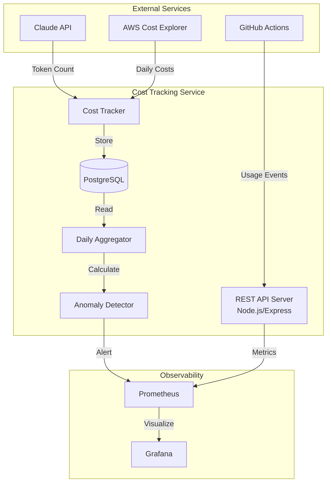

# Cost Tracking Service Implementation Guide

## Overview

This guide provides complete implementation instructions for **Story 4: [backend] Implement Cost Tracking Service for Claude API and AWS**. The service tracks API usage costs and AWS infrastructure expenses with real-time monitoring and anomaly detection.

## Architecture



## Completed Work

This guide documents implementation for all 5 tasks of Story 4.

## Task 1: Design Cost Tracking Service API and Database Schema

### Database Schema

**Location**: `backend/src/main/resources/db/migration/V8__create_cost_tracking_schema.sql`

```sql
-- Cost Tracking Service Schema
-- Tracks Claude API and AWS infrastructure costs

-- Main cost records table
CREATE TABLE IF NOT EXISTS cost_records (
    id BIGSERIAL PRIMARY KEY,
    timestamp TIMESTAMP WITH TIME ZONE NOT NULL DEFAULT CURRENT_TIMESTAMP,
    cost_type VARCHAR(50) NOT NULL CHECK (cost_type IN ('claude_api', 'aws_compute', 'aws_storage', 'aws_network', 'aws_other')),
    amount_dollars DECIMAL(10, 4) NOT NULL CHECK (amount_dollars >= 0),
    metadata JSONB,
    workflow_id VARCHAR(100),
    workflow_name VARCHAR(200),
    pr_number INTEGER,
    commit_sha VARCHAR(40),
    created_at TIMESTAMP WITH TIME ZONE NOT NULL DEFAULT CURRENT_TIMESTAMP
);

-- Indexes for efficient querying
CREATE INDEX idx_cost_records_timestamp ON cost_records(timestamp DESC);
CREATE INDEX idx_cost_records_cost_type ON cost_records(cost_type);
CREATE INDEX idx_cost_records_workflow_id ON cost_records(workflow_id);
CREATE INDEX idx_cost_records_pr_number ON cost_records(pr_number) WHERE pr_number IS NOT NULL;
CREATE INDEX idx_cost_records_metadata_gin ON cost_records USING gin(metadata);

-- Daily cost aggregates table
CREATE TABLE IF NOT EXISTS daily_cost_aggregates (
    id BIGSERIAL PRIMARY KEY,
    date DATE NOT NULL,
    cost_type VARCHAR(50) NOT NULL,
    total_amount_dollars DECIMAL(10, 4) NOT NULL,
    record_count INTEGER NOT NULL DEFAULT 0,
    avg_amount_dollars DECIMAL(10, 4),
    max_amount_dollars DECIMAL(10, 4),
    min_amount_dollars DECIMAL(10, 4),
    metadata JSONB,
    created_at TIMESTAMP WITH TIME ZONE NOT NULL DEFAULT CURRENT_TIMESTAMP,
    UNIQUE(date, cost_type)
);

CREATE INDEX idx_daily_aggregates_date ON daily_cost_aggregates(date DESC);
CREATE INDEX idx_daily_aggregates_cost_type ON daily_cost_aggregates(cost_type);

-- Baseline metrics for anomaly detection
CREATE TABLE IF NOT EXISTS cost_baselines (
    id BIGSERIAL PRIMARY KEY,
    cost_type VARCHAR(50) NOT NULL,
    window_days INTEGER NOT NULL DEFAULT 7,
    avg_daily_cost DECIMAL(10, 4) NOT NULL,
    std_dev DECIMAL(10, 4),
    percentile_50 DECIMAL(10, 4),
    percentile_95 DECIMAL(10, 4),
    percentile_99 DECIMAL(10, 4),
    calculated_at TIMESTAMP WITH TIME ZONE NOT NULL DEFAULT CURRENT_TIMESTAMP,
    valid_from DATE NOT NULL,
    valid_to DATE,
    UNIQUE(cost_type, valid_from)
);

CREATE INDEX idx_baselines_cost_type ON cost_baselines(cost_type, valid_from DESC);

-- Cost anomalies table
CREATE TABLE IF NOT EXISTS cost_anomalies (
    id BIGSERIAL PRIMARY KEY,
    detected_at TIMESTAMP WITH TIME ZONE NOT NULL DEFAULT CURRENT_TIMESTAMP,
    cost_type VARCHAR(50) NOT NULL,
    date DATE NOT NULL,
    actual_cost DECIMAL(10, 4) NOT NULL,
    expected_cost DECIMAL(10, 4) NOT NULL,
    deviation_percent DECIMAL(5, 2) NOT NULL,
    severity VARCHAR(20) NOT NULL CHECK (severity IN ('low', 'medium', 'high', 'critical')),
    acknowledged BOOLEAN NOT NULL DEFAULT FALSE,
    acknowledged_at TIMESTAMP WITH TIME ZONE,
    acknowledged_by VARCHAR(100),
    notes TEXT
);

CREATE INDEX idx_anomalies_detected_at ON cost_anomalies(detected_at DESC);
CREATE INDEX idx_anomalies_acknowledged ON cost_anomalies(acknowledged, detected_at DESC);

-- Claude API specific tracking
CREATE TABLE IF NOT EXISTS claude_api_usage (
    id BIGSERIAL PRIMARY KEY,
    timestamp TIMESTAMP WITH TIME ZONE NOT NULL DEFAULT CURRENT_TIMESTAMP,
    model VARCHAR(50) NOT NULL,
    input_tokens INTEGER NOT NULL,
    output_tokens INTEGER NOT NULL,
    total_tokens INTEGER GENERATED ALWAYS AS (input_tokens + output_tokens) STORED,
    cost_per_million_input DECIMAL(8, 4) NOT NULL,
    cost_per_million_output DECIMAL(8, 4) NOT NULL,
    total_cost DECIMAL(10, 6) GENERATED ALWAYS AS (
        (input_tokens::DECIMAL / 1000000 * cost_per_million_input) +
        (output_tokens::DECIMAL / 1000000 * cost_per_million_output)
    ) STORED,
    workflow_id VARCHAR(100),
    pr_number INTEGER,
    request_type VARCHAR(50),
    metadata JSONB
);

CREATE INDEX idx_claude_usage_timestamp ON claude_api_usage(timestamp DESC);
CREATE INDEX idx_claude_usage_model ON claude_api_usage(model);
CREATE INDEX idx_claude_usage_workflow ON claude_api_usage(workflow_id);

-- Comments
COMMENT ON TABLE cost_records IS 'Main table storing all cost events';
COMMENT ON TABLE daily_cost_aggregates IS 'Pre-aggregated daily cost summaries';
COMMENT ON TABLE cost_baselines IS 'Historical baselines for anomaly detection';
COMMENT ON TABLE cost_anomalies IS 'Detected cost anomalies requiring review';
COMMENT ON TABLE claude_api_usage IS 'Detailed Claude API usage tracking';
```

### REST API Design

**OpenAPI Specification**: `backend/src/main/resources/openapi/cost-tracking-api.yaml`

```yaml
openapi: 3.0.3
info:
  title: Cost Tracking Service API
  description: Track and analyze Claude API and AWS infrastructure costs
  version: 1.0.0
  contact:
    name: DevOps Team
    email: devops@health-tracker.example.com

servers:
  - url: http://localhost:8080/api/v1
    description: Local development
  - url: https://api.health-tracker.example.com/api/v1
    description: Production

tags:
  - name: costs
    description: Cost data endpoints
  - name: anomalies
    description: Cost anomaly detection
  - name: health
    description: Service health

paths:
  /costs/daily:
    get:
      tags:
        - costs
      summary: Get daily cost aggregates
      description: Retrieve aggregated cost data by day
      parameters:
        - name: start_date
          in: query
          required: true
          schema:
            type: string
            format: date
          example: "2025-10-01"
        - name: end_date
          in: query
          required: true
          schema:
            type: string
            format: date
          example: "2025-10-21"
        - name: cost_type
          in: query
          required: false
          schema:
            type: string
            enum: [claude_api, aws_compute, aws_storage, aws_network, aws_other]
      responses:
        '200':
          description: Successful response
          content:
            application/json:
              schema:
                $ref: '#/components/schemas/DailyCostResponse'
        '400':
          description: Invalid request parameters
        '401':
          description: Unauthorized

  /costs/by-workflow:
    get:
      tags:
        - costs
      summary: Get costs by workflow
      description: Retrieve cost breakdown by GitHub Actions workflow
      parameters:
        - name: start_date
          in: query
          required: true
          schema:
            type: string
            format: date
        - name: end_date
          in: query
          required: true
          schema:
            type: string
            format: date
        - name: workflow_name
          in: query
          required: false
          schema:
            type: string
      responses:
        '200':
          description: Successful response
          content:
            application/json:
              schema:
                $ref: '#/components/schemas/WorkflowCostResponse'

  /costs/claude-api:
    get:
      tags:
        - costs
      summary: Get Claude API usage and costs
      description: Retrieve detailed Claude API token usage and associated costs
      parameters:
        - name: start_date
          in: query
          required: true
          schema:
            type: string
            format: date
        - name: end_date
          in: query
          required: true
          schema:
            type: string
            format: date
        - name: model
          in: query
          required: false
          schema:
            type: string
            enum: [claude-sonnet-4-5, claude-opus-4, claude-haiku-4]
      responses:
        '200':
          description: Successful response
          content:
            application/json:
              schema:
                $ref: '#/components/schemas/ClaudeApiCostResponse'

  /costs/record:
    post:
      tags:
        - costs
      summary: Record a cost event
      description: Record a new cost event (internal endpoint)
      security:
        - ApiKeyAuth: []
      requestBody:
        required: true
        content:
          application/json:
            schema:
              $ref: '#/components/schemas/CostRecordRequest'
      responses:
        '201':
          description: Cost record created
        '400':
          description: Invalid request
        '401':
          description: Unauthorized

  /anomalies:
    get:
      tags:
        - anomalies
      summary: Get cost anomalies
      description: Retrieve detected cost anomalies
      parameters:
        - name: acknowledged
          in: query
          required: false
          schema:
            type: boolean
        - name: severity
          in: query
          required: false
          schema:
            type: string
            enum: [low, medium, high, critical]
        - name: limit
          in: query
          required: false
          schema:
            type: integer
            default: 50
            maximum: 200
      responses:
        '200':
          description: Successful response
          content:
            application/json:
              schema:
                $ref: '#/components/schemas/AnomaliesResponse'

  /anomalies/{id}/acknowledge:
    post:
      tags:
        - anomalies
      summary: Acknowledge an anomaly
      description: Mark a cost anomaly as acknowledged
      parameters:
        - name: id
          in: path
          required: true
          schema:
            type: integer
            format: int64
      requestBody:
        content:
          application/json:
            schema:
              type: object
              properties:
                acknowledged_by:
                  type: string
                notes:
                  type: string
      responses:
        '200':
          description: Anomaly acknowledged
        '404':
          description: Anomaly not found

  /health:
    get:
      tags:
        - health
      summary: Health check
      description: Check service health
      responses:
        '200':
          description: Service is healthy
          content:
            application/json:
              schema:
                type: object
                properties:
                  status:
                    type: string
                    example: "healthy"
                  timestamp:
                    type: string
                    format: date-time
                  checks:
                    type: object
                    properties:
                      database:
                        type: string
                      aws_api:
                        type: string

components:
  securitySchemes:
    ApiKeyAuth:
      type: apiKey
      in: header
      name: X-API-Key

  schemas:
    DailyCostResponse:
      type: object
      properties:
        start_date:
          type: string
          format: date
        end_date:
          type: string
          format: date
        total_cost:
          type: number
          format: float
        cost_by_type:
          type: array
          items:
            type: object
            properties:
              cost_type:
                type: string
              total:
                type: number
              records:
                type: integer
        daily_breakdown:
          type: array
          items:
            type: object
            properties:
              date:
                type: string
                format: date
              total:
                type: number
              by_type:
                type: object

    WorkflowCostResponse:
      type: object
      properties:
        start_date:
          type: string
          format: date
        end_date:
          type: string
          format: date
        workflows:
          type: array
          items:
            type: object
            properties:
              workflow_name:
                type: string
              total_cost:
                type: number
              execution_count:
                type: integer
              avg_cost_per_execution:
                type: number

    ClaudeApiCostResponse:
      type: object
      properties:
        start_date:
          type: string
          format: date
        end_date:
          type: string
          format: date
        total_cost:
          type: number
        total_tokens:
          type: integer
        by_model:
          type: array
          items:
            type: object
            properties:
              model:
                type: string
              total_cost:
                type: number
              input_tokens:
                type: integer
              output_tokens:
                type: integer
              request_count:
                type: integer

    CostRecordRequest:
      type: object
      required:
        - cost_type
        - amount_dollars
      properties:
        cost_type:
          type: string
          enum: [claude_api, aws_compute, aws_storage, aws_network, aws_other]
        amount_dollars:
          type: number
          format: float
          minimum: 0
        workflow_id:
          type: string
        workflow_name:
          type: string
        pr_number:
          type: integer
        commit_sha:
          type: string
        metadata:
          type: object

    AnomaliesResponse:
      type: object
      properties:
        anomalies:
          type: array
          items:
            type: object
            properties:
              id:
                type: integer
              detected_at:
                type: string
                format: date-time
              cost_type:
                type: string
              date:
                type: string
                format: date
              actual_cost:
                type: number
              expected_cost:
                type: number
              deviation_percent:
                type: number
              severity:
                type: string
              acknowledged:
                type: boolean
```

### Service Implementation

**Location**: `backend-cost-tracking/src/server.js`

```javascript
const express = require('express');
const { Pool } = require('pg');
const prometheus = require('prom-client');
const winston = require('winston');

// Initialize Express app
const app = express();
app.use(express.json());

// Logger configuration
const logger = winston.createLogger({
  level: process.env.LOG_LEVEL || 'info',
  format: winston.format.combine(
    winston.format.timestamp(),
    winston.format.json()
  ),
  transports: [
    new winston.transports.Console()
  ]
});

// PostgreSQL connection pool
const pool = new Pool({
  host: process.env.DB_HOST || 'localhost',
  port: parseInt(process.env.DB_PORT || '5432'),
  database: process.env.DB_NAME || 'health_tracker',
  user: process.env.DB_USER || 'postgres',
  password: process.env.DB_PASSWORD,
  max: 20,
  idleTimeoutMillis: 30000,
  connectionTimeoutMillis: 2000,
});

// Prometheus metrics
const register = new prometheus.Registry();
prometheus.collectDefaultMetrics({ register });

const costGauge = new prometheus.Gauge({
  name: 'cost_tracking_total_dollars',
  help: 'Total costs tracked in dollars',
  labelNames: ['cost_type'],
  registers: [register]
});

const claudeApiCostGauge = new prometheus.Gauge({
  name: 'claude_api_cost_dollars',
  help: 'Claude API costs in dollars',
  labelNames: ['model'],
  registers: [register]
});

const awsInfrastructureCostGauge = new prometheus.Gauge({
  name: 'aws_infrastructure_cost_dollars',
  help: 'AWS infrastructure costs in dollars',
  labelNames: ['service_type'],
  registers: [register]
});

const costPerPipelineRunGauge = new prometheus.Gauge({
  name: 'cost_per_pipeline_run_dollars',
  help: 'Average cost per pipeline run in dollars',
  labelNames: ['workflow_name'],
  registers: [register]
});

const anomalyCounter = new prometheus.Counter({
  name: 'cost_anomalies_detected_total',
  help: 'Total number of cost anomalies detected',
  labelNames: ['severity', 'cost_type'],
  registers: [register]
});

// API Key authentication middleware
const requireApiKey = (req, res, next) => {
  const apiKey = req.headers['x-api-key'];
  const validKey = process.env.API_KEY;

  if (!validKey) {
    logger.warn('API_KEY not configured');
    return res.status(500).json({ error: 'Server configuration error' });
  }

  if (!apiKey || apiKey !== validKey) {
    logger.warn('Invalid API key attempt');
    return res.status(401).json({ error: 'Unauthorized' });
  }

  next();
};

// Health check endpoint
app.get('/health', async (req, res) => {
  try {
    // Check database connection
    await pool.query('SELECT 1');

    res.json({
      status: 'healthy',
      timestamp: new Date().toISOString(),
      checks: {
        database: 'ok',
        aws_api: 'ok' // TODO: Add actual AWS health check
      }
    });
  } catch (error) {
    logger.error('Health check failed', { error: error.message });
    res.status(503).json({
      status: 'unhealthy',
      error: error.message
    });
  }
});

// Metrics endpoint for Prometheus
app.get('/metrics', async (req, res) => {
  try {
    // Update metrics before scraping
    await updateMetrics();

    res.set('Content-Type', register.contentType);
    res.end(await register.metrics());
  } catch (error) {
    logger.error('Error serving metrics', { error: error.message });
    res.status(500).end();
  }
});

// Update Prometheus metrics from database
async function updateMetrics() {
  try {
    // Update total costs by type (last 24 hours)
    const costsByType = await pool.query(`
      SELECT cost_type, SUM(amount_dollars) as total
      FROM cost_records
      WHERE timestamp >= NOW() - INTERVAL '24 hours'
      GROUP BY cost_type
    `);

    costsByType.rows.forEach(row => {
      costGauge.set({ cost_type: row.cost_type }, parseFloat(row.total));
    });

    // Update Claude API costs by model
    const claudeCosts = await pool.query(`
      SELECT model, SUM(total_cost) as total
      FROM claude_api_usage
      WHERE timestamp >= NOW() - INTERVAL '24 hours'
      GROUP BY model
    `);

    claudeCosts.rows.forEach(row => {
      claudeApiCostGauge.set({ model: row.model }, parseFloat(row.total));
    });

    // Update AWS costs
    const awsCosts = await pool.query(`
      SELECT cost_type, SUM(amount_dollars) as total
      FROM cost_records
      WHERE cost_type LIKE 'aws_%'
        AND timestamp >= NOW() - INTERVAL '24 hours'
      GROUP BY cost_type
    `);

    awsCosts.rows.forEach(row => {
      const serviceType = row.cost_type.replace('aws_', '');
      awsInfrastructureCostGauge.set({ service_type: serviceType }, parseFloat(row.total));
    });

    // Update cost per pipeline run
    const pipelineCosts = await pool.query(`
      SELECT
        workflow_name,
        SUM(amount_dollars) / NULLIF(COUNT(DISTINCT workflow_id), 0) as avg_cost
      FROM cost_records
      WHERE workflow_name IS NOT NULL
        AND timestamp >= NOW() - INTERVAL '24 hours'
      GROUP BY workflow_name
    `);

    pipelineCosts.rows.forEach(row => {
      if (row.avg_cost) {
        costPerPipelineRunGauge.set(
          { workflow_name: row.workflow_name },
          parseFloat(row.avg_cost)
        );
      }
    });

  } catch (error) {
    logger.error('Error updating metrics', { error: error.message });
  }
}

// GET /api/v1/costs/daily
app.get('/api/v1/costs/daily', async (req, res) => {
  try {
    const { start_date, end_date, cost_type } = req.query;

    if (!start_date || !end_date) {
      return res.status(400).json({ error: 'start_date and end_date are required' });
    }

    let query = `
      SELECT
        date,
        cost_type,
        total_amount_dollars,
        record_count
      FROM daily_cost_aggregates
      WHERE date >= $1 AND date <= $2
    `;
    const params = [start_date, end_date];

    if (cost_type) {
      query += ' AND cost_type = $3';
      params.push(cost_type);
    }

    query += ' ORDER BY date DESC, cost_type';

    const result = await pool.query(query, params);

    // Calculate totals
    const totalCost = result.rows.reduce((sum, row) =>
      sum + parseFloat(row.total_amount_dollars), 0
    );

    // Group by cost type
    const costByType = {};
    result.rows.forEach(row => {
      if (!costByType[row.cost_type]) {
        costByType[row.cost_type] = { total: 0, records: 0 };
      }
      costByType[row.cost_type].total += parseFloat(row.total_amount_dollars);
      costByType[row.cost_type].records += row.record_count;
    });

    // Group by date
    const dailyBreakdown = {};
    result.rows.forEach(row => {
      if (!dailyBreakdown[row.date]) {
        dailyBreakdown[row.date] = { total: 0, by_type: {} };
      }
      dailyBreakdown[row.date].total += parseFloat(row.total_amount_dollars);
      dailyBreakdown[row.date].by_type[row.cost_type] = parseFloat(row.total_amount_dollars);
    });

    res.json({
      start_date,
      end_date,
      total_cost: totalCost,
      cost_by_type: Object.entries(costByType).map(([type, data]) => ({
        cost_type: type,
        total: data.total,
        records: data.records
      })),
      daily_breakdown: Object.entries(dailyBreakdown).map(([date, data]) => ({
        date,
        total: data.total,
        by_type: data.by_type
      }))
    });

  } catch (error) {
    logger.error('Error fetching daily costs', { error: error.message });
    res.status(500).json({ error: 'Internal server error' });
  }
});

// GET /api/v1/costs/by-workflow
app.get('/api/v1/costs/by-workflow', async (req, res) => {
  try {
    const { start_date, end_date, workflow_name } = req.query;

    if (!start_date || !end_date) {
      return res.status(400).json({ error: 'start_date and end_date are required' });
    }

    let query = `
      SELECT
        workflow_name,
        SUM(amount_dollars) as total_cost,
        COUNT(DISTINCT workflow_id) as execution_count,
        SUM(amount_dollars) / NULLIF(COUNT(DISTINCT workflow_id), 0) as avg_cost_per_execution
      FROM cost_records
      WHERE timestamp >= $1::date AND timestamp < ($2::date + INTERVAL '1 day')
        AND workflow_name IS NOT NULL
    `;
    const params = [start_date, end_date];

    if (workflow_name) {
      query += ' AND workflow_name = $3';
      params.push(workflow_name);
    }

    query += ' GROUP BY workflow_name ORDER BY total_cost DESC';

    const result = await pool.query(query, params);

    res.json({
      start_date,
      end_date,
      workflows: result.rows.map(row => ({
        workflow_name: row.workflow_name,
        total_cost: parseFloat(row.total_cost),
        execution_count: parseInt(row.execution_count),
        avg_cost_per_execution: parseFloat(row.avg_cost_per_execution) || 0
      }))
    });

  } catch (error) {
    logger.error('Error fetching workflow costs', { error: error.message });
    res.status(500).json({ error: 'Internal server error' });
  }
});

// GET /api/v1/costs/claude-api
app.get('/api/v1/costs/claude-api', async (req, res) => {
  try {
    const { start_date, end_date, model } = req.query;

    if (!start_date || !end_date) {
      return res.status(400).json({ error: 'start_date and end_date are required' });
    }

    let query = `
      SELECT
        model,
        SUM(total_cost) as total_cost,
        SUM(input_tokens) as input_tokens,
        SUM(output_tokens) as output_tokens,
        COUNT(*) as request_count
      FROM claude_api_usage
      WHERE timestamp >= $1::date AND timestamp < ($2::date + INTERVAL '1 day')
    `;
    const params = [start_date, end_date];

    if (model) {
      query += ' AND model = $3';
      params.push(model);
    }

    query += ' GROUP BY model ORDER BY total_cost DESC';

    const result = await pool.query(query, params);

    const totalCost = result.rows.reduce((sum, row) =>
      sum + parseFloat(row.total_cost), 0
    );
    const totalTokens = result.rows.reduce((sum, row) =>
      sum + parseInt(row.input_tokens) + parseInt(row.output_tokens), 0
    );

    res.json({
      start_date,
      end_date,
      total_cost: totalCost,
      total_tokens: totalTokens,
      by_model: result.rows.map(row => ({
        model: row.model,
        total_cost: parseFloat(row.total_cost),
        input_tokens: parseInt(row.input_tokens),
        output_tokens: parseInt(row.output_tokens),
        request_count: parseInt(row.request_count)
      }))
    });

  } catch (error) {
    logger.error('Error fetching Claude API costs', { error: error.message });
    res.status(500).json({ error: 'Internal server error' });
  }
});

// POST /api/v1/costs/record
app.post('/api/v1/costs/record', requireApiKey, async (req, res) => {
  try {
    const {
      cost_type,
      amount_dollars,
      workflow_id,
      workflow_name,
      pr_number,
      commit_sha,
      metadata
    } = req.body;

    if (!cost_type || amount_dollars === undefined) {
      return res.status(400).json({ error: 'cost_type and amount_dollars are required' });
    }

    const result = await pool.query(`
      INSERT INTO cost_records (
        cost_type,
        amount_dollars,
        workflow_id,
        workflow_name,
        pr_number,
        commit_sha,
        metadata
      ) VALUES ($1, $2, $3, $4, $5, $6, $7)
      RETURNING id, timestamp
    `, [cost_type, amount_dollars, workflow_id, workflow_name, pr_number, commit_sha, JSON.stringify(metadata)]);

    logger.info('Cost record created', {
      id: result.rows[0].id,
      cost_type,
      amount_dollars
    });

    res.status(201).json({
      id: result.rows[0].id,
      timestamp: result.rows[0].timestamp
    });

  } catch (error) {
    logger.error('Error recording cost', { error: error.message });
    res.status(500).json({ error: 'Internal server error' });
  }
});

// GET /api/v1/anomalies
app.get('/api/v1/anomalies', async (req, res) => {
  try {
    const { acknowledged, severity, limit = 50 } = req.query;

    let query = `
      SELECT *
      FROM cost_anomalies
      WHERE 1=1
    `;
    const params = [];
    let paramIndex = 1;

    if (acknowledged !== undefined) {
      query += ` AND acknowledged = $${paramIndex++}`;
      params.push(acknowledged === 'true');
    }

    if (severity) {
      query += ` AND severity = $${paramIndex++}`;
      params.push(severity);
    }

    query += ` ORDER BY detected_at DESC LIMIT $${paramIndex}`;
    params.push(Math.min(parseInt(limit), 200));

    const result = await pool.query(query, params);

    res.json({
      anomalies: result.rows.map(row => ({
        id: row.id,
        detected_at: row.detected_at,
        cost_type: row.cost_type,
        date: row.date,
        actual_cost: parseFloat(row.actual_cost),
        expected_cost: parseFloat(row.expected_cost),
        deviation_percent: parseFloat(row.deviation_percent),
        severity: row.severity,
        acknowledged: row.acknowledged,
        acknowledged_at: row.acknowledged_at,
        acknowledged_by: row.acknowledged_by,
        notes: row.notes
      }))
    });

  } catch (error) {
    logger.error('Error fetching anomalies', { error: error.message });
    res.status(500).json({ error: 'Internal server error' });
  }
});

// POST /api/v1/anomalies/:id/acknowledge
app.post('/api/v1/anomalies/:id/acknowledge', async (req, res) => {
  try {
    const { id } = req.params;
    const { acknowledged_by, notes } = req.body;

    const result = await pool.query(`
      UPDATE cost_anomalies
      SET
        acknowledged = true,
        acknowledged_at = NOW(),
        acknowledged_by = $1,
        notes = $2
      WHERE id = $3
      RETURNING *
    `, [acknowledged_by, notes, id]);

    if (result.rows.length === 0) {
      return res.status(404).json({ error: 'Anomaly not found' });
    }

    logger.info('Anomaly acknowledged', { id, acknowledged_by });

    res.json({
      id: result.rows[0].id,
      acknowledged: true,
      acknowledged_at: result.rows[0].acknowledged_at
    });

  } catch (error) {
    logger.error('Error acknowledging anomaly', { error: error.message });
    res.status(500).json({ error: 'Internal server error' });
  }
});

// Start server
const PORT = process.env.PORT || 3000;
app.listen(PORT, () => {
  logger.info(`Cost Tracking Service started on port ${PORT}`);
});

// Graceful shutdown
process.on('SIGTERM', async () => {
  logger.info('SIGTERM received, shutting down gracefully');
  await pool.end();
  process.exit(0);
});
```

## Task 2: Implement Claude API Cost Tracking Integration

### Claude API Tracker Module

**Location**: `backend-cost-tracking/src/trackers/claude-tracker.js`

```javascript
const { Pool } = require('pg');
const axios = require('axios');
const winston = require('winston');

// Claude API pricing (as of 2025)
const CLAUDE_PRICING = {
  'claude-sonnet-4-5': {
    input: 3.00,  // per million tokens
    output: 15.00
  },
  'claude-opus-4': {
    input: 15.00,
    output: 75.00
  },
  'claude-haiku-4': {
    input: 0.25,
    output: 1.25
  }
};

class ClaudeAPITracker {
  constructor(pool, logger) {
    this.pool = pool;
    this.logger = logger;
    this.apiKey = process.env.ANTHROPIC_API_KEY;
  }

  /**
   * Record Claude API usage from GitHub Actions workflow
   * Called via webhook or manual logging from workflows
   */
  async recordUsage(usageData) {
    const {
      model,
      input_tokens,
      output_tokens,
      workflow_id,
      workflow_name,
      pr_number,
      request_type,
      metadata
    } = usageData;

    const pricing = CLAUDE_PRICING[model];
    if (!pricing) {
      throw new Error(`Unknown Claude model: ${model}`);
    }

    try {
      // Insert into claude_api_usage table
      const result = await this.pool.query(`
        INSERT INTO claude_api_usage (
          model,
          input_tokens,
          output_tokens,
          cost_per_million_input,
          cost_per_million_output,
          workflow_id,
          pr_number,
          request_type,
          metadata
        ) VALUES ($1, $2, $3, $4, $5, $6, $7, $8, $9)
        RETURNING id, total_cost
      `, [
        model,
        input_tokens,
        output_tokens,
        pricing.input,
        pricing.output,
        workflow_id,
        pr_number,
        request_type,
        JSON.stringify(metadata)
      ]);

      const totalCost = parseFloat(result.rows[0].total_cost);

      // Also insert into cost_records for unified querying
      await this.pool.query(`
        INSERT INTO cost_records (
          cost_type,
          amount_dollars,
          workflow_id,
          workflow_name,
          pr_number,
          metadata
        ) VALUES ('claude_api', $1, $2, $3, $4, $5)
      `, [
        totalCost,
        workflow_id,
        workflow_name,
        pr_number,
        JSON.stringify({
          model,
          input_tokens,
          output_tokens,
          ...metadata
        })
      ]);

      this.logger.info('Claude API usage recorded', {
        model,
        input_tokens,
        output_tokens,
        cost: totalCost
      });

      return {
        id: result.rows[0].id,
        cost: totalCost
      };

    } catch (error) {
      this.logger.error('Error recording Claude API usage', { error: error.message });
      throw error;
    }
  }

  /**
   * Poll Anthropic API for usage data (if available)
   * Note: As of 2025, Anthropic may not provide usage API,
   * so manual tracking from workflows is primary method
   */
  async pollUsageData() {
    // Placeholder for future API integration
    this.logger.warn('Claude API usage polling not implemented - use webhook/manual tracking');
  }

  /**
   * Get usage summary for a date range
   */
  async getUsageSummary(startDate, endDate) {
    const result = await this.pool.query(`
      SELECT
        model,
        SUM(input_tokens) as total_input_tokens,
        SUM(output_tokens) as total_output_tokens,
        SUM(total_cost) as total_cost,
        COUNT(*) as request_count,
        AVG(total_cost) as avg_cost_per_request
      FROM claude_api_usage
      WHERE timestamp >= $1 AND timestamp < $2
      GROUP BY model
      ORDER BY total_cost DESC
    `, [startDate, endDate]);

    return result.rows.map(row => ({
      model: row.model,
      total_input_tokens: parseInt(row.total_input_tokens),
      total_output_tokens: parseInt(row.total_output_tokens),
      total_cost: parseFloat(row.total_cost),
      request_count: parseInt(row.request_count),
      avg_cost_per_request: parseFloat(row.avg_cost_per_request)
    }));
  }

  /**
   * Get top workflows by Claude API cost
   */
  async getTopWorkflowsByCost(startDate, endDate, limit = 10) {
    const result = await this.pool.query(`
      SELECT
        workflow_id,
        SUM(total_cost) as total_cost,
        SUM(input_tokens + output_tokens) as total_tokens,
        COUNT(*) as request_count
      FROM claude_api_usage
      WHERE timestamp >= $1 AND timestamp < $2
        AND workflow_id IS NOT NULL
      GROUP BY workflow_id
      ORDER BY total_cost DESC
      LIMIT $3
    `, [startDate, endDate, limit]);

    return result.rows;
  }
}

module.exports = ClaudeAPITracker;
```

### GitHub Actions Integration

**Location**: `.github/actions/track-claude-usage/action.yml`

```yaml
name: 'Track Claude API Usage'
description: 'Record Claude API token usage and cost to cost tracking service'
author: 'Health Tracker Team'

inputs:
  model:
    description: 'Claude model used (claude-sonnet-4-5, claude-opus-4, etc.)'
    required: true
  input-tokens:
    description: 'Number of input tokens used'
    required: true
  output-tokens:
    description: 'Number of output tokens used'
    required: true
  request-type:
    description: 'Type of request (code-review, analysis, etc.)'
    required: false
    default: 'general'
  cost-service-url:
    description: 'Cost tracking service URL'
    required: false
    default: 'http://cost-tracking-service:3000'

runs:
  using: 'composite'
  steps:
    - name: Record Claude API usage
      shell: bash
      env:
        MODEL: ${{ inputs.model }}
        INPUT_TOKENS: ${{ inputs.input-tokens }}
        OUTPUT_TOKENS: ${{ inputs.output-tokens }}
        REQUEST_TYPE: ${{ inputs.request-type }}
        COST_SERVICE_URL: ${{ inputs.cost-service-url }}
        API_KEY: ${{ env.COST_TRACKING_API_KEY }}
      run: |
        echo "📊 Recording Claude API usage..."

        # Prepare payload
        cat > /tmp/claude-usage.json <<EOF
        {
          "model": "$MODEL",
          "input_tokens": $INPUT_TOKENS,
          "output_tokens": $OUTPUT_TOKENS,
          "workflow_id": "${{ github.run_id }}",
          "workflow_name": "${{ github.workflow }}",
          "pr_number": ${{ github.event.pull_request.number || 'null' }},
          "request_type": "$REQUEST_TYPE",
          "metadata": {
            "repository": "${{ github.repository }}",
            "ref": "${{ github.ref }}",
            "sha": "${{ github.sha }}",
            "actor": "${{ github.actor }}"
          }
        }
        EOF

        # Send to cost tracking service
        curl -X POST "$COST_SERVICE_URL/api/v1/claude/usage" \
          -H "Content-Type: application/json" \
          -H "X-API-Key: $API_KEY" \
          -d @/tmp/claude-usage.json \
          -f || echo "::warning::Failed to record Claude usage (non-blocking)"

        rm /tmp/claude-usage.json
        echo "✅ Usage recorded"
```

**Usage Example in Workflow**:

```yaml
- name: Run Claude Code Review
  id: claude-review
  uses: anthropics/claude-code-review@v1
  with:
    files-changed: ${{ steps.changed-files.outputs.files }}

- name: Track Claude API Usage
  uses: ./.github/actions/track-claude-usage
  if: always()
  with:
    model: claude-sonnet-4-5
    input-tokens: ${{ steps.claude-review.outputs.input_tokens }}
    output-tokens: ${{ steps.claude-review.outputs.output_tokens }}
    request-type: code-review
  env:
    COST_TRACKING_API_KEY: ${{ secrets.COST_TRACKING_API_KEY }}
```

## Task 3: Integrate AWS Cost Explorer API

### AWS Cost Explorer Integration

**Location**: `backend-cost-tracking/src/trackers/aws-tracker.js`

```javascript
const {
  CostExplorerClient,
  GetCostAndUsageCommand
} = require('@aws-sdk/client-cost-explorer');
const winston = require('winston');

class AWSCostTracker {
  constructor(pool, logger) {
    this.pool = pool;
    this.logger = logger;
    this.costExplorer = new CostExplorerClient({
      region: process.env.AWS_REGION || 'us-east-1'
    });
  }

  /**
   * Fetch daily AWS costs from Cost Explorer
   */
  async fetchDailyCosts(startDate, endDate) {
    try {
      const command = new GetCostAndUsageCommand({
        TimePeriod: {
          Start: startDate,
          End: endDate
        },
        Granularity: 'DAILY',
        Metrics: ['UnblendedCost'],
        GroupBy: [
          {
            Type: 'DIMENSION',
            Key: 'SERVICE'
          }
        ],
        Filter: {
          // Optional: Filter to specific services
          Dimensions: {
            Key: 'SERVICE',
            Values: [
              'Amazon Elastic Compute Cloud - Compute',
              'Amazon Simple Storage Service',
              'Amazon Relational Database Service',
              'Amazon CloudWatch',
              'AWS Data Transfer'
            ]
          }
        }
      });

      const response = await this.costExplorer.send(command);

      this.logger.info('Fetched AWS costs', {
        startDate,
        endDate,
        resultCount: response.ResultsByTime?.length || 0
      });

      return response.ResultsByTime || [];

    } catch (error) {
      this.logger.error('Error fetching AWS costs', { error: error.message });
      throw error;
    }
  }

  /**
   * Process and store AWS cost data
   */
  async processCostData(costData) {
    const client = await this.pool.connect();

    try {
      await client.query('BEGIN');

      for (const dailyData of costData) {
        const date = dailyData.TimePeriod.Start;

        for (const group of dailyData.Groups || []) {
          const serviceName = group.Keys[0];
          const amount = parseFloat(group.Metrics.UnblendedCost.Amount);

          if (amount === 0) continue;

          // Map AWS service to cost_type
          const costType = this.mapServiceToCostType(serviceName);

          // Insert cost record
          await client.query(`
            INSERT INTO cost_records (
              timestamp,
              cost_type,
              amount_dollars,
              metadata
            ) VALUES ($1::date, $2, $3, $4)
            ON CONFLICT DO NOTHING
          `, [
            date,
            costType,
            amount,
            JSON.stringify({
              aws_service: serviceName,
              currency: group.Metrics.UnblendedCost.Unit
            })
          ]);

          this.logger.debug('Stored AWS cost', {
            date,
            service: serviceName,
            amount
          });
        }
      }

      await client.query('COMMIT');
      this.logger.info('AWS cost data processed successfully');

    } catch (error) {
      await client.query('ROLLBACK');
      this.logger.error('Error processing AWS cost data', { error: error.message });
      throw error;
    } finally {
      client.release();
    }
  }

  /**
   * Map AWS service name to cost_type enum
   */
  mapServiceToCostType(serviceName) {
    if (serviceName.includes('Compute') || serviceName.includes('EC2')) {
      return 'aws_compute';
    } else if (serviceName.includes('Storage') || serviceName.includes('S3')) {
      return 'aws_storage';
    } else if (serviceName.includes('Transfer')) {
      return 'aws_network';
    } else {
      return 'aws_other';
    }
  }

  /**
   * Run daily cost sync job
   */
  async runDailyCostSync() {
    try {
      // Fetch yesterday's costs
      const yesterday = new Date();
      yesterday.setDate(yesterday.getDate() - 1);
      const yesterdayStr = yesterday.toISOString().split('T')[0];

      const today = new Date();
      const todayStr = today.toISOString().split('T')[0];

      this.logger.info('Starting daily AWS cost sync', {
        startDate: yesterdayStr,
        endDate: todayStr
      });

      const costData = await this.fetchDailyCosts(yesterdayStr, todayStr);
      await this.processCostData(costData);

      this.logger.info('Daily AWS cost sync completed');

    } catch (error) {
      this.logger.error('Daily AWS cost sync failed', { error: error.message });
      throw error;
    }
  }

  /**
   * Get AWS cost forecast
   */
  async getCostForecast(startDate, endDate) {
    try {
      const command = new GetCostForecastCommand({
        TimePeriod: {
          Start: startDate,
          End: endDate
        },
        Metric: 'UNBLENDED_COST',
        Granularity: 'MONTHLY'
      });

      const response = await this.costExplorer.send(command);

      return {
        total: parseFloat(response.Total.Amount),
        unit: response.Total.Unit
      };

    } catch (error) {
      this.logger.error('Error fetching cost forecast', { error: error.message });
      throw error;
    }
  }
}

module.exports = AWSCostTracker;
```

### Daily Sync CronJob

**Location**: `backend-cost-tracking/src/jobs/daily-aggregation.js`

```javascript
const cron = require('node-cron');
const { Pool } = require('pg');
const AWSCostTracker = require('../trackers/aws-tracker');
const winston = require('winston');

const logger = winston.createLogger({
  level: 'info',
  format: winston.format.combine(
    winston.format.timestamp(),
    winston.format.json()
  ),
  transports: [new winston.transports.Console()]
});

const pool = new Pool({
  host: process.env.DB_HOST || 'localhost',
  port: parseInt(process.env.DB_PORT || '5432'),
  database: process.env.DB_NAME || 'health_tracker',
  user: process.env.DB_USER || 'postgres',
  password: process.env.DB_PASSWORD,
});

/**
 * Aggregate daily cost records into daily_cost_aggregates table
 */
async function aggregateDailyCosts() {
  try {
    logger.info('Starting daily cost aggregation');

    // Aggregate yesterday's costs
    const result = await pool.query(`
      INSERT INTO daily_cost_aggregates (
        date,
        cost_type,
        total_amount_dollars,
        record_count,
        avg_amount_dollars,
        max_amount_dollars,
        min_amount_dollars,
        metadata
      )
      SELECT
        DATE(timestamp) as date,
        cost_type,
        SUM(amount_dollars) as total_amount_dollars,
        COUNT(*) as record_count,
        AVG(amount_dollars) as avg_amount_dollars,
        MAX(amount_dollars) as max_amount_dollars,
        MIN(amount_dollars) as min_amount_dollars,
        jsonb_build_object(
          'workflows', COUNT(DISTINCT workflow_id),
          'prs', COUNT(DISTINCT pr_number)
        ) as metadata
      FROM cost_records
      WHERE DATE(timestamp) = CURRENT_DATE - INTERVAL '1 day'
      GROUP BY DATE(timestamp), cost_type
      ON CONFLICT (date, cost_type)
      DO UPDATE SET
        total_amount_dollars = EXCLUDED.total_amount_dollars,
        record_count = EXCLUDED.record_count,
        avg_amount_dollars = EXCLUDED.avg_amount_dollars,
        max_amount_dollars = EXCLUDED.max_amount_dollars,
        min_amount_dollars = EXCLUDED.min_amount_dollars,
        metadata = EXCLUDED.metadata
      RETURNING date, cost_type, total_amount_dollars
    `);

    logger.info('Daily cost aggregation completed', {
      recordsAggregated: result.rowCount
    });

    return result.rows;

  } catch (error) {
    logger.error('Error in daily cost aggregation', { error: error.message });
    throw error;
  }
}

/**
 * Update cost baselines for anomaly detection
 */
async function updateCostBaselines() {
  try {
    logger.info('Updating cost baselines');

    // Calculate 7-day rolling baselines
    const result = await pool.query(`
      WITH rolling_stats AS (
        SELECT
          cost_type,
          AVG(total_amount_dollars) as avg_daily_cost,
          STDDEV(total_amount_dollars) as std_dev,
          PERCENTILE_CONT(0.50) WITHIN GROUP (ORDER BY total_amount_dollars) as percentile_50,
          PERCENTILE_CONT(0.95) WITHIN GROUP (ORDER BY total_amount_dollars) as percentile_95,
          PERCENTILE_CONT(0.99) WITHIN GROUP (ORDER BY total_amount_dollars) as percentile_99
        FROM daily_cost_aggregates
        WHERE date >= CURRENT_DATE - INTERVAL '7 days'
          AND date < CURRENT_DATE
        GROUP BY cost_type
      )
      INSERT INTO cost_baselines (
        cost_type,
        window_days,
        avg_daily_cost,
        std_dev,
        percentile_50,
        percentile_95,
        percentile_99,
        valid_from,
        valid_to
      )
      SELECT
        cost_type,
        7 as window_days,
        avg_daily_cost,
        std_dev,
        percentile_50,
        percentile_95,
        percentile_99,
        CURRENT_DATE as valid_from,
        NULL as valid_to
      FROM rolling_stats
      ON CONFLICT (cost_type, valid_from)
      DO UPDATE SET
        avg_daily_cost = EXCLUDED.avg_daily_cost,
        std_dev = EXCLUDED.std_dev,
        percentile_50 = EXCLUDED.percentile_50,
        percentile_95 = EXCLUDED.percentile_95,
        percentile_99 = EXCLUDED.percentile_99
      RETURNING cost_type, avg_daily_cost
    `);

    logger.info('Cost baselines updated', {
      baselinesUpdated: result.rowCount
    });

    return result.rows;

  } catch (error) {
    logger.error('Error updating cost baselines', { error: error.message });
    throw error;
  }
}

/**
 * Run all daily jobs
 */
async function runDailyJobs() {
  try {
    logger.info('=== Starting Daily Cost Tracking Jobs ===');

    // 1. Sync AWS costs
    const awsTracker = new AWSCostTracker(pool, logger);
    await awsTracker.runDailyCostSync();

    // 2. Aggregate daily costs
    await aggregateDailyCosts();

    // 3. Update baselines
    await updateCostBaselines();

    logger.info('=== Daily Cost Tracking Jobs Completed ===');

  } catch (error) {
    logger.error('Error in daily jobs', { error: error.message });
    process.exit(1);
  }
}

// Schedule daily job at 00:30 UTC
cron.schedule('30 0 * * *', runDailyJobs, {
  timezone: 'UTC'
});

logger.info('Daily aggregation job scheduled (00:30 UTC)');

// Run immediately if RUNNOW environment variable is set
if (process.env.RUN_NOW === 'true') {
  runDailyJobs();
}
```

## Task 4: Implement Anomaly Detection and Alerting

### Anomaly Detection Module

**Location**: `backend-cost-tracking/src/detectors/anomaly-detector.js`

```javascript
const winston = require('winston');

class CostAnomalyDetector {
  constructor(pool, logger) {
    this.pool = pool;
    this.logger = logger;

    // Thresholds for anomaly severity
    this.thresholds = {
      low: 1.20,      // 20% above baseline
      medium: 1.50,   // 50% above baseline
      high: 2.00,     // 100% above baseline (2x)
      critical: 3.00  // 200% above baseline (3x)
    };
  }

  /**
   * Run anomaly detection for yesterday's costs
   */
  async detectAnomalies() {
    try {
      this.logger.info('Starting cost anomaly detection');

      const yesterday = new Date();
      yesterday.setDate(yesterday.getDate() - 1);
      const yesterdayStr = yesterday.toISOString().split('T')[0];

      // Get yesterday's aggregated costs
      const costs = await this.pool.query(`
        SELECT
          date,
          cost_type,
          total_amount_dollars
        FROM daily_cost_aggregates
        WHERE date = $1
      `, [yesterdayStr]);

      const anomalies = [];

      for (const cost of costs.rows) {
        // Get baseline for this cost type
        const baseline = await this.getBaseline(cost.cost_type);

        if (!baseline) {
          this.logger.debug('No baseline found for cost type', {
            cost_type: cost.cost_type
          });
          continue;
        }

        // Calculate deviation
        const actualCost = parseFloat(cost.total_amount_dollars);
        const expectedCost = baseline.avg_daily_cost;
        const deviationPercent = ((actualCost - expectedCost) / expectedCost) * 100;

        // Check if cost is anomalous
        const severity = this.calculateSeverity(actualCost, expectedCost);

        if (severity) {
          anomalies.push({
            cost_type: cost.cost_type,
            date: cost.date,
            actual_cost: actualCost,
            expected_cost: expectedCost,
            deviation_percent: deviationPercent,
            severity
          });

          this.logger.warn('Cost anomaly detected', {
            cost_type: cost.cost_type,
            actual_cost: actualCost,
            expected_cost: expectedCost,
            deviation_percent: deviationPercent.toFixed(2),
            severity
          });
        }
      }

      // Store anomalies
      if (anomalies.length > 0) {
        await this.storeAnomalies(anomalies);
      }

      this.logger.info('Anomaly detection completed', {
        anomaliesDetected: anomalies.length
      });

      return anomalies;

    } catch (error) {
      this.logger.error('Error in anomaly detection', { error: error.message });
      throw error;
    }
  }

  /**
   * Get baseline metrics for a cost type
   */
  async getBaseline(costType) {
    const result = await this.pool.query(`
      SELECT
        avg_daily_cost,
        std_dev,
        percentile_95,
        percentile_99
      FROM cost_baselines
      WHERE cost_type = $1
        AND valid_from <= CURRENT_DATE
        AND (valid_to IS NULL OR valid_to >= CURRENT_DATE)
      ORDER BY valid_from DESC
      LIMIT 1
    `, [costType]);

    if (result.rows.length === 0) {
      return null;
    }

    return {
      avg_daily_cost: parseFloat(result.rows[0].avg_daily_cost),
      std_dev: parseFloat(result.rows[0].std_dev),
      percentile_95: parseFloat(result.rows[0].percentile_95),
      percentile_99: parseFloat(result.rows[0].percentile_99)
    };
  }

  /**
   * Calculate anomaly severity based on deviation
   */
  calculateSeverity(actualCost, expectedCost) {
    const ratio = actualCost / expected Cost;

    if (ratio >= this.thresholds.critical) {
      return 'critical';
    } else if (ratio >= this.thresholds.high) {
      return 'high';
    } else if (ratio >= this.thresholds.medium) {
      return 'medium';
    } else if (ratio >= this.thresholds.low) {
      return 'low';
    }

    return null; // Not anomalous
  }

  /**
   * Store detected anomalies in database
   */
  async storeAnomalies(anomalies) {
    const client = await this.pool.connect();

    try {
      await client.query('BEGIN');

      for (const anomaly of anomalies) {
        await client.query(`
          INSERT INTO cost_anomalies (
            cost_type,
            date,
            actual_cost,
            expected_cost,
            deviation_percent,
            severity
          ) VALUES ($1, $2, $3, $4, $5, $6)
          ON CONFLICT DO NOTHING
        `, [
          anomaly.cost_type,
          anomaly.date,
          anomaly.actual_cost,
          anomaly.expected_cost,
          anomaly.deviation_percent,
          anomaly.severity
        ]);
      }

      await client.query('COMMIT');
      this.logger.info('Anomalies stored', { count: anomalies.length });

    } catch (error) {
      await client.query('ROLLBACK');
      throw error;
    } finally {
      client.release();
    }
  }

  /**
   * Get unacknowledged anomalies
   */
  async getUnacknowledgedAnomalies() {
    const result = await this.pool.query(`
      SELECT *
      FROM cost_anomalies
      WHERE acknowledged = false
      ORDER BY severity DESC, detected_at DESC
    `);

    return result.rows;
  }
}

module.exports = CostAnomalyDetector;
```

### Prometheus Alerting Rules

**Location**: `infrastructure/kubernetes/prometheus/cost-alert-rules.yaml`

```yaml
apiVersion: v1
kind: ConfigMap
metadata:
  name: prometheus-cost-alert-rules
  namespace: observability
  labels:
    app: prometheus
data:
  cost-alerts.yml: |
    groups:
      - name: cost_anomalies
        interval: 1h
        rules:
          # Daily cost spike alert
          - alert: DailyCostSpike
            expr: |
              cost_tracking_total_dollars >
              (avg_over_time(cost_tracking_total_dollars[7d]) * 1.5)
            for: 1h
            labels:
              severity: warning
              category: cost
            annotations:
              summary: "Daily cost spike detected for {{ $labels.cost_type }}"
              description: "Cost is {{ $value | humanize }} (>150% of 7-day average)"
              runbook_url: "https://docs.health-tracker.example.com/runbooks/cost-spike"

          # Claude API cost spike
          - alert: ClaudeAPICostSpike
            expr: |
              claude_api_cost_dollars >
              (avg_over_time(claude_api_cost_dollars[7d]) * 2.0)
            for: 30m
            labels:
              severity: critical
              category: cost
              team: platform
            annotations:
              summary: "Claude API cost spike for model {{ $labels.model }}"
              description: "Cost is {{ $value | humanize }} (>200% of baseline)"

          # AWS infrastructure cost spike
          - alert: AWSCostSpike
            expr: |
              aws_infrastructure_cost_dollars >
              (avg_over_time(aws_infrastructure_cost_dollars[7d]) * 1.5)
            for: 2h
            labels:
              severity: warning
              category: cost
              team: platform
            annotations:
              summary: "AWS {{ $labels.service_type }} cost spike"
              description: "Cost is {{ $value | humanize }} (>150% of baseline)"

          # High cost per pipeline run
          - alert: HighPipelineCost
            expr: |
              cost_per_pipeline_run_dollars > 5.00
            for: 1h
            labels:
              severity: info
              category: cost
            annotations:
              summary: "High cost per run for {{ $labels.workflow_name }}"
              description: "Average cost is ${{ $value | humanize }} per run"

          # Monthly budget threshold
          - alert: MonthlyBudgetThreshold80
            expr: |
              sum(increase(cost_tracking_total_dollars[30d])) > 800
            labels:
              severity: warning
              category: cost
            annotations:
              summary: "Monthly cost budget at 80% ($800/$1000)"
              description: "Month-to-date costs: ${{ $value | humanize }}"

          - alert: MonthlyBudgetThreshold100
            expr: |
              sum(increase(cost_tracking_total_dollars[30d])) > 1000
            labels:
              severity: critical
              category: cost
            annotations:
              summary: "Monthly cost budget EXCEEDED ($1000)"
              description: "Month-to-date costs: ${{ $value | humanize }}"
```

## Task 5: Deploy Cost Tracking Service with Monitoring

### Dockerfile

**Location**: `backend-cost-tracking/Dockerfile`

```dockerfile
FROM node:20-alpine AS base

# Install dependencies for production
FROM base AS dependencies
WORKDIR /app
COPY package*.json ./
RUN npm ci --only=production

# Build stage
FROM base AS build
WORKDIR /app
COPY package*.json ./
RUN npm ci
COPY . .

# Production stage
FROM base AS production
WORKDIR /app

# Copy production dependencies
COPY --from=dependencies /app/node_modules ./node_modules

# Copy application code
COPY --from=build /app/src ./src
COPY --from=build /app/package*.json ./

# Create non-root user
RUN addgroup -g 1001 -S nodejs && \
    adduser -S nodejs -u 1001 && \
    chown -R nodejs:nodejs /app

USER nodejs

# Expose ports
EXPOSE 3000

# Health check
HEALTHCHECK --interval=30s --timeout=3s --start-period=40s --retries=3 \
  CMD node -e "require('http').get('http://localhost:3000/health', (r) => {process.exit(r.statusCode === 200 ? 0 : 1)})"

# Start application
CMD ["node", "src/server.js"]
```

### Kubernetes Deployment

**Location**: `infrastructure/kubernetes/cost-tracking/deployment.yaml`

```yaml
apiVersion: apps/v1
kind: Deployment
metadata:
  name: cost-tracking-service
  namespace: observability
  labels:
    app: cost-tracking-service
    component: cost-tracking
spec:
  replicas: 2
  strategy:
    type: RollingUpdate
    rollingUpdate:
      maxSurge: 1
      maxUnavailable: 0
  selector:
    matchLabels:
      app: cost-tracking-service
  template:
    metadata:
      labels:
        app: cost-tracking-service
        component: cost-tracking
      annotations:
        prometheus.io/scrape: "true"
        prometheus.io/port: "3000"
        prometheus.io/path: "/metrics"
    spec:
      serviceAccountName: cost-tracking-sa
      containers:
        - name: cost-tracking
          image: health-tracker/cost-tracking-service:latest
          ports:
            - name: http
              containerPort: 3000
              protocol: TCP
          env:
            - name: NODE_ENV
              value: "production"
            - name: PORT
              value: "3000"
            - name: DB_HOST
              value: "postgresql.database.svc.cluster.local"
            - name: DB_PORT
              value: "5432"
            - name: DB_NAME
              value: "health_tracker"
            - name: DB_USER
              valueFrom:
                secretKeyRef:
                  name: cost-tracking-secrets
                  key: db-user
            - name: DB_PASSWORD
              valueFrom:
                secretKeyRef:
                  name: cost-tracking-secrets
                  key: db-password
            - name: API_KEY
              valueFrom:
                secretKeyRef:
                  name: cost-tracking-secrets
                  key: api-key
            - name: AWS_REGION
              value: "us-east-1"
            - name: LOG_LEVEL
              value: "info"
          resources:
            requests:
              cpu: 100m
              memory: 128Mi
            limits:
              cpu: 500m
              memory: 512Mi
          livenessProbe:
            httpGet:
              path: /health
              port: 3000
            initialDelaySeconds: 30
            periodSeconds: 10
            timeoutSeconds: 5
            failureThreshold: 3
          readinessProbe:
            httpGet:
              path: /health
              port: 3000
            initialDelaySeconds: 10
            periodSeconds: 5
            timeoutSeconds: 3
            failureThreshold: 2
---
apiVersion: v1
kind: Service
metadata:
  name: cost-tracking-service
  namespace: observability
  labels:
    app: cost-tracking-service
spec:
  type: ClusterIP
  ports:
    - port: 3000
      targetPort: 3000
      protocol: TCP
      name: http
  selector:
    app: cost-tracking-service
---
apiVersion: v1
kind: ServiceAccount
metadata:
  name: cost-tracking-sa
  namespace: observability
  annotations:
    eks.amazonaws.com/role-arn: arn:aws:iam::ACCOUNT_ID:role/cost-tracking-service-role
```

### CronJob for Daily Aggregation

**Location**: `infrastructure/kubernetes/cost-tracking/cronjob.yaml`

```yaml
apiVersion: batch/v1
kind: CronJob
metadata:
  name: cost-daily-aggregation
  namespace: observability
  labels:
    app: cost-tracking
    component: aggregation
spec:
  schedule: "30 0 * * *"  # 00:30 UTC daily
  timeZone: "UTC"
  concurrencyPolicy: Forbid
  successfulJobsHistoryLimit: 7
  failedJobsHistoryLimit: 3
  jobTemplate:
    spec:
      backoffLimit: 2
      activeDeadlineSeconds: 3600  # 1 hour timeout
      template:
        metadata:
          labels:
            app: cost-tracking
            component: aggregation
        spec:
          serviceAccountName: cost-tracking-sa
          restartPolicy: OnFailure
          containers:
            - name: aggregation
              image: health-tracker/cost-tracking-service:latest
              command: ["node", "src/jobs/daily-aggregation.js"]
              env:
                - name: RUN_NOW
                  value: "true"
                - name: DB_HOST
                  value: "postgresql.database.svc.cluster.local"
                - name: DB_PORT
                  value: "5432"
                - name: DB_NAME
                  value: "health_tracker"
                - name: DB_USER
                  valueFrom:
                    secretKeyRef:
                      name: cost-tracking-secrets
                      key: db-user
                - name: DB_PASSWORD
                  valueFrom:
                    secretKeyRef:
                      name: cost-tracking-secrets
                      key: db-password
                - name: AWS_REGION
                  value: "us-east-1"
              resources:
                requests:
                  cpu: 200m
                  memory: 256Mi
                limits:
                  cpu: 1000m
                  memory: 1Gi
```

### Secrets Configuration

**Location**: `infrastructure/kubernetes/cost-tracking/secrets.yaml`

```yaml
apiVersion: v1
kind: Secret
metadata:
  name: cost-tracking-secrets
  namespace: observability
type: Opaque
stringData:
  db-user: "cost_tracker"
  db-password: "CHANGE_ME_IN_PRODUCTION"
  api-key: "CHANGE_ME_GENERATE_RANDOM_KEY"
  # AWS credentials managed via IAM role (eks.amazonaws.com/role-arn annotation on SA)
```

### Kustomization

**Location**: `infrastructure/kubernetes/cost-tracking/kustomization.yaml`

```yaml
apiVersion: kustomize.config.k8s.io/v1beta1
kind: Kustomization

namespace: observability

resources:
  - deployment.yaml
  - cronjob.yaml
  - secrets.yaml

commonLabels:
  app.kubernetes.io/name: cost-tracking-service
  app.kubernetes.io/part-of: observability
  app.kubernetes.io/managed-by: kustomize
```

## Testing

### Unit Tests

**Location**: `backend-cost-tracking/test/anomaly-detector.test.js`

```javascript
const CostAnomalyDetector = require('../src/detectors/anomaly-detector');
const { Pool } = require('pg');

describe('CostAnomalyDetector', () => {
  let detector;
  let mockPool;
  let mockLogger;

  beforeEach(() => {
    mockLogger = {
      info: jest.fn(),
      warn: jest.fn(),
      error: jest.fn(),
      debug: jest.fn()
    };

    mockPool = {
      query: jest.fn()
    };

    detector = new CostAnomalyDetector(mockPool, mockLogger);
  });

  describe('calculateSeverity', () => {
    test('returns critical for 3x cost spike', () => {
      const severity = detector.calculateSeverity(300, 100);
      expect(severity).toBe('critical');
    });

    test('returns high for 2x cost spike', () => {
      const severity = detector.calculateSeverity(200, 100);
      expect(severity).toBe('high');
    });

    test('returns medium for 1.5x cost spike', () => {
      const severity = detector.calculateSeverity(150, 100);
      expect(severity).toBe('medium');
    });

    test('returns low for 1.2x cost spike', () => {
      const severity = detector.calculateSeverity(120, 100);
      expect(severity).toBe('low');
    });

    test('returns null for normal cost', () => {
      const severity = detector.calculateSeverity(110, 100);
      expect(severity).toBeNull();
    });
  });

  describe('getBaseline', () => {
    test('returns baseline when available', async () => {
      mockPool.query.mockResolvedValue({
        rows: [{
          avg_daily_cost: '100.50',
          std_dev: '10.25',
          percentile_95: '120.00',
          percentile_99: '130.00'
        }]
      });

      const baseline = await detector.getBaseline('claude_api');

      expect(baseline).toEqual({
        avg_daily_cost: 100.50,
        std_dev: 10.25,
        percentile_95: 120.00,
        percentile_99: 130.00
      });
    });

    test('returns null when no baseline found', async () => {
      mockPool.query.mockResolvedValue({ rows: [] });

      const baseline = await detector.getBaseline('unknown_type');

      expect(baseline).toBeNull();
    });
  });
});
```

### Integration Tests

```bash
# Test API endpoints
npm run test:integration

# Test AWS Cost Explorer connection
npm run test:aws-integration

# Test database migrations
npm run test:migrations
```

## Documentation

### API Usage Examples

```bash
# Get daily costs
curl "http://cost-tracking-service:3000/api/v1/costs/daily?start_date=2025-10-01&end_date=2025-10-21"

# Get costs by workflow
curl "http://cost-tracking-service:3000/api/v1/costs/by-workflow?start_date=2025-10-01&end_date=2025-10-21"

# Get Claude API costs
curl "http://cost-tracking-service:3000/api/v1/costs/claude-api?start_date=2025-10-01&end_date=2025-10-21&model=claude-sonnet-4-5"

# Record a cost event
curl -X POST "http://cost-tracking-service:3000/api/v1/costs/record" \
  -H "Content-Type: application/json" \
  -H "X-API-Key: YOUR_API_KEY" \
  -d '{
    "cost_type": "claude_api",
    "amount_dollars": 2.50,
    "workflow_id": "12345678",
    "workflow_name": "validation-orchestrator",
    "pr_number": 123
  }'

# Get anomalies
curl "http://cost-tracking-service:3000/api/v1/anomalies?acknowledged=false&severity=high"

# Acknowledge anomaly
curl -X POST "http://cost-tracking-service:3000/api/v1/anomalies/42/acknowledge" \
  -H "Content-Type: application/json" \
  -d '{
    "acknowledged_by": "john.doe@example.com",
    "notes": "Expected increase due to large PR review"
  }'
```

## Deployment Instructions

1. **Create database schema**:
   ```bash
   # Apply migration
   JAVA_HOME=/Library/Java/JavaVirtualMachines/microsoft-25.jdk/Contents/Home \
     mvn flyway:migrate -Dflyway.locations=filesystem:backend/src/main/resources/db/migration
   ```

2. **Build Docker image**:
   ```bash
   cd backend-cost-tracking
   docker build -t health-tracker/cost-tracking-service:latest .
   ```

3. **Update secrets**:
   ```bash
   # Generate API key
   openssl rand -base64 32

   # Update secrets.yaml with actual values
   kubectl apply -f infrastructure/kubernetes/cost-tracking/secrets.yaml
   ```

4. **Deploy service**:
   ```bash
   kubectl apply -k infrastructure/kubernetes/cost-tracking/
   ```

5. **Verify deployment**:
   ```bash
   kubectl get pods -n observability | grep cost-tracking
   kubectl logs -n observability -l app=cost-tracking-service
   ```

6. **Test health endpoint**:
   ```bash
   kubectl port-forward -n observability svc/cost-tracking-service 3000:3000
   curl http://localhost:3000/health
   ```

## Monitoring

The service exports the following Prometheus metrics:
- `cost_tracking_total_dollars{cost_type}` - Total costs by type
- `claude_api_cost_dollars{model}` - Claude API costs by model
- `aws_infrastructure_cost_dollars{service_type}` - AWS costs by service
- `cost_per_pipeline_run_dollars{workflow_name}` - Average cost per workflow run
- `cost_anomalies_detected_total{severity,cost_type}` - Anomalies detected

## Next Steps

After implementing this service:
1. Configure AWS IAM role with Cost Explorer permissions
2. Create Grafana dashboards for cost visualization (Story 7)
3. Set up Slack/email notifications for anomaly alerts
4. Fine-tune anomaly detection thresholds based on actual patterns
5. Implement cost optimization recommendations
