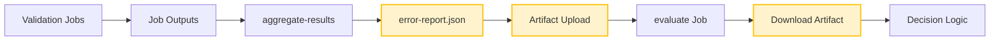

# CI/CD Pipeline Flow - Validation Orchestrator System

This document provides a comprehensive visualization of the complete CI/CD pipeline execution flow for our validation orchestrator system.

## Complete Pipeline Flow Diagram

```mermaid
graph TB
    %% Start Event
    START([PR Created/Updated]) --> TRIGGER[validation-orchestrator.yml Triggered]

    %% Parallel Validation Jobs
    TRIGGER --> PARALLEL{Execute Parallel<br/>Validation Jobs}

    %% Frontend Validation Branch
    PARALLEL -->|Job 1| FE_START[Frontend CI Workflow]
    FE_START --> FE_LINT[Lint Check]
    FE_LINT -->|Pass| FE_TYPE[Type Check]
    FE_LINT -->|Fail| FE_FAIL[Frontend Failed]
    FE_TYPE -->|Pass| FE_TEST[Unit Tests]
    FE_TYPE -->|Fail| FE_FAIL
    FE_TEST -->|Pass| FE_BUILD[Build]
    FE_TEST -->|Fail| FE_FAIL
    FE_BUILD -->|Pass| FE_SUCCESS[Frontend Success]
    FE_BUILD -->|Fail| FE_FAIL

    %% Backend Validation Branch
    PARALLEL -->|Job 2| BE_START[Backend CI Workflow]
    BE_START --> BE_COMPILE[Compile/Build]
    BE_COMPILE -->|Pass| BE_UNIT[Unit Tests]
    BE_COMPILE -->|Fail| BE_FAIL[Backend Failed]
    BE_UNIT -->|Pass| BE_INT[Integration Tests]
    BE_UNIT -->|Fail| BE_FAIL
    BE_INT -->|Pass| BE_COV[Coverage Check]
    BE_INT -->|Fail| BE_FAIL
    BE_COV -->|Pass| BE_SUCCESS[Backend Success]
    BE_COV -->|Fail| BE_FAIL

    %% Security Validation Branch
    PARALLEL -->|Job 3| SEC_START[Security Validation Workflow]
    SEC_START --> SEC_DEP[Dependency Scan]
    SEC_DEP -->|Pass| SEC_SAST[SAST Analysis]
    SEC_DEP -->|Fail| SEC_FAIL[Security Failed]
    SEC_SAST -->|Pass| SEC_SUCCESS[Security Success]
    SEC_SAST -->|Fail| SEC_FAIL

    %% Aggregate Results Job
    FE_SUCCESS --> AGG_WAIT[Wait for All Jobs]
    FE_FAIL --> AGG_WAIT
    BE_SUCCESS --> AGG_WAIT
    BE_FAIL --> AGG_WAIT
    SEC_SUCCESS --> AGG_WAIT
    SEC_FAIL --> AGG_WAIT

    AGG_WAIT --> AGG_JOB[aggregate-results Job]
    AGG_JOB --> AGG_COLLECT[Collect Job Outputs]
    AGG_COLLECT --> AGG_ANALYZE{Analyze Results}

    %% Aggregation Logic
    AGG_ANALYZE -->|All Pass| AGG_ALL_PASS[Set: all_passed=true<br/>has_critical_failures=false]
    AGG_ANALYZE -->|Critical Failures| AGG_CRITICAL[Set: all_passed=false<br/>has_critical_failures=true]
    AGG_ANALYZE -->|Non-Critical Failures| AGG_NON_CRITICAL[Set: all_passed=false<br/>has_critical_failures=false]

    %% Create Artifacts
    AGG_ALL_PASS --> CREATE_ARTIFACT[Create error-report.json Artifact]
    AGG_CRITICAL --> CREATE_ARTIFACT
    AGG_NON_CRITICAL --> CREATE_ARTIFACT

    CREATE_ARTIFACT --> POST_STATUS[post-status-comment Job]

    %% Post Status Comment
    POST_STATUS --> GEN_COMMENT[Generate PR Comment]
    GEN_COMMENT --> POST_COMMENT[Post Comment to PR]
    POST_COMMENT --> ORCHESTRATOR_COMPLETE[Orchestrator Complete]

    %% Claude Review Conditional Workflow
    ORCHESTRATOR_COMPLETE -.->|workflow_run completed| CLAUDE_TRIGGER[claude-review-conditional.yml Triggered]

    CLAUDE_TRIGGER --> EVAL_JOB[evaluate Job]
    EVAL_JOB --> DOWNLOAD_ART[Download error-report.json Artifact]
    DOWNLOAD_ART --> READ_RESULTS[Read Validation Results]
    READ_RESULTS --> DECISION{Decision Logic}

    %% Decision Logic Paths
    DECISION -->|all_passed=true| SHOULD_REVIEW[Set: should_review=true]
    DECISION -->|has_critical_failures=true| SKIP_CRITICAL[Set: should_review=false<br/>Reason: Critical Failures]
    DECISION -->|all_passed=false<br/>no critical failures| SKIP_NON_CRITICAL[Set: should_review=false<br/>Reason: Non-Critical Issues]

    %% Claude Review Execution
    SHOULD_REVIEW --> CLAUDE_JOB[claude-review Job]
    CLAUDE_JOB --> SETUP_CLAUDE[Setup Claude Code]
    SETUP_CLAUDE --> RUN_REVIEW[Run Claude Code Review]
    RUN_REVIEW --> REVIEW_COMPLETE[Claude Review Complete]
    REVIEW_COMPLETE --> END_SUCCESS([Pipeline Complete:<br/>Review Posted])

    %% Skip Notification
    SKIP_CRITICAL --> SKIP_JOB[skip-notification Job]
    SKIP_NON_CRITICAL --> SKIP_JOB
    SKIP_JOB --> POST_SKIP[Post Skip Comment to PR]
    POST_SKIP --> END_SKIP([Pipeline Complete:<br/>Review Skipped])

    %% Styling
    classDef successStyle fill:#d4edda,stroke:#28a745,stroke-width:3px,color:#000
    classDef failureStyle fill:#f8d7da,stroke:#dc3545,stroke-width:3px,color:#000
    classDef warningStyle fill:#fff3cd,stroke:#ffc107,stroke-width:3px,color:#000
    classDef processStyle fill:#d1ecf1,stroke:#0c5460,stroke-width:2px,color:#000
    classDef decisionStyle fill:#e2e3e5,stroke:#6c757d,stroke-width:2px,color:#000
    classDef startEndStyle fill:#cfe2ff,stroke:#084298,stroke-width:3px,color:#000

    %% Apply Styles
    class FE_SUCCESS,BE_SUCCESS,SEC_SUCCESS,AGG_ALL_PASS,SHOULD_REVIEW,REVIEW_COMPLETE,END_SUCCESS successStyle
    class FE_FAIL,BE_FAIL,SEC_FAIL,AGG_CRITICAL failureStyle
    class AGG_NON_CRITICAL,SKIP_CRITICAL,SKIP_NON_CRITICAL,SKIP_JOB,POST_SKIP,END_SKIP warningStyle
    class FE_START,BE_START,SEC_START,AGG_JOB,POST_STATUS,CLAUDE_TRIGGER,EVAL_JOB,CLAUDE_JOB processStyle
    class PARALLEL,AGG_ANALYZE,DECISION decisionStyle
    class START,END_SUCCESS,END_SKIP startEndStyle
```



## Pipeline Execution Paths

### Path 1: Success Flow (All Validations Pass)

```
PR Trigger → Parallel Validations (All Pass) → Aggregate Results (all_passed=true)
→ Post Status Comment → Claude Review Triggered → Evaluate (should_review=true)
→ Run Claude Review → Review Posted
```

### Path 2: Critical Failure Flow

```
PR Trigger → Parallel Validations (Critical Failures) → Aggregate Results (has_critical_failures=true)
→ Post Status Comment → Claude Review Triggered → Evaluate (should_review=false)
→ Skip Notification → Review Skipped
```

### Path 3: Non-Critical Failure Flow

```
PR Trigger → Parallel Validations (Non-Critical Failures) → Aggregate Results (all_passed=false)
→ Post Status Comment → Claude Review Triggered → Evaluate (should_review=false)
→ Skip Notification → Review Skipped
```

## Color Legend

- 🟢 **Green (Success)**: Successful validations and review execution
- 🔴 **Red (Failure)**: Failed validations and critical errors
- 🟡 **Yellow (Warning/Skip)**: Non-critical issues and skipped reviews
- 🔵 **Blue (Process)**: Workflow jobs and execution steps
- ⚪ **Gray (Decision)**: Decision points and conditional logic
- 🔷 **Light Blue (Start/End)**: Pipeline entry and exit points

## Key Components

### 1. Parallel Validation Workflows

- **Frontend CI**: Lint → Type Check → Tests → Build
- **Backend CI**: Compile → Unit Tests → Integration Tests → Coverage
- **Security**: Dependency Scan → SAST Analysis

### 2. Orchestrator Jobs

- **aggregate-results**: Collects outputs, analyzes results, creates artifacts
- **post-status-comment**: Generates and posts PR comment with results

### 3. Claude Review Conditional Logic

- **evaluate**: Downloads artifacts, reads results, decides review trigger
- **claude-review**: Executes Claude Code review (only if should_review=true)
- **skip-notification**: Posts skip comment (if should_review=false)

## Decision Logic

The Claude review is triggered **ONLY** when:

```
all_passed = true AND has_critical_failures = false
```

The Claude review is skipped when:

```
has_critical_failures = true OR all_passed = false
```

## Artifact Flow



## Status Comment Format

The pipeline posts comments to the PR with:

- ✅ Validation results summary
- 📊 Detailed job status
- 🔍 Claude review status (triggered/skipped)
- 📝 Error details (if any)

## Workflow Files

- `/Users/francisaraujo/repos/health-tracker/.github/workflows/validation-orchestrator.yml`
- `/Users/francisaraujo/repos/health-tracker/.github/workflows/frontend-ci.yml`
- `/Users/francisaraujo/repos/health-tracker/.github/workflows/backend-ci.yml`
- `/Users/francisaraujo/repos/health-tracker/.github/workflows/security-validation.yml`
- `/Users/francisaraujo/repos/health-tracker/.github/workflows/claude-review-conditional.yml`

## Usage

This diagram helps developers understand:

1. The complete pipeline execution flow
2. When and why Claude review is triggered or skipped
3. The parallel nature of validation jobs
4. The decision logic for conditional review
5. All possible execution paths and outcomes
