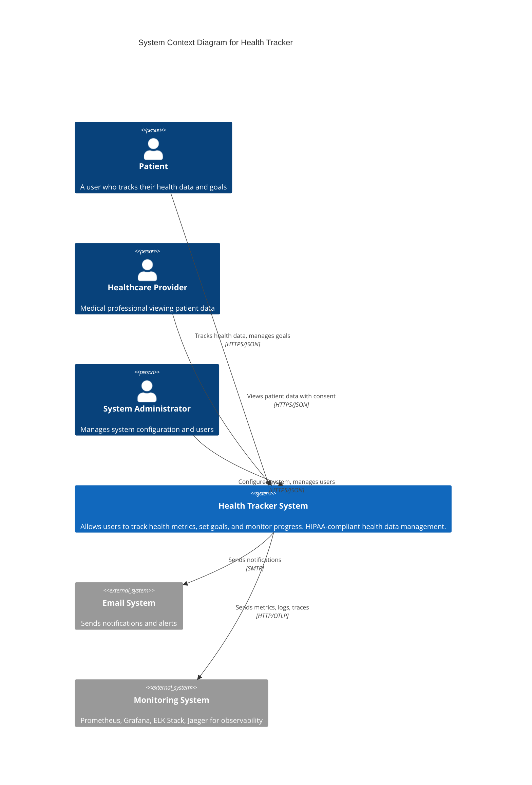

# C4 Model - Level 1: System Context Diagram

## Overview

The System Context diagram shows the Health Tracker system and how it fits into the world around it. It shows the key users and external systems that interact with the Health Tracker application.

## Diagram

## Users

### Patient

- **Role**: Primary user of the system
- **Responsibilities**:
  - Register and authenticate
  - Track daily health metrics (vitals, activities, nutrition, sleep)
  - Set and manage health goals
  - View progress dashboards
  - Update profile information
- **Authentication**: JWT-based with email/password

### Healthcare Provider

- **Role**: Medical professional with patient consent
- **Responsibilities**:
  - View patient health data (read-only)
  - Access historical trends
  - Review goal progress
- **Authentication**: JWT-based with role-based access control (RBAC)
- **Authorization**: Requires patient consent to access data

### System Administrator

- **Role**: System operator
- **Responsibilities**:
  - Manage user accounts
  - Configure system settings
  - Monitor system health
  - Review audit logs
  - Manage security policies
- **Authentication**: JWT-based with elevated privileges

## External Systems

### Email System

- **Purpose**: Notification delivery
- **Integration**: SMTP
- **Use Cases**:
  - Password reset emails
  - Goal reminders
  - System notifications
  - Weekly/monthly health summaries

### Monitoring System

- **Components**:
  - **Prometheus**: Metrics collection and alerting
  - **Grafana**: Metrics visualization and dashboards
  - **Elasticsearch**: Log storage and indexing
  - **Logstash**: Log processing and PHI masking
  - **Kibana**: Log visualization and search
  - **Jaeger**: Distributed tracing
- **Purpose**: System observability and operational intelligence
- **Integration**: HTTP APIs, OTLP protocol
- **Data Flow**:
  - Application metrics → Prometheus → Grafana
  - Application logs → Logstash → Elasticsearch → Kibana
  - Distributed traces → Jaeger collector → Jaeger UI

## Key Characteristics

### Security

- All communication over HTTPS (TLS 1.3)
- JWT authentication with token refresh
- Role-based access control (RBAC)
- PHI data encryption at rest and in transit
- Audit logging for all data access

### Compliance

- HIPAA-compliant architecture
- 7-year audit log retention
- PHI masking in logs
- Secure data handling practices

### Performance

- Target API response time: <500ms (p95)
- Frontend load time: <2 seconds
- 99.9% uptime SLA
- Horizontal scalability

## Technology Decisions

### Why Monorepo?

- Simplified dependency management
- Atomic commits across frontend/backend
- Shared configuration and tooling
- Easier refactoring across boundaries

### Why JWT?

- Stateless authentication
- Mobile-friendly
- Industry standard
- Easy to implement refresh token rotation

### Why HIPAA-Ready Architecture?

- Health data requires strict compliance
- Audit trails for all data access
- Encryption requirements
- Future-proofing for healthcare integrations
