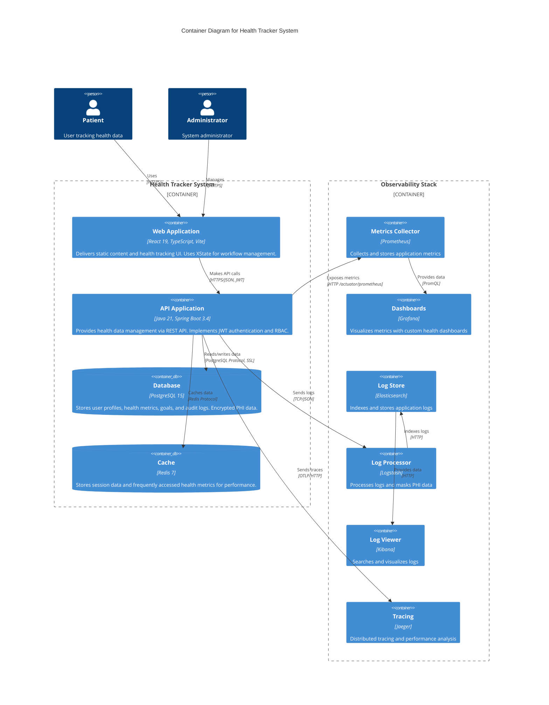

# C4 Model - Level 2: Container Diagram

## Overview

The Container diagram zooms into the Health Tracker system and shows the high-level shape of the software architecture. It shows the applications, data stores, and how they interact with each other.

## Diagram



## Containers

### Web Application (Frontend)

- **Technology**: React 19, TypeScript, Vite
- **Purpose**: Single-page application for health tracking
- **Key Features**:
  - Health data entry forms
  - Goal management interface
  - Progress dashboards and charts
  - User profile management
  - Authentication flows
- **State Management**: XState 5.x for complex health workflows
- **API Integration**: React Query + Axios with JWT interceptors
- **Deployment**: Nginx serving static files
- **Port**: 3000 (development), 80 (production)

### API Application (Backend)

- **Technology**: Java 21, Spring Boot 3.4.1
- **Purpose**: Business logic and data management
- **Key Components**:
  - REST Controllers (health metrics, goals, users, auth)
  - Service Layer (business logic)
  - Repository Layer (Spring Data JPA)
  - Security Layer (Spring Security + JWT)
  - Health Endpoints (Spring Boot Actuator)
- **Authentication**: JWT with refresh tokens
- **Authorization**: Role-based access control (RBAC)
- **Deployment**: Java application in Docker container
- **Port**: 8080

### Database (PostgreSQL)

- **Technology**: PostgreSQL 15
- **Purpose**: Primary data storage
- **Schema**:
  - **users**: User accounts and credentials
  - **health_profiles**: User health information
  - **health_metrics**: Time-series health data
  - **goals**: User health goals
  - **audit_logs**: HIPAA compliance audit trail
- **Features**:
  - Connection pooling (HikariCP)
  - Encrypted PHI columns (application-level encryption)
  - Table partitioning for time-series data
  - Automated backups
- **Port**: 5432 (internal), 5433 (exposed)

### Cache (Redis)

- **Technology**: Redis 7
- **Purpose**: Session and performance caching
- **Use Cases**:
  - JWT token blacklist (logout)
  - Session data
  - Frequently accessed health metrics
  - Rate limiting counters
- **Persistence**: AOF (Append-Only File)
- **Port**: 6379

## Observability Containers

### Prometheus

- **Purpose**: Metrics collection and alerting
- **Metrics**:
  - JVM metrics (heap, GC, threads)
  - HTTP metrics (request count, latency, errors)
  - Database pool metrics
  - Custom business metrics
- **Scrape Interval**: 15 seconds
- **Retention**: 30 days
- **Port**: 9090

### Grafana

- **Purpose**: Metrics visualization
- **Dashboards**:
  1. Application Health (JVM, DB, API metrics)
  2. Business Metrics (user activity, data entry rates)
  3. Security Monitoring (failed logins, access patterns)
  4. Infrastructure (container resources, DB performance)
- **Data Source**: Prometheus
- **Port**: 3001

### Elasticsearch

- **Purpose**: Log storage and indexing
- **Indices**:
  - `healthtracker-application-*`: General logs
  - `healthtracker-audit-*`: Audit trail (7-year retention)
  - `healthtracker-security-*`: Security events
  - `healthtracker-error-*`: Error logs
- **Retention**: ILM policy (hot/warm/cold/delete)
- **Port**: 9200

### Logstash

- **Purpose**: Log processing pipeline
- **Features**:
  - PHI data masking (email, SSN, phone, DOB)
  - Log enrichment and routing
  - Structured JSON formatting
- **Input**: TCP (port 5000)
- **Output**: Elasticsearch
- **Port**: 5000 (input), 9600 (monitoring)

### Kibana

- **Purpose**: Log search and visualization
- **Features**:
  - Full-text search across logs
  - Log pattern analysis
  - Security incident investigation
  - Audit trail queries
- **Data Source**: Elasticsearch
- **Port**: 5601

### Jaeger

- **Purpose**: Distributed tracing
- **Features**:
  - End-to-end request tracking
  - Performance bottleneck identification
  - Service dependency visualization
  - Trace sampling (10% in production)
- **Protocol**: OTLP (OpenTelemetry Protocol)
- **Port**: 16686 (UI), 4318 (collector)

## Communication Patterns

### Frontend ↔ Backend

- **Protocol**: HTTPS with JSON payloads
- **Authentication**: JWT in Authorization header
- **Error Handling**: Structured error responses
- **Retry Logic**: Automatic retry with exponential backoff

### Backend ↔ Database

- **Protocol**: PostgreSQL wire protocol over SSL
- **Connection Pool**: HikariCP (max 10 connections)
- **Transactions**: ACID guarantees
- **Migration**: Flyway for schema versioning

### Backend ↔ Cache

- **Protocol**: Redis protocol
- **Pattern**: Cache-aside
- **TTL**: Variable by data type
- **Eviction**: LRU (Least Recently Used)

### Backend ↔ Monitoring

- **Metrics**: HTTP pull (Prometheus scrapes)
- **Logs**: TCP push (async appender)
- **Traces**: HTTP push (OTLP exporter)
- **Sampling**: 10% for traces, 100% for metrics/logs

## Deployment Architecture

### Development

```
Docker Compose:
- All containers on single host
- Shared network bridge
- Volume mounts for development
- Hot reload enabled
```

### Production (Future)

```
Kubernetes:
- Multi-pod deployment
- Load balancer for frontend/backend
- StatefulSet for databases
- Horizontal pod autoscaling
- Rolling updates
```

## Security Boundaries

### Network Security

- Frontend: Public internet access (HTTPS only)
- Backend API: Internal network + public HTTPS
- Database: Internal network only
- Cache: Internal network only
- Monitoring: Internal network only

### Data Security

- All external communication: TLS 1.3
- Internal communication: SSL/TLS
- Database encryption: At-rest encryption
- Cache: No PHI stored
- Logs: PHI masked automatically

## Scalability Considerations

### Horizontal Scaling

- **Frontend**: CDN + multiple Nginx instances
- **Backend**: Multiple application instances behind load balancer
- **Database**: Read replicas for queries
- **Cache**: Redis cluster with sharding

### Vertical Scaling

- **Database**: Increase memory for larger working set
- **Backend**: Increase JVM heap size
- **Cache**: Increase memory for larger cache

### Performance Targets

- API response time: <500ms (p95)
- Frontend load time: <2 seconds
- Database query time: <100ms (p95)
- Cache hit rate: >80%
