# C4 Model - Level 3: Component Diagram

## Overview

The Component diagram zooms into the API Application container and shows the internal components, their responsibilities, and interactions. This focuses on the backend architecture built with Spring Boot.

## Diagram

```mermaid
C4Component
    title Component Diagram for API Application (Spring Boot Backend)

    Container_Boundary(api, "API Application") {
        Component(authController, "Authentication Controller", "Spring MVC Controller", "Handles login, registration, token refresh")
        Component(userController, "User Controller", "Spring MVC Controller", "Manages user profile operations")
        Component(metricsController, "Health Metrics Controller", "Spring MVC Controller", "CRUD operations for health metrics")
        Component(goalsController, "Goals Controller", "Spring MVC Controller", "Manages health goals and progress")

        Component(jwtFilter, "JWT Authentication Filter", "Spring Security Filter", "Validates JWT tokens on each request")
        Component(securityConfig, "Security Configuration", "Spring Security Config", "Configures authentication and authorization")

        Component(userService, "User Service", "Spring Service", "Business logic for user management")
        Component(metricsService, "Health Metrics Service", "Spring Service", "Business logic for health data")
        Component(goalsService, "Goals Service", "Spring Service", "Business logic for goal tracking")
        Component(jwtService, "JWT Service", "Spring Service", "Token generation and validation")
        Component(encryptionService, "Encryption Service", "Spring Service", "PHI data encryption/decryption")
        Component(auditService, "Audit Service", "Spring Service", "HIPAA audit logging")

        Component(userRepo, "User Repository", "Spring Data JPA", "Database access for users")
        Component(metricsRepo, "Health Metrics Repository", "Spring Data JPA", "Database access for metrics")
        Component(goalsRepo, "Goals Repository", "Spring Data JPA", "Database access for goals")
        Component(auditRepo, "Audit Repository", "Spring Data JPA", "Database access for audit logs")

        Component(userEntity, "User Entity", "JPA Entity", "User data model")
        Component(metricsEntity, "Health Metrics Entity", "JPA Entity", "Health metrics data model")
        Component(goalsEntity, "Goals Entity", "JPA Entity", "Goals data model")
        Component(auditEntity, "Audit Log Entity", "JPA Entity", "Audit log data model")

        Component(actuator, "Spring Boot Actuator", "Spring Boot", "Health checks and metrics endpoints")
    }

    ContainerDb_Ext(db, "PostgreSQL Database", "Relational database")
    ContainerDb_Ext(redis, "Redis Cache", "Key-value store")
    Container_Ext(prometheus, "Prometheus", "Metrics collector")

    Rel(authController, jwtService, "Uses")
    Rel(authController, userService, "Uses")
    Rel(userController, userService, "Uses")
    Rel(metricsController, metricsService, "Uses")
    Rel(goalsController, goalsService, "Uses")

    Rel(jwtFilter, jwtService, "Validates tokens")
    Rel(securityConfig, jwtFilter, "Configures")

    Rel(userService, userRepo, "Uses")
    Rel(userService, auditService, "Logs actions")
    Rel(metricsService, metricsRepo, "Uses")
    Rel(metricsService, encryptionService, "Encrypts PHI")
    Rel(metricsService, auditService, "Logs actions")
    Rel(goalsService, goalsRepo, "Uses")
    Rel(goalsService, auditService, "Logs actions")

    Rel(userRepo, userEntity, "Maps")
    Rel(metricsRepo, metricsEntity, "Maps")
    Rel(goalsRepo, goalsEntity, "Maps")
    Rel(auditRepo, auditEntity, "Maps")

    Rel(userRepo, db, "Reads/writes", "JPA/Hibernate")
    Rel(metricsRepo, db, "Reads/writes", "JPA/Hibernate")
    Rel(goalsRepo, db, "Reads/writes", "JPA/Hibernate")
    Rel(auditRepo, db, "Writes", "JPA/Hibernate")

    Rel(jwtService, redis, "Stores blacklist", "Redis Protocol")
    Rel(actuator, prometheus, "Exposes metrics", "HTTP")
```



## Controllers (API Layer)

### Authentication Controller

- **Package**: `com.healthtracker.backend.controller`
- **Endpoints**:
  - `POST /api/v1/auth/register` - User registration
  - `POST /api/v1/auth/login` - User login
  - `POST /api/v1/auth/refresh` - Token refresh
  - `POST /api/v1/auth/logout` - User logout
- **Responsibilities**:
  - Request validation
  - Response formatting
  - Error handling
- **Dependencies**: UserService, JwtService

### User Controller

- **Package**: `com.healthtracker.backend.controller`
- **Endpoints**:
  - `GET /api/v1/users/me` - Get current user profile
  - `PUT /api/v1/users/me` - Update user profile
  - `DELETE /api/v1/users/me` - Delete user account
- **Security**: Requires JWT authentication
- **Dependencies**: UserService

### Health Metrics Controller

- **Package**: `com.healthtracker.backend.controller`
- **Endpoints**:
  - `GET /api/v1/health-metrics` - Query health metrics
  - `POST /api/v1/health-metrics` - Record new metric
  - `PUT /api/v1/health-metrics/{id}` - Update metric
  - `DELETE /api/v1/health-metrics/{id}` - Delete metric
- **Query Parameters**: type, from, to, limit, offset
- **Security**: Requires JWT authentication, user can only access own data
- **Dependencies**: HealthMetricsService

### Goals Controller

- **Package**: `com.healthtracker.backend.controller`
- **Endpoints**:
  - `GET /api/v1/goals` - List user goals
  - `POST /api/v1/goals` - Create new goal
  - `PUT /api/v1/goals/{id}` - Update goal
  - `DELETE /api/v1/goals/{id}` - Delete goal
  - `GET /api/v1/goals/{id}/progress` - Get goal progress
- **Security**: Requires JWT authentication, user can only access own goals
- **Dependencies**: GoalsService

## Security Components

### JWT Authentication Filter

- **Package**: `com.healthtracker.backend.security`
- **Type**: OncePerRequestFilter
- **Responsibilities**:
  - Extract JWT from Authorization header
  - Validate token signature and expiration
  - Load user details from token
  - Set SecurityContext for the request
- **Order**: Runs before other security filters
- **Dependencies**: JwtService

### Security Configuration

- **Package**: `com.healthtracker.backend.config`
- **Type**: @Configuration
- **Responsibilities**:
  - Configure security filter chain
  - Define public vs protected endpoints
  - Configure CORS
  - Set up JWT authentication
  - Configure password encoding (BCrypt)
- **Public Endpoints**: /api/v1/auth/\*\*, /actuator/health
- **Protected Endpoints**: All others require authentication

## Services (Business Logic Layer)

### User Service

- **Package**: `com.healthtracker.backend.service`
- **Responsibilities**:
  - User registration (password hashing)
  - User profile management
  - User deletion (soft delete)
  - Email uniqueness validation
- **Transactions**: @Transactional for data consistency
- **Dependencies**: UserRepository, AuditService

### Health Metrics Service

- **Package**: `com.healthtracker.backend.service`
- **Responsibilities**:
  - Record health metrics
  - Query metrics by type and date range
  - Calculate aggregations (averages, trends)
  - Validate metric values
  - Encrypt sensitive metrics
- **Business Rules**:
  - Metrics belong to authenticated user
  - Date cannot be in the future
  - Value must be within valid range
- **Dependencies**: HealthMetricsRepository, EncryptionService, AuditService

### Goals Service

- **Package**: `com.healthtracker.backend.service`
- **Responsibilities**:
  - Create and manage goals
  - Track goal progress
  - Calculate completion percentage
  - Send goal reminders (future)
- **Business Rules**:
  - Target date must be in future
  - Target value must be positive
  - Progress calculated from health metrics
- **Dependencies**: GoalsRepository, HealthMetricsRepository, AuditService

### JWT Service

- **Package**: `com.healthtracker.backend.service`
- **Responsibilities**:
  - Generate access tokens (7-day expiration)
  - Generate refresh tokens (30-day expiration)
  - Validate token signatures
  - Extract claims from tokens
  - Manage token blacklist (logout)
- **Algorithm**: HMAC-SHA256
- **Secret**: Configured via environment variable
- **Dependencies**: Redis (for blacklist)

### Encryption Service

- **Package**: `com.healthtracker.backend.service`
- **Responsibilities**:
  - Encrypt PHI data (AES-256-GCM)
  - Decrypt PHI data
  - Key management
- **Algorithm**: AES-256 in GCM mode
- **Key**: Configured via environment variable
- **Use Cases**: Medical history, sensitive notes

### Audit Service

- **Package**: `com.healthtracker.backend.service`
- **Responsibilities**:
  - Log all PHI access (HIPAA requirement)
  - Record user actions
  - Capture IP address and timestamp
  - Support 7-year retention
- **Logged Actions**: READ, WRITE, DELETE
- **Logged Resources**: HEALTH_METRICS, GOALS, PROFILE
- **Dependencies**: AuditRepository

## Repositories (Data Access Layer)

### User Repository

- **Package**: `com.healthtracker.backend.repository`
- **Type**: JpaRepository<User, UUID>
- **Custom Queries**:
  - `findByEmail(String email)`
  - `existsByEmail(String email)`
- **Optimizations**: Index on email column

### Health Metrics Repository

- **Package**: `com.healthtracker.backend.repository`
- **Type**: JpaRepository<HealthMetrics, UUID>
- **Custom Queries**:
  - `findByUserIdAndRecordedAtBetween(UUID userId, Instant from, Instant to)`
  - `findByUserIdAndMetricType(UUID userId, String metricType)`
  - `findTop10ByUserIdOrderByRecordedAtDesc(UUID userId)`
- **Optimizations**: Composite index on (user_id, recorded_at)

### Goals Repository

- **Package**: `com.healthtracker.backend.repository`
- **Type**: JpaRepository<Goals, UUID>
- **Custom Queries**:
  - `findByUserIdAndStatus(UUID userId, String status)`
  - `findByUserIdAndEndDateAfter(UUID userId, Instant date)`
- **Optimizations**: Index on (user_id, status)

### Audit Repository

- **Package**: `com.healthtracker.backend.repository`
- **Type**: JpaRepository<AuditLog, UUID>
- **Custom Queries**:
  - `findByUserIdAndTimestampBetween(UUID userId, Instant from, Instant to)`
  - `findByResourceTypeAndAction(String resourceType, String action)`
- **Optimizations**: Index on (user_id, timestamp), partitioned by month

## Entities (Domain Model)

### User Entity

- **Table**: `users`
- **Fields**:
  - `id` (UUID, primary key)
  - `email` (String, unique)
  - `passwordHash` (String, BCrypt)
  - `roles` (List<String>)
  - `createdAt` (Instant)
  - `updatedAt` (Instant)
- **Relationships**: One-to-many with HealthMetrics, Goals, AuditLog

### Health Metrics Entity

- **Table**: `health_metrics`
- **Fields**:
  - `id` (UUID, primary key)
  - `userId` (UUID, foreign key)
  - `metricType` (String: BLOOD_PRESSURE, HEART_RATE, etc.)
  - `value` (BigDecimal)
  - `unit` (String)
  - `recordedAt` (Instant)
  - `source` (String: MANUAL, DEVICE)
  - `notes` (String, encrypted)
- **Relationships**: Many-to-one with User
- **Indexes**: (user_id, recorded_at), (user_id, metric_type)

### Goals Entity

- **Table**: `goals`
- **Fields**:
  - `id` (UUID, primary key)
  - `userId` (UUID, foreign key)
  - `goalType` (String: WEIGHT_LOSS, EXERCISE, etc.)
  - `targetValue` (BigDecimal)
  - `currentValue` (BigDecimal)
  - `unit` (String)
  - `startDate` (Instant)
  - `endDate` (Instant)
  - `status` (String: ACTIVE, COMPLETED, ABANDONED)
- **Relationships**: Many-to-one with User
- **Indexes**: (user_id, status)

### Audit Log Entity

- **Table**: `audit_logs`
- **Fields**:
  - `id` (UUID, primary key)
  - `userId` (UUID, foreign key)
  - `action` (String: READ, WRITE, DELETE)
  - `resourceType` (String: HEALTH_METRICS, GOALS, PROFILE)
  - `resourceId` (UUID)
  - `timestamp` (Instant)
  - `ipAddress` (String)
  - `userAgent` (String)
- **Relationships**: Many-to-one with User
- **Retention**: 7 years (HIPAA requirement)
- **Partitioning**: Monthly partitions for performance

## Spring Boot Actuator

### Endpoints

- `GET /actuator/health` - Application health status
- `GET /actuator/health/liveness` - Kubernetes liveness probe
- `GET /actuator/health/readiness` - Kubernetes readiness probe
- `GET /actuator/metrics` - Available metrics
- `GET /actuator/prometheus` - Prometheus metrics endpoint
- `GET /actuator/info` - Application information

### Custom Health Indicators

- Database connectivity
- Redis connectivity
- Disk space
- Custom business health checks

## Cross-Cutting Concerns

### Exception Handling

- **Global Exception Handler**: @ControllerAdvice
- **Custom Exceptions**: EntityNotFoundException, ValidationException
- **Error Response Format**:
  ```json
  {
    "error": {
      "code": "VALIDATION_ERROR",
      "message": "Invalid input data",
      "details": ["Email is required", "Password too weak"],
      "timestamp": "2025-09-30T17:00:00Z"
    }
  }
  ```

### Validation

- **Bean Validation**: @Valid, @NotNull, @Email, @Size
- **Custom Validators**: @ValidMetricType, @FutureDate
- **Validation Groups**: Create, Update

### Logging

- **Framework**: Logback with structured JSON
- **Levels**: DEBUG for development, INFO for production
- **MDC**: Correlation ID, user ID, request ID
- **Appenders**: Console, Logstash (async)
- **PHI Masking**: Automatic redaction in logs

### Transactions

- **Isolation**: READ_COMMITTED
- **Propagation**: REQUIRED (default)
- **Rollback**: On RuntimeException
- **Optimistic Locking**: @Version for concurrent updates

### Caching

- **Framework**: Spring Cache with Redis
- **Strategy**: Cache-aside
- **TTL**: Configurable per cache
- **Eviction**: LRU, manual invalidation on updates
- **Cached Data**: User profiles, frequently accessed metrics

## Component Interaction Flow

### Example: Record Health Metric

1. **Client** → `POST /api/v1/health-metrics` with JWT
2. **JwtFilter** → Validates token, sets SecurityContext
3. **HealthMetricsController** → Validates request body
4. **HealthMetricsService** → Business logic validation
5. **EncryptionService** → Encrypts sensitive notes
6. **HealthMetricsRepository** → Persists to database
7. **AuditService** → Logs WRITE action
8. **HealthMetricsController** → Returns 201 Created

### Example: User Login

1. **Client** → `POST /api/v1/auth/login` with credentials
2. **AuthController** → Validates credentials
3. **UserService** → Loads user, verifies password (BCrypt)
4. **JwtService** → Generates access + refresh tokens
5. **Redis** → Stores refresh token
6. **AuditService** → Logs LOGIN action
7. **AuthController** → Returns tokens in response

## Testing Strategy

### Unit Tests

- Service layer logic
- Validation rules
- Encryption/decryption
- JWT generation/validation
- **Framework**: JUnit 5, Mockito

### Integration Tests

- Repository queries
- Controller endpoints
- Security filters
- Database transactions
- **Framework**: Spring Boot Test, Testcontainers

### End-to-End Tests

- Complete user flows
- Cross-component interactions
- **Framework**: REST Assured, Testcontainers
