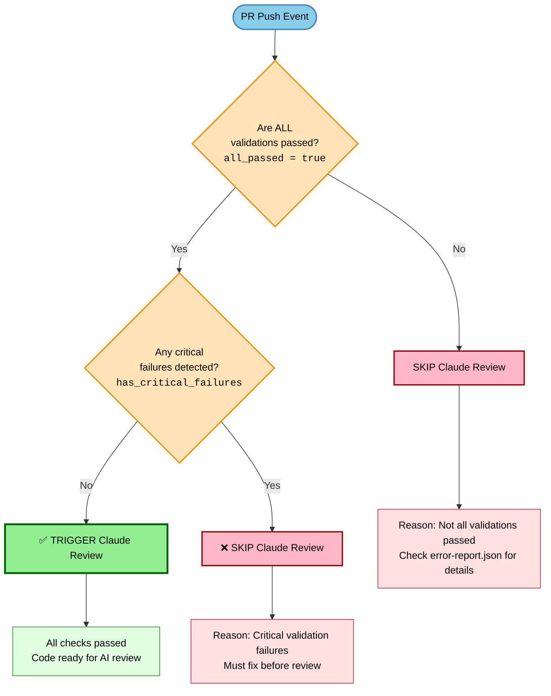
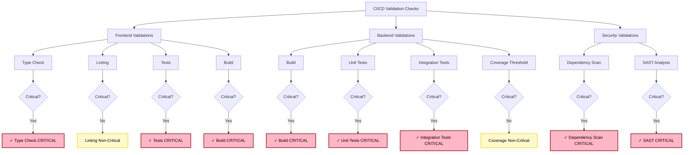
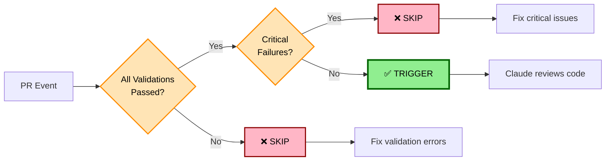
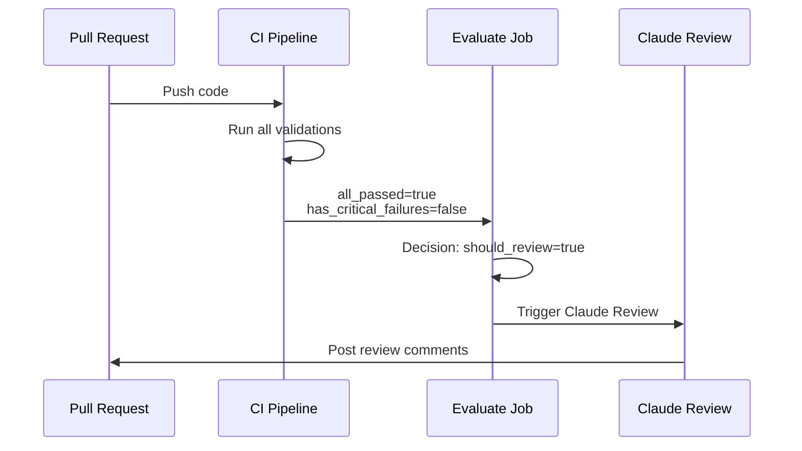
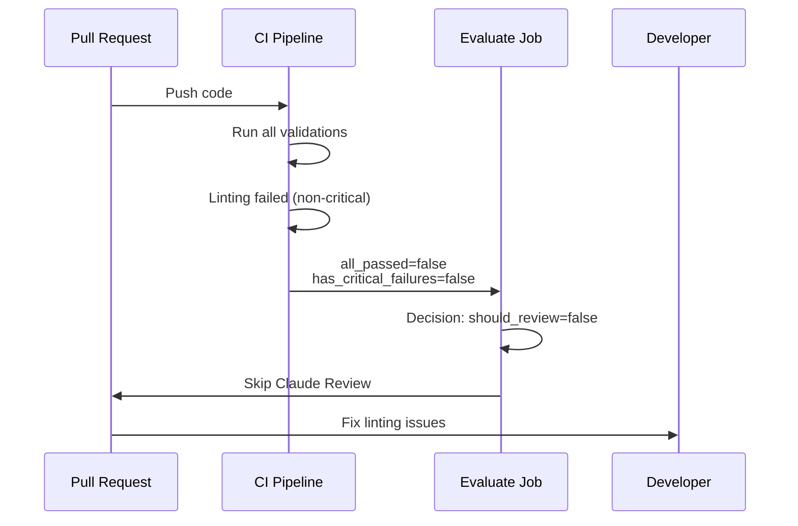
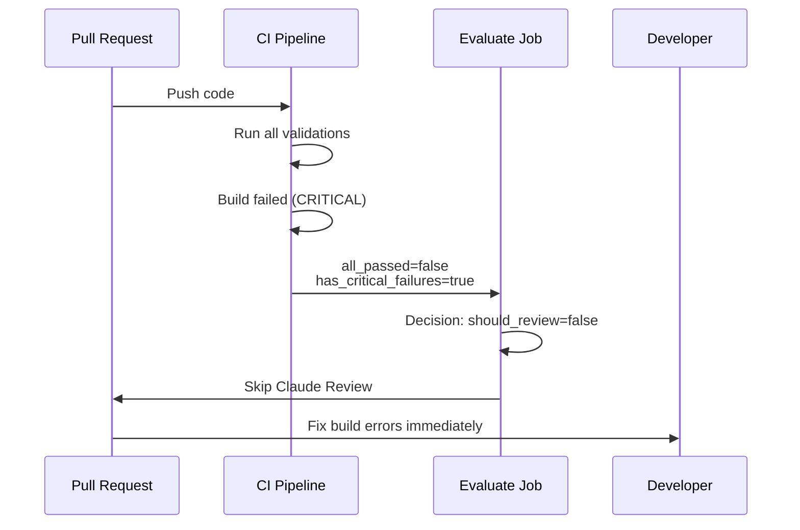
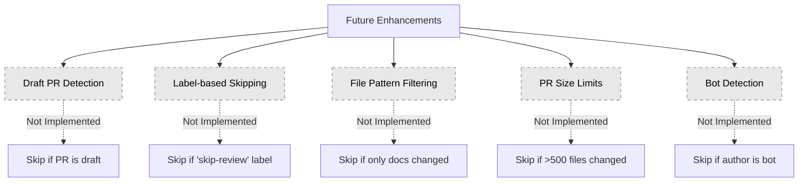
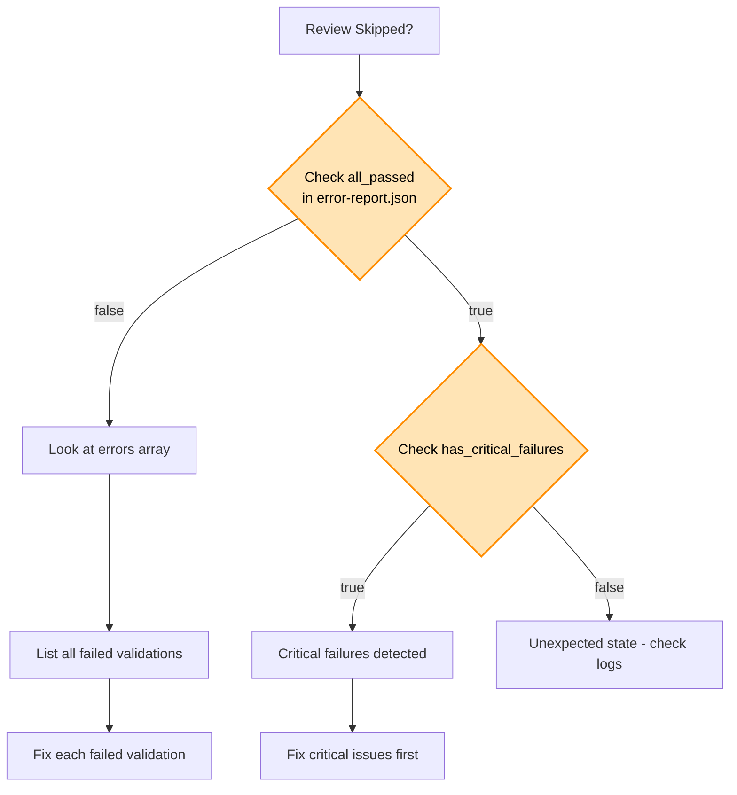

# Claude Code Review Decision Tree

## Overview

This document explains when Claude Code review triggers versus skips based on the validation results from CI pipeline checks.

## Decision Tree Diagram (Detailed)



## Validation Categories Breakdown



## Simplified Flow Chart



## Decision Logic Implementation

### Current Implementation (from `claude-review-conditional.yml`)

```bash
# Primary decision logic
if [ "${ALL_PASSED}" = "true" ]; then
    echo "should_review=true"
else
    echo "should_review=false"
fi
```

### Input Variables (from `error-report.json`)

| Variable                | Type    | Description                              |
| ----------------------- | ------- | ---------------------------------------- |
| `all_passed`            | boolean | `true` if ALL validations passed         |
| `has_critical_failures` | boolean | `true` if any critical validation failed |
| `errors`                | array   | List of validation errors with severity  |

## Decision Scenarios

### Scenario 1: All Checks Pass ✅



**Example error-report.json:**

```json
{
  "all_passed": true,
  "has_critical_failures": false,
  "errors": []
}
```

### Scenario 2: Non-Critical Failure (e.g., Linting) ❌



**Example error-report.json:**

```json
{
  "all_passed": false,
  "has_critical_failures": false,
  "errors": [
    {
      "validation": "frontend-lint",
      "severity": "warning",
      "message": "ESLint found 3 warnings"
    }
  ]
}
```

### Scenario 3: Critical Failure (e.g., Build Failed) ❌



**Example error-report.json:**

```json
{
  "all_passed": false,
  "has_critical_failures": true,
  "errors": [
    {
      "validation": "backend-build",
      "severity": "error",
      "message": "Maven build failed: compilation errors"
    }
  ]
}
```

## Critical vs Non-Critical Validations

### Critical Failures (Block Claude Review)

**Frontend:**

- ❌ Type Check Failed
- ❌ Tests Failed
- ❌ Build Failed

**Backend:**

- ❌ Build Failed
- ❌ Unit Tests Failed
- ❌ Integration Tests Failed

**Security:**

- ❌ Dependency Scan Failed
- ❌ SAST Failed

### Non-Critical Failures (Still Block Claude Review)

**Frontend:**

- ⚠️ Linting Failed

**Backend:**

- ⚠️ Coverage Threshold Not Met

> **Note:** While non-critical failures don't set `has_critical_failures=true`, they still cause `all_passed=false`, which blocks Claude review.

## Future Enhancements (Not Yet Implemented)

The following conditions are **NOT** currently implemented but may be added:



## Debugging: Why Was My Review Skipped?

### Step 1: Check CI Pipeline Status

```bash
# Navigate to GitHub Actions
# Find your PR's "Claude Code Review (Conditional)" workflow
# Click on the "evaluate" job
```

### Step 2: Examine error-report.json

```bash
# Download the error report artifact from the workflow run
# Or check the evaluate job logs for the JSON content
```

### Step 3: Identify Failed Validations



### Step 4: Common Issues and Solutions

| Issue                 | Diagnosis                             | Solution                                       |
| --------------------- | ------------------------------------- | ---------------------------------------------- |
| Frontend build failed | `frontend-build` in errors            | Run `npm run build` locally, fix errors        |
| Backend tests failed  | `backend-test` in errors              | Run `mvn test` locally, fix failing tests      |
| Linting issues        | `frontend-lint` in errors             | Run `npm run lint` and fix warnings            |
| Type errors           | `frontend-typecheck` in errors        | Run `npm run typecheck`, fix TypeScript errors |
| Security scan failed  | `dependency-scan` or `sast` in errors | Review security report, update dependencies    |
| Coverage too low      | `backend-coverage` in errors          | Add more tests to increase coverage            |

## Quick Reference

### ✅ When Claude Review TRIGGERS

```
all_passed = true
AND
has_critical_failures = false
```

### ❌ When Claude Review SKIPS

```
all_passed = false
OR
has_critical_failures = true
```

## Related Files

- **Workflow:** `/Users/francisaraujo/repos/health-tracker/.github/workflows/claude-review-conditional.yml`
- **Validation Reports:** CI artifacts `error-report.json`
- **Skip Logic:** `evaluate` job in claude-review-conditional.yml

---

**Last Updated:** 2025-10-19
**Status:** Current Implementation (v1.0)
