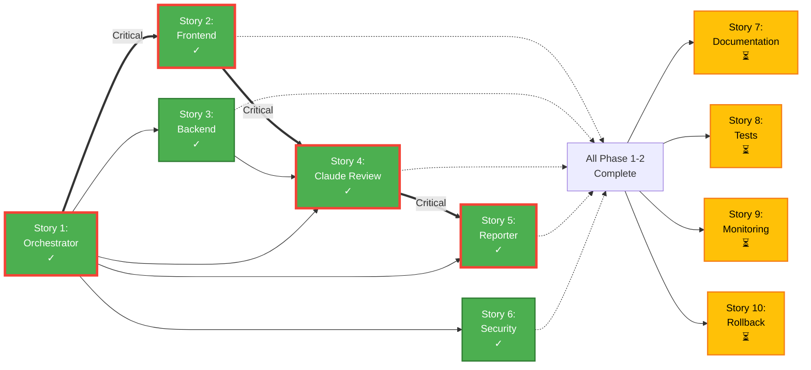

# Epic Story Dependency Graph

## Comprehensive Dependency Diagram with Phases

```mermaid
graph TB
    %% Define styles for phases
    classDef phase1 fill:#4CAF50,stroke:#2E7D32,stroke-width:3px,color:#fff
    classDef phase2 fill:#2196F3,stroke:#1565C0,stroke-width:3px,color:#fff
    classDef phase3 fill:#FF9800,stroke:#E65100,stroke-width:3px,color:#fff
    classDef done fill:#4CAF50,stroke:#2E7D32,stroke-width:2px,color:#fff
    classDef doing fill:#FFC107,stroke:#F57F17,stroke-width:2px,color:#000
    classDef critical fill:#F44336,stroke:#C62828,stroke-width:4px,color:#fff

    %% Phase 1: Foundation (Green)
    subgraph Phase1["🔨 Phase 1: Foundation"]
        S1["Story 1:<br/>Validation Orchestrator<br/>Workflow<br/>(DONE)"]
        S2["Story 2:<br/>Frontend Validation<br/>Pipeline<br/>(DONE)"]
        S3["Story 3:<br/>Backend Validation<br/>Pipeline<br/>(DONE)"]
        S6["Story 6:<br/>Security & Dependency<br/>Validation<br/>(DONE)"]
    end

    %% Phase 2: Integration (Blue)
    subgraph Phase2["🔗 Phase 2: Integration"]
        S4["Story 4:<br/>Conditional Claude<br/>Code Review<br/>(DONE)"]
        S5["Story 5:<br/>Validation Status<br/>Reporter<br/>(DONE)"]
    end

    %% Phase 3: Enhancement (Orange)
    subgraph Phase3["⚡ Phase 3: Enhancement"]
        S7["Story 7:<br/>Pipeline Documentation<br/>& Runbooks<br/>(DOING)"]
        S8["Story 8:<br/>Pipeline Integration<br/>Tests<br/>(DOING)"]
        S9["Story 9:<br/>Performance Monitoring<br/>& Optimization<br/>(DOING)"]
        S10["Story 10:<br/>Rollback & Recovery<br/>Mechanisms<br/>(DOING)"]
    end

    %% Critical Path Dependencies (thick red arrows)
    S1 ===|Critical Path|==> S2
    S2 ===|Critical Path|==> S4
    S4 ===|Critical Path|==> S5

    %% Other Phase 1 Dependencies
    S1 -->|Foundation| S3
    S1 -->|Foundation| S6

    %% Phase 2 Dependencies
    S3 -->|Requires Backend| S4
    S1 -->|Requires Orchestrator| S4
    S1 -->|Requires Orchestrator| S5

    %% Phase 3 Dependencies (all depend on Phase 1 & 2)
    S1 -.->|Complete Foundation| S7
    S2 -.->|Complete Frontend| S7
    S3 -.->|Complete Backend| S7
    S4 -.->|Complete Integration| S7
    S5 -.->|Complete Reporting| S7
    S6 -.->|Complete Security| S7

    S1 -.->|Complete Foundation| S8
    S2 -.->|Complete Frontend| S8
    S3 -.->|Complete Backend| S8
    S4 -.->|Complete Integration| S8
    S5 -.->|Complete Reporting| S8
    S6 -.->|Complete Security| S8

    S1 -.->|Complete Foundation| S9
    S2 -.->|Complete Frontend| S9
    S3 -.->|Complete Backend| S9
    S4 -.->|Complete Integration| S9
    S5 -.->|Complete Reporting| S9
    S6 -.->|Complete Security| S9

    S1 -.->|Complete Foundation| S10
    S2 -.->|Complete Frontend| S10
    S3 -.->|Complete Backend| S10
    S4 -.->|Complete Integration| S10
    S5 -.->|Complete Reporting| S10
    S6 -.->|Complete Security| S10

    %% Apply styles
    class S1,S2,S3,S4,S5,S6 done
    class S7,S8,S9,S10 doing
    class S1,S2,S4,S5 critical
```

## Simplified Dependency Diagram (Cleaner View)



## Gantt Chart View (Timeline Perspective)

```mermaid
gantt
    title Epic Implementation Timeline
    dateFormat YYYY-MM-DD

    section Phase 1: Foundation
    Story 1: Orchestrator          :done, s1, 2024-01-01, 5d
    Story 2: Frontend Pipeline      :done, s2, after s1, 5d
    Story 3: Backend Pipeline       :done, s3, after s1, 5d
    Story 6: Security Validation    :done, s6, after s1, 5d

    section Phase 2: Integration
    Story 4: Claude Review Trigger  :done, s4, after s2 s3, 7d
    Story 5: Status Reporter        :done, s5, after s4, 5d

    section Phase 3: Enhancement
    Story 7: Documentation          :active, s7, after s5, 7d
    Story 8: Integration Tests      :active, s8, after s5, 10d
    Story 9: Monitoring             :active, s9, after s5, 10d
    Story 10: Rollback Mechanisms   :active, s10, after s5, 8d
```

## Legend and Symbols

### Node Colors

- **Green (✓)**: Completed stories (DONE)
- **Yellow (⏳)**: In-progress stories (DOING)

### Arrow Types

- **Thick Double Arrow (==>)**: Critical path dependencies
- **Solid Arrow (-->)**: Direct dependencies
- **Dotted Arrow (-.->)**: Phase completion dependencies

### Phase Colors (First Diagram)

- **🔨 Green**: Phase 1 - Foundation (Core infrastructure)
- **🔗 Blue**: Phase 2 - Integration (Connecting components)
- **⚡ Orange**: Phase 3 - Enhancement (Quality & resilience)

### Critical Path (Red Border)

```
Story 1 → Story 2 → Story 4 → Story 5
```

## Parallelization Opportunities

### Phase 1

After Story 1 is complete, these can run in parallel:

- Story 2 (Frontend Validation)
- Story 3 (Backend Validation)
- Story 6 (Security Validation)

### Phase 3

After Phase 1 & 2 complete, these can run in parallel:

- Story 7 (Documentation)
- Story 8 (Integration Tests)
- Story 9 (Monitoring)
- Story 10 (Rollback)

## Implementation Sequence

### Week 1-2: Foundation Layer

1. **Start**: Story 1 (Orchestrator) - Foundation for everything
2. **Parallel**: Stories 2, 3, 6 - Build validation pipelines

### Week 3-4: Integration Layer

3. **Sequential**: Story 4 - Requires Stories 1, 2, 3 complete
4. **Sequential**: Story 5 - Requires Stories 1, 4 complete

### Week 5-7: Enhancement Layer

5. **Parallel**: Stories 7, 8, 9, 10 - All can start together

## Dependency Matrix

| Story | Depends On | Can Parallelize With   |
| ----- | ---------- | ---------------------- |
| S1    | None       | None (first)           |
| S2    | S1         | S3, S6                 |
| S3    | S1         | S2, S6                 |
| S6    | S1         | S2, S3                 |
| S4    | S1, S2, S3 | None (blocker for S5)  |
| S5    | S1, S4     | None (last of Phase 2) |
| S7    | S1-S6      | S8, S9, S10            |
| S8    | S1-S6      | S7, S9, S10            |
| S9    | S1-S6      | S7, S8, S10            |
| S10   | S1-S6      | S7, S8, S9             |

## Risk Analysis

### Critical Path Risks

- **Story 1**: Highest risk - blocks everything
- **Story 2**: Blocks Story 4 (integration)
- **Story 4**: Blocks Story 5 (reporting)
- **Story 5**: Blocks all Phase 3 work

### Mitigation Strategies

1. Prioritize Story 1 quality and early completion
2. Assign senior developers to critical path stories
3. Start Phase 3 planning early (during Phase 2)
4. Maintain parallel work on non-critical path items

## Usage Instructions

### For Project Managers

- Focus on critical path (red bordered items) for schedule management
- Use parallelization opportunities to optimize timeline
- Monitor Phase 3 as it has 4 concurrent stories

### For Development Teams

- Start with Gantt chart for sprint planning
- Reference dependency matrix for task ordering
- Use comprehensive diagram for understanding overall architecture

### Rendering

1. Copy any of the above Mermaid code blocks
2. Paste into:
   - GitHub markdown files (auto-renders)
   - [Mermaid Live Editor](https://mermaid.live)
   - VS Code with Mermaid extension
   - Notion, Confluence, or other tools with Mermaid support
