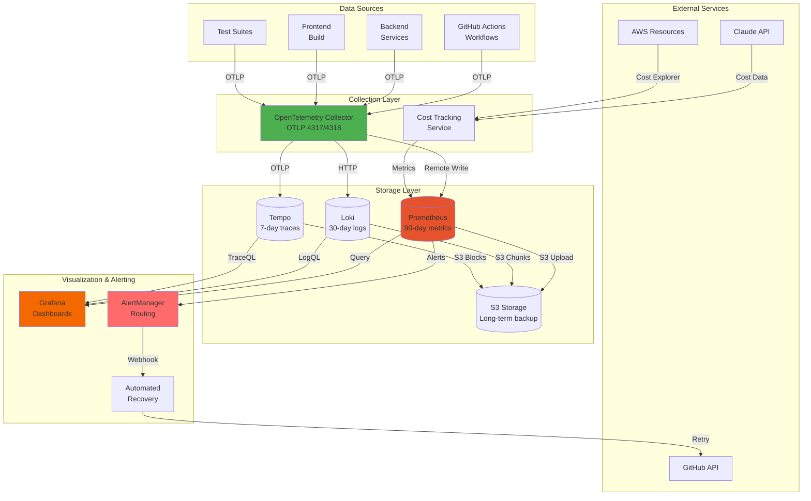

# Observability Stack Architecture

## Executive Summary

The observability stack provides comprehensive monitoring, logging, and tracing for the Health Tracker CI/CD pipeline. Built on industry-standard open-source tools (OpenTelemetry, Prometheus, Grafana, Loki, Tempo), it delivers real-time visibility into pipeline performance, cost tracking, and automated recovery capabilities.

**Key Capabilities:**
- 📊 **Metrics**: 90-day retention with Prometheus, 100k+ samples/sec
- 📝 **Logs**: 30-day centralized logging with Loki, structured JSON format
- 🔍 **Traces**: 7-day distributed tracing with Tempo, 10% sampling
- 📈 **Dashboards**: 4 role-based Grafana dashboards (Executive, Ops, Dev, Cost)
- 🔔 **Alerting**: Intelligent routing via AlertManager (Slack, PagerDuty, Email)
- 🔧 **Self-Healing**: Automated recovery for common pipeline failures

---

## System Architecture

### High-Level Overview



### Data Flow

#### 1. Metrics Flow
```
GitHub Actions → OpenTelemetry SDK → OTel Collector → Prometheus → Grafana
                                                     ↓
                                                   S3 (Thanos)
```

#### 2. Logs Flow
```
GitHub Actions → Structured Logs → OTel Collector → Loki → Grafana
                                                     ↓
                                                   S3 (Chunks)
```

#### 3. Traces Flow
```
GitHub Actions → OTLP Spans → OTel Collector → Tempo → Grafana
                                                 ↓
                                               S3 (Blocks)
```

#### 4. Alert & Recovery Flow
```
Prometheus → Alert Rules → AlertManager → Webhook → Recovery Service → GitHub API
                          ↓
                        Slack/PagerDuty/Email
```

---

## Component Specifications

### OpenTelemetry Collector

**Purpose**: Central telemetry collection and routing hub

**Version**: `otel/opentelemetry-collector-contrib:0.96.0`

**Deployment**:
- Kubernetes StatefulSet with 3 replicas
- Anti-affinity rules for high availability
- Resource requests: 500m CPU, 512Mi memory
- Resource limits: 2 CPU, 2Gi memory

**Receivers**:
- OTLP gRPC: `0.0.0.0:4317`
- OTLP HTTP: `0.0.0.0:4318`
- Health check: `0.0.0.0:13133`

**Processors**:
- **batch**: Aggregates telemetry (10s timeout, 1024 batch size)
- **memory_limiter**: Prevents OOM (1GB limit, 750MB spike limit)
- **k8s_attributes**: Enriches with pod metadata
- **resource_detection**: Adds cloud provider info

**Exporters**:
- Prometheus: Remote write endpoint
- Loki: HTTP endpoint with tenant headers
- Tempo: OTLP with compression

**Key Configurations**:
```yaml
receivers:
  otlp:
    protocols:
      grpc:
        endpoint: 0.0.0.0:4317
      http:
        endpoint: 0.0.0.0:4318

processors:
  batch:
    timeout: 10s
    send_batch_size: 1024

  memory_limiter:
    check_interval: 1s
    limit_mib: 1024
    spike_limit_mib: 750

  k8s_attributes:
    extract:
      metadata:
        - k8s.pod.name
        - k8s.namespace.name
        - k8s.node.name

exporters:
  prometheus:
    endpoint: prometheus.observability.svc:9090

  loki:
    endpoint: http://loki.observability.svc:3100/loki/api/v1/push

  tempo:
    endpoint: tempo.observability.svc:4317
```

**Health & Monitoring**:
- `/health/status` endpoint for liveness
- zpages extension for debugging (`/debug/servicez`)
- Self-monitoring metrics exposed on `:8888/metrics`

**HPA Configuration**:
- Min replicas: 2, Max replicas: 10
- CPU target: 70%
- Memory target: 80%
- Custom metric: queue size

---

### Prometheus

**Purpose**: Time-series metrics storage and query engine

**Version**: `prom/prometheus:v2.48.0`

**Deployment**:
- Kubernetes StatefulSet with 2 replicas
- Persistent volumes: 500GB per replica
- Resource requests: 2 CPU, 4Gi memory
- Resource limits: 4 CPU, 8Gi memory

**Retention Policy**:
- Time-based: 90 days (`--storage.tsdb.retention.time=90d`)
- Size-based: 450GB (`--storage.tsdb.retention.size=450GB`)
- WAL compression: Enabled
- Compaction: Daily

**Storage Backend**:
- Local TSDB for active data
- Thanos sidecar for S3 long-term storage
- Downsampling: 5m and 1h resolutions
- S3 bucket lifecycle: 2 years

**Service Discovery**:
- **Kubernetes SD**: Automatic pod/service discovery
- **File SD**: Static targets
- **DNS SD**: External services

**Recording Rules**:
```yaml
groups:
  - name: pipeline_metrics
    interval: 60s
    rules:
      - record: pipeline:duration:p95
        expr: histogram_quantile(0.95, pipeline_duration_seconds_bucket)

      - record: pipeline:success_rate
        expr: sum(rate(pipeline_runs_total{status="success"}[5m])) / sum(rate(pipeline_runs_total[5m]))
```

**Query Performance**:
- Dashboard queries: <2s for 24h range
- Heavy aggregations: <10s for 90d range
- Concurrent queries: 100+

---

### Loki

**Purpose**: Centralized log aggregation and search

**Version**: `grafana/loki:2.9.4`

**Deployment**:
- Kubernetes StatefulSet (single binary mode)
- Resource requests: 1 CPU, 2Gi memory
- Resource limits: 2 CPU, 4Gi memory
- Persistent volume for WAL: 50GB

**Retention Policy**:
- Global retention: 30 days
- Per-tenant overrides supported
- Compactor runs daily
- Deletion API enabled

**Storage Configuration**:
```yaml
schema_config:
  configs:
    - from: 2024-01-01
      store: boltdb-shipper
      object_store: s3
      schema: v11

storage_config:
  boltdb_shipper:
    active_index_directory: /loki/index
    cache_location: /loki/cache
  aws:
    s3: s3://loki-logs
    region: us-east-1
```

**Log Pipeline**:
- JSON parser for structured logs
- Regex extractors for GitHub Actions format
- Label extraction with cardinality limits
- Automatic trace ID extraction

**Multi-Tenancy**:
- Tenant isolation via `X-Scope-OrgID` header
- Tenants: `github-actions`, `development`, `default`
- Per-tenant rate limits

**Query Performance**:
- LogQL queries: <5s for 24h range
- Search optimized with indexes
- Cache enabled for frequently accessed logs

---

### Tempo

**Purpose**: Distributed tracing storage and query

**Version**: `grafana/tempo:2.3.1`

**Deployment Architecture**:
- **Distributor**: Receives OTLP traces (3 replicas)
- **Ingester**: Writes traces to storage (StatefulSet, 3 replicas)
- **Querier**: Serves trace queries (3 replicas)
- **Compactor**: Compacts blocks (CronJob, daily)

**Retention Policy**:
- Block retention: 7 days
- Sampling: 10% probabilistic (adjustable)
- Tail-based sampling: Always sample errors and slow requests

**Storage Configuration**:
```yaml
storage:
  trace:
    backend: s3
    s3:
      bucket: tempo-traces
      region: us-east-1
    wal:
      path: /var/tempo/wal
    pool:
      max_workers: 100
      queue_depth: 10000

compactor:
  compaction:
    block_retention: 168h  # 7 days
```

**Features**:
- Service graph generation
- Trace-to-metrics correlation (exemplars)
- Trace-to-logs correlation (trace IDs in logs)
- Search by trace ID, service, duration

**Query Performance**:
- Single trace lookup: <3s
- Search queries: <10s
- Service graph: Real-time

---

### Grafana

**Purpose**: Unified visualization and exploration

**Version**: `grafana/grafana:10.2.3`

**Deployment**:
- Kubernetes Deployment with 2 replicas
- Resource requests: 500m CPU, 1Gi memory
- Persistent volume for dashboards: 10GB

**Datasources**:
1. **Prometheus**: Metrics queries, alerting
2. **Loki**: Log exploration, search
3. **Tempo**: Trace visualization, service graph
4. **Derived fields**: Automatic trace ID linking

**Dashboard Hierarchy**:

1. **Executive Dashboard**:
   - Pipeline health score
   - Success rate trends
   - Cost vs. budget
   - Active alerts

2. **Operations Dashboard**:
   - Real-time pipeline status
   - Workflow duration heatmap
   - Error rate by stage
   - Resource utilization

3. **Development Dashboard**:
   - Build duration by workflow
   - Test execution time
   - Flaky test detection
   - Trace viewer

4. **Cost Dashboard**:
   - Daily cost trend
   - Cost breakdown by service
   - Claude API token usage
   - Cost anomalies

**Features**:
- Mobile-responsive design
- Drill-down capabilities
- Dynamic variables and filters
- Alert annotations
- Dashboard versioning (Git backup)

---

### AlertManager

**Purpose**: Alert routing and notification management

**Version**: `prom/alertmanager:v0.26.0`

**Deployment**:
- HA setup with 2 replicas
- Gossip protocol for cluster state
- Resource requests: 100m CPU, 128Mi memory

**Routing Rules**:
```yaml
route:
  receiver: 'default'
  group_by: ['alertname', 'workflow']
  group_wait: 30s
  group_interval: 5m
  repeat_interval: 4h

  routes:
    - match:
        severity: critical
      receiver: pagerduty
      continue: true

    - match:
        severity: high
      receiver: slack-high
      continue: true
```

**Receivers**:
- **PagerDuty**: Critical/High severity
- **Slack**: High/Medium severity (#pipeline-alerts)
- **Email**: All severities (devops@company.com)
- **Webhook**: Automated recovery system

**Features**:
- Alert grouping and deduplication
- Silence rules for maintenance
- Inhibition rules (suppress cascading alerts)
- Alert templates with runbook links

---

### Automated Recovery System

**Purpose**: Self-healing for common pipeline failures

**Components**:
- Webhook receiver (Spring Boot service)
- Recovery orchestrator
- Circuit breaker for external services
- Multiple recovery handlers

**Recovery Handlers**:
1. **Workflow Retry**: Automatically retries failed workflows via GitHub API
2. **Rate Limit**: Exponential backoff for rate limit errors (1s, 2s, 4s)
3. **Circuit Breaker**: Protects GitHub API from cascading failures

**Metrics**:
- `recovery_attempts_total`: Total recovery attempts
- `recovery_success_total`: Successful recoveries
- `recovery_failure_total`: Failed recoveries
- `recovery_duration_seconds`: Recovery timing

---

## Data Retention & Storage

| Component | Retention | Storage | Daily Volume | Total Size |
|-----------|-----------|---------|--------------|------------|
| Prometheus | 90 days | Local TSDB + S3 | ~5GB | ~450GB |
| Loki | 30 days | S3 chunks | ~2GB | ~60GB |
| Tempo | 7 days | S3 blocks | ~500MB | ~3.5GB |
| Grafana | Permanent | PVC | ~10MB | ~10GB |
| AlertManager | 30 days | PVC | ~1MB | ~30MB |

**Total Storage**: ~525GB active + unlimited S3 archival

---

## Network Architecture

### Internal Communication

```
Component            Port    Protocol    Purpose
-------------------- ------- ----------- ---------------------------
OTel Collector       4317    gRPC        OTLP traces/metrics/logs
OTel Collector       4318    HTTP        OTLP traces/metrics/logs
OTel Collector       13133   HTTP        Health checks
OTel Collector       8888    HTTP        Metrics (self-monitoring)

Prometheus           9090    HTTP        Query API & UI
AlertManager         9093    HTTP        UI & API
AlertManager         9094    TCP         Gossip protocol (HA)

Loki                 3100    HTTP        Push/Query API
Tempo Distributor    4317    gRPC        OTLP trace ingestion
Tempo Querier        3200    HTTP        Query API

Grafana              3000    HTTP        UI & API
Recovery Service     8080    HTTP        Webhook endpoint
```

### External Communication

```
Service              Direction   Purpose
-------------------- ----------- ----------------------------
GitHub API           Outbound    Workflow retry, run metadata
Claude API           Inbound     Cost tracking
AWS Cost Explorer    Outbound    Infrastructure cost data
Slack API            Outbound    Alert notifications
PagerDuty API        Outbound    Incident creation
```

---

## Security Architecture

### Authentication & Authorization

- **Grafana**: OAuth2 (GitHub), local accounts
- **Prometheus**: Basic auth for API endpoints
- **AlertManager**: Webhook secret validation
- **Recovery Service**: Public webhook endpoint (IP allowlist recommended)

### TLS Configuration

- **Internal**: mTLS between OTel Collector and backends
- **External**: TLS for Grafana UI (Let's Encrypt)
- **Webhooks**: HTTPS for AlertManager notifications

### Secrets Management

```bash
kubectl create secret generic observability-secrets \
  --from-literal=github-token=ghp_xxx \
  --from-literal=prometheus-password=xxx \
  --from-literal=alertmanager-webhook-secret=xxx
```

### Network Policies

- OTel Collector: Allow ingress from all namespaces
- Prometheus/Loki/Tempo: Allow ingress only from OTel Collector and Grafana
- Grafana: Allow ingress from LoadBalancer
- AlertManager: Allow ingress from Prometheus

---

## Scalability & Performance

### Horizontal Scaling

| Component | Min Replicas | Max Replicas | Trigger |
|-----------|--------------|--------------|---------|
| OTel Collector | 2 | 10 | CPU > 70%, Queue depth > 1000 |
| Prometheus | 2 | 2 | N/A (vertical scale) |
| Loki | 1 | 5 | Ingestion rate > 10k logs/sec |
| Tempo Distributor | 3 | 10 | Trace rate > 1k/sec |
| Grafana | 2 | 5 | Concurrent users > 50 |

### Performance Benchmarks

- **OTel Collector**: 100k samples/sec with <50ms latency
- **Prometheus**: 10M active series, <2s query latency
- **Loki**: 5k logs/sec ingestion, <5s search latency
- **Tempo**: 1k traces/sec, <3s trace retrieval
- **Grafana**: 100 concurrent users, <1s dashboard load

---

## Disaster Recovery

### Backup Strategy

1. **Prometheus**:
   - Daily snapshots to S3
   - Thanos long-term storage
   - Retention: 2 years

2. **Grafana**:
   - Dashboard JSON backup to Git (hourly)
   - Database backup daily
   - Retention: Permanent

3. **Loki**:
   - Chunks automatically backed up to S3
   - No manual backup required

4. **Tempo**:
   - Blocks automatically uploaded to S3
   - No manual backup required

### Recovery Procedures

**RTO (Recovery Time Objective)**: 1 hour
**RPO (Recovery Point Objective)**: 1 hour

Detailed recovery procedures in: `infrastructure/kubernetes/DISASTER-RECOVERY.md`

---

## Monitoring the Monitors

The observability stack monitors itself:

- **OTel Collector** self-monitoring metrics
- **Prometheus** health checks and TSDB stats
- **Loki** ingestion rate and query performance
- **Tempo** trace ingestion and compaction status
- **Grafana** datasource health
- **AlertManager** notification delivery rates

**Meta-Dashboard**: `observability-health` in Grafana

---

## References

- [OpenTelemetry Docs](https://opentelemetry.io/docs/)
- [Prometheus Best Practices](https://prometheus.io/docs/practices/)
- [Loki Documentation](https://grafana.com/docs/loki/latest/)
- [Tempo Documentation](https://grafana.com/docs/tempo/latest/)
- [Grafana Dashboards](https://grafana.com/docs/grafana/latest/)

---

**Last Updated**: 2025-10-22
**Authors**: DevOps Team
**Status**: Production
