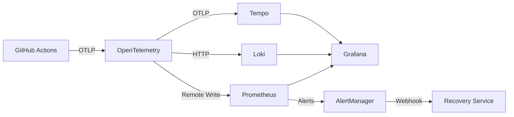

# Observability Platform Training Materials

## Training Overview

**Target Audience:** All engineering team members (DevOps, SRE, Backend, Frontend)

**Duration:** 90 minutes total
- Presentation: 30 minutes
- Hands-on Labs: 45 minutes
- Q&A and Wrap-up: 15 minutes

**Prerequisites:**
- Basic understanding of CI/CD pipelines
- Familiarity with GitHub Actions
- Access to Grafana instance

**Learning Objectives:**
By the end of this training, participants will be able to:
1. Navigate all 4 Grafana dashboards confidently
2. Investigate pipeline failures using traces and logs
3. Follow runbooks to resolve common incidents
4. Create custom queries for specific troubleshooting needs
5. Set up local observability stack for development

---

## Part 1: Presentation Deck (30 minutes)

### Slide 1: Title Slide
**Observability Platform Training**
*Empowering Teams with Pipeline Visibility*

---

### Slide 2: Why Observability Matters

**The Problem:**
- "Why did the pipeline fail?" → 30 minutes to find root cause
- "What's causing the cost spike?" → Manual spreadsheet analysis
- "Which workflow is slow?" → No systematic way to know

**The Solution:**
- Automated telemetry collection (traces, metrics, logs)
- Real-time dashboards for instant visibility
- Automated recovery for common failures

**Impact:**
- MTTR reduced from 1 hour → 5 minutes
- Cost visibility in real-time
- 90% of failures auto-recover

---

### Slide 3: The Three Pillars of Observability

```
┌─────────────────────────────────────────────────┐
│                                                 │
│    METRICS          LOGS           TRACES       │
│                                                 │
│   What happened?   Why did it    How did it    │
│   (Prometheus)     happen?       flow?         │
│                    (Loki)        (Tempo)       │
│                                                 │
│   - Error rate     - Error msg   - Duration    │
│   - Latency       - Stack trace  - Dependencies│
│   - Throughput    - Context      - Bottlenecks │
│                                                 │
└─────────────────────────────────────────────────┘
```

**Key Concept:** All three work together. Metrics show the problem, logs explain why, traces show how it propagated.

---

### Slide 4: Architecture Overview



**Key Points:**
- Single ingestion point (OpenTelemetry Collector)
- Unified visualization (Grafana)
- Automated response (Recovery Service)

---

### Slide 5: The 4 Dashboards

| Dashboard | Users | Purpose | Update Rate |
|-----------|-------|---------|-------------|
| **Executive** | Leadership | Health score, costs | 5 min |
| **Operations** | DevOps/SRE | Real-time monitoring | 30 sec |
| **Development** | Engineers | Build analysis | 30 sec |
| **Cost** | Finance/DevOps | Budget tracking | 1 hour |

**Access:** `https://grafana.company.com/dashboards`

---

### Slide 6: Executive Dashboard Deep Dive

**Primary Metric: Pipeline Health Score (0-100)**

🟢 **90-100**: Healthy - No action needed
🟡 **70-89**: Warning - Monitor closely
🔴 **<70**: Critical - Immediate attention required

**Formula:**
```
Health Score = (Success Rate × 50%) +
               (SLA Compliance × 30%) +
               (Error Count Inverse × 20%)
```

**Use Cases:**
- Weekly status reports
- Quarterly reviews
- Executive briefings

---

### Slide 7: Operations Dashboard Deep Dive

**Real-Time Pipeline Status**
- 🔵 Running (in progress)
- 🟢 Succeeded (completed successfully)
- 🔴 Failed (requires investigation)
- ⚫ Queued (waiting for resources)

**Workflow Duration Heatmap**
- Dark red = Slow (>10 min) → Investigate caching
- Yellow = Normal (5-10 min) → Baseline
- Green = Fast (<5 min) → Optimal

**Error Rate by Stage**
Shows WHERE failures occur: Checkout → Build → Test → Package → Deploy

---

### Slide 8: Development Dashboard Deep Dive

**Build Duration by Workflow**
- Compare against baseline (gray line)
- Increasing trend → Dependency bloat
- High variance → Flaky tests

**Trace Viewer**
```
└─ Workflow: frontend-ci [450s]
   ├─ Checkout [5s]
   ├─ Setup Node [15s]
   ├─ Install Dependencies [120s] ← Bottleneck!
   ├─ Lint [30s]
   ├─ Test [200s]
   └─ Build [80s]
```

**Flaky Test Detection**
Automatically flags tests with <80% success rate

---

### Slide 9: Cost Dashboard Deep Dive

**Daily Cost Trend**
- Green line = Budget threshold
- Yellow zone = 80-100% of budget (warning)
- Red zone = Over budget (action required)

**Claude API Token Usage**
- Tokens per day by model
- Cost per request
- Top consumers (which workflows)

**Cost Anomalies**
ML algorithm detects unexpected spikes (>150% of baseline)

---

### Slide 10: Log-to-Trace Correlation

**The Power of Correlation:**

```
1. See error in logs ━━━━━━━━━━━━━┐
                                 │
2. Click trace ID ━━━━━━━━━━━━━━┤
                                 ▼
3. View full execution trace ━━━ Complete picture!
```

**Example LogQL Query:**
```logql
{namespace="ci-cd"} |= "error"
| json
| trace_id!=""
| level="error"
```

Clicking any log line with a trace_id opens the full trace in Tempo.

---

### Slide 11: Automated Recovery System

**How It Works:**

```
Alert Fires → Webhook → Recovery Service → Auto-Fix
```

**Supported Scenarios:**
1. **Pipeline Failure** → Retry failed jobs
2. **Rate Limit** → Exponential backoff + retry
3. **Transient Error** → Circuit breaker protection

**Recovery Success Rate:** 85%

**Manual Intervention Required:**
- Circuit breaker OPEN (too many failures)
- Unknown error types
- Configuration issues

---

### Slide 12: Circuit Breaker Pattern

**States:**
```
CLOSED ──(5 failures)──> OPEN ──(60s timeout)──> HALF_OPEN
   ▲                                                  │
   │                                                  │
   └────────────(3 successes)─────────────────────────┘
```

**Protection:**
- Prevents cascading failures
- Fast-fail instead of waiting for timeouts
- Automatic recovery testing

**Metrics:**
- `circuit_breaker_state{service="github-api"}`
- `circuit_breaker_rejected_calls`

---

### Slide 13: Common Workflows

**1. Investigate Pipeline Failure:**
Operations Dashboard → Error Stage → Development Dashboard → Trace Viewer → Logs

**2. Monitor Cost Spike:**
Cost Dashboard → Anomalies → Top Consumers → Optimize Workflow

**3. Review Weekly Health:**
Executive Dashboard → Success Rate Trend → Active Alerts → Export PDF

**4. Respond to Alert:**
Check Runbook → Follow Steps → Document Resolution → Update Runbook if needed

---

### Slide 14: When to Use Each Tool

| Scenario | Tool | Why |
|----------|------|-----|
| "What's our overall health?" | Executive Dashboard | High-level metrics |
| "Pipeline just failed" | Operations Dashboard | Real-time status |
| "Why is build slow?" | Development Dashboard | Trace analysis |
| "Are we over budget?" | Cost Dashboard | Financial tracking |
| "Need error details" | Loki (Logs) | Stack traces, context |
| "Need full execution flow" | Tempo (Traces) | Span-by-span breakdown |

---

### Slide 15: Best Practices

**DO:**
✓ Start with Operations Dashboard each morning
✓ Use trace IDs to correlate logs and traces
✓ Follow runbooks for known issues
✓ Document new issues in runbooks
✓ Set up Slack/email alerts for critical issues

**DON'T:**
✗ Ignore yellow indicators (address before red)
✗ Skip runbook steps (they're tested)
✗ Create custom dashboards without consulting DevOps
✗ Delete metrics (retention policy handles this)
✗ Modify alert thresholds without team discussion

---

### Slide 16: Getting Help

**Resources:**
- **Documentation:** `/docs/observability/` in repo
- **Runbooks:** 10 common scenarios documented
- **Dashboard Guides:** Step-by-step for each dashboard
- **Architecture Docs:** Deep dive into system design

**Support Channels:**
- **#observability-help** Slack channel (monitored 24/7)
- **Office Hours:** Tuesdays 2-3pm with DevOps team
- **On-Call:** Page DevOps for P1 incidents

---

## Part 2: Hands-On Lab Exercises (45 minutes)

### Lab Setup

**Prerequisites:**
1. Access to Grafana: `https://grafana.company.com`
2. Clone repository: `git clone https://github.com/francisaraujo/health-tracker.git`
3. Docker Desktop installed and running

**Test Data:**
For these labs, we'll use pre-recorded data from the last 7 days of actual pipeline runs.

---

### Lab 1: Dashboard Navigation (10 minutes)

**Objective:** Get comfortable navigating all 4 dashboards

**Steps:**

1. **Access Grafana**
   - Open browser to `https://grafana.company.com`
   - Login with your company credentials
   - You should see the home page with 4 dashboard links

2. **Explore Executive Dashboard**
   - Click "Executive Overview"
   - Find the Pipeline Health Score (top-left panel)
   - Question: What is the current health score? ___________
   - Click the health score → Notice it drills down to Operations Dashboard

3. **Explore Operations Dashboard**
   - Click "Operations Overview" from home
   - Find the "Workflow Duration Heatmap"
   - Question: Which workflow has the longest duration? ___________
   - Hover over any cell → Notice tooltip showing exact time

4. **Explore Development Dashboard**
   - Click "Development Overview"
   - Find the "Build Duration by Workflow" bar chart
   - Question: Which workflow has the most variance (tallest error bars)? ___________

5. **Explore Cost Dashboard**
   - Click "Cost Overview"
   - Find the "Daily Cost Trend" line chart
   - Question: What was the cost spike date? ___________
   - Check the "Cost Anomalies" table → Any entries?

**Success Criteria:**
✓ Answered all 4 questions
✓ Comfortable clicking between dashboards
✓ Found time range selector (top-right)

---

### Lab 2: Investigate a Pipeline Failure (15 minutes)

**Scenario:** The `frontend-ci` workflow failed this morning. Your task: Find out why.

**Steps:**

1. **Check Operations Dashboard**
   ```
   - Go to Operations Dashboard
   - Set time range to "Last 24 hours"
   - Look at "Error Rate by Stage" panel
   - Question: Which stage has the highest error rate? ___________
   ```

2. **Filter to Specific Workflow**
   ```
   - At the top of dashboard, find "Workflow" dropdown
   - Select "frontend-ci"
   - Notice all panels update to show only frontend-ci data
   ```

3. **Find Failed Run**
   ```
   - In "Real-Time Pipeline Status" panel
   - Find any workflow with 🔴 Failed status
   - Copy the run ID (e.g., "12345678")
   ```

4. **View Trace**
   ```
   - Go to Development Dashboard
   - Find "Trace Viewer" panel
   - Paste the run ID
   - Click "View Trace"
   ```

5. **Analyze Trace**
   ```
   - Look for red spans (errors)
   - Question: Which span failed? ___________
   - Click the failed span
   - In the details panel, find "Attributes"
   - Question: What is the exit code? ___________
   ```

6. **View Related Logs**
   ```
   - In the span details, click "View Logs"
   - This opens Loki with pre-filtered logs
   - Find the error message
   - Question: What is the error message? ___________
   ```

7. **Consult Runbook**
   ```
   - Open docs/observability/runbooks.md
   - Find the runbook matching your error
   - Follow the "Common Causes" section
   - Question: What is the likely root cause? ___________
   ```

**Success Criteria:**
✓ Located failed workflow
✓ Viewed trace and identified failed span
✓ Found error message in logs
✓ Matched error to appropriate runbook

**Bonus Challenge:**
- Use the runbook to determine remediation steps
- Estimate time to resolution

---

### Lab 3: Cost Analysis (10 minutes)

**Scenario:** Finance noticed a cost spike yesterday. Investigate and identify the cause.

**Steps:**

1. **Open Cost Dashboard**
   ```
   - Go to Cost Dashboard
   - Set time range to "Last 7 days"
   ```

2. **Identify Spike**
   ```
   - Look at "Daily Cost Trend" panel
   - Question: What date had the highest cost? ___________
   - Question: What was the cost on that day? $___________
   ```

3. **Check Anomalies**
   ```
   - Scroll to "Cost Anomalies" table
   - Question: What service caused the anomaly? ___________
   - Click the anomaly row → Opens filtered view
   ```

4. **Analyze Claude API Usage**
   ```
   - Scroll to "Claude API Token Usage" section
   - Look at "Tokens per Day" panel
   - Question: Which model consumed the most tokens? ___________
   ```

5. **Find Top Consumer**
   ```
   - Look at "Top Consumers" table
   - Question: Which workflow used the most API tokens? ___________
   - Estimate: How much could be saved by optimizing this workflow? ___________
   ```

6. **Verify in Prometheus**
   ```
   - Click "Explore" in left sidebar
   - Select "Prometheus" datasource
   - Enter query:
     sum(increase(claude_api_cost_dollars[1d])) by (workflow)
   - Run query
   - Verify your findings match
   ```

**Success Criteria:**
✓ Identified cost spike date
✓ Found responsible service/workflow
✓ Estimated potential savings

**Bonus Challenge:**
- Calculate the percentage increase from baseline
- Propose 3 optimization strategies

---

### Lab 4: Create a Custom Query (10 minutes)

**Scenario:** You want to monitor how long the "test" stage takes across all workflows.

**Steps:**

1. **Open Prometheus Explore**
   ```
   - Go to Grafana home
   - Click "Explore" in left sidebar
   - Select "Prometheus" datasource
   ```

2. **Basic Query**
   ```promql
   workflow_stage_duration_seconds{stage="test"}
   ```
   - Run the query
   - Question: What does this show? ___________

3. **Calculate Average**
   ```promql
   avg(workflow_stage_duration_seconds{stage="test"}) by (workflow)
   ```
   - Run the query
   - Question: Which workflow has the longest average test time? ___________

4. **Calculate 95th Percentile**
   ```promql
   histogram_quantile(0.95,
     sum(rate(workflow_stage_duration_seconds_bucket{stage="test"}[5m]))
     by (le, workflow)
   )
   ```
   - Run the query
   - This shows: 95% of test runs complete within this time

5. **Visualize Over Time**
   ```
   - Change visualization type to "Time series"
   - Adjust time range to "Last 7 days"
   - Notice trend over time
   ```

6. **Add to Dashboard (Optional)**
   ```
   - Click "Add to dashboard"
   - Select "Development Dashboard"
   - Name panel: "Test Stage Duration (P95)"
   - Save dashboard
   ```

**Success Criteria:**
✓ Wrote working PromQL query
✓ Calculated percentile
✓ Visualized trend over time

**Bonus Challenge:**
- Create query showing test failure rate
- Add alert rule if P95 > 5 minutes

---

## Part 3: Scenario-Based Exercises

### Exercise 1: Alert Response Drill

**Scenario:**
```
🔴 ALERT: PipelineFailure
Severity: High
Workflow: backend-ci
Message: "Build failed with exit code 1"
Time: 09:15 AM
```

**Your Task:** Follow the incident response procedure

**Steps:**
1. Which runbook do you consult? ___________
2. What are the first 3 investigation steps?
   - Step 1: ___________
   - Step 2: ___________
   - Step 3: ___________
3. Based on exit code 1, what are likely causes?
   - Cause 1: ___________
   - Cause 2: ___________
4. At what point do you escalate? ___________

**Debrief Questions:**
- What went well?
- What was confusing?
- How can we improve the runbook?

---

### Exercise 2: Cost Optimization Challenge

**Scenario:**
Your team has a monthly budget of $10,000. Current monthly projection is $12,500 (25% over budget).

**Your Task:** Identify cost savings opportunities

**Analysis:**
1. Open Cost Dashboard
2. Identify top 3 cost drivers:
   - Driver 1: ___________
   - Driver 2: ___________
   - Driver 3: ___________
3. For each driver, propose optimization:
   - Optimization 1: ___________
   - Optimization 2: ___________
   - Optimization 3: ___________
4. Estimate savings for each optimization:
   - Savings 1: $___________
   - Savings 2: $___________
   - Savings 3: $___________

**Success Criteria:**
Total estimated savings ≥ $2,500 (brings budget to $10,000)

---

### Exercise 3: Performance Investigation

**Scenario:**
Developers are complaining that builds are getting slower. Investigate and provide recommendations.

**Your Task:** Analyze build performance trends

**Steps:**
1. Go to Development Dashboard
2. Set time range to "Last 30 days"
3. Analyze "Build Duration by Workflow" panel
4. Questions:
   - Has average build time increased? Yes / No
   - By how much? ___________
   - Which workflow has degraded most? ___________
5. Use Trace Viewer to analyze a slow build:
   - Which stage takes longest? ___________
   - What is the duration? ___________
6. Recommendations:
   - Short-term fix: ___________
   - Long-term optimization: ___________

---

## Part 4: Local Development Setup (Optional Advanced Topic)

### Running Observability Stack Locally

**Use Case:** Test instrumentation changes before deploying

**Prerequisites:**
- Docker Desktop with 8GB RAM allocated
- 20GB free disk space

**Quick Start:**

```bash
# Clone repository
git clone https://github.com/francisaraujo/health-tracker.git
cd health-tracker

# Start observability stack
docker compose -f infrastructure/docker/docker-compose.observability.yml up -d

# Verify services
docker compose ps

# Access services
# Grafana: http://localhost:3000 (admin/admin)
# Prometheus: http://localhost:9090
# AlertManager: http://localhost:9093
```

**Test Data Injection:**

```bash
# Send test traces
cd scripts/observability
./inject-test-data.sh --traces 100

# Send test metrics
./inject-test-data.sh --metrics 1000

# Send test logs
./inject-test-data.sh --logs 500
```

**Verify Data:**
1. Open Grafana (http://localhost:3000)
2. Go to Explore
3. Select Prometheus → Run query: `up`
4. Select Loki → Run query: `{job="test"}`
5. Select Tempo → Search for traces

---

## Part 5: Workshop Agenda

### Pre-Workshop (1 week before)

**Trainer Preparation:**
- [ ] Review all slides and update any outdated screenshots
- [ ] Test all lab exercises end-to-end
- [ ] Prepare demo environment with sample data
- [ ] Send calendar invite with Zoom link
- [ ] Share pre-read materials (architecture.md)

**Participant Preparation:**
- [ ] Ensure Grafana access
- [ ] Install Docker Desktop (for optional local setup)
- [ ] Read architecture.md (15-minute read)

---

### Workshop Day Schedule

**Session 1: Presentation (30 minutes)**
- 09:00-09:30: Slides 1-16 with Q&A

**Break (5 minutes)**
- 09:30-09:35: Stretch, grab coffee

**Session 2: Hands-On Labs (45 minutes)**
- 09:35-09:45: Lab 1 - Dashboard Navigation
- 09:45-10:00: Lab 2 - Pipeline Failure Investigation
- 10:00-10:10: Lab 3 - Cost Analysis
- 10:10-10:20: Lab 4 - Custom Queries

**Break (5 minutes)**
- 10:20-10:25: Quick break

**Session 3: Scenario Exercises (20 minutes)**
- 10:25-10:35: Exercise 1 - Alert Response (teams of 3)
- 10:35-10:45: Exercise 2 - Cost Optimization (teams of 3)

**Session 4: Wrap-Up (10 minutes)**
- 10:45-10:50: Key takeaways recap
- 10:50-10:55: Q&A
- 10:55-11:00: Feedback survey + next steps

**Total Duration:** 2 hours (includes breaks)

---

### Workshop Delivery Tips

**For Trainers:**

1. **Interactive, Not Lecture:**
   - Ask questions frequently ("What do you think this shows?")
   - Encourage participants to navigate dashboards during presentation
   - Use polls for quick checks (show of hands)

2. **Pace Management:**
   - Budget 2 minutes per slide
   - If running behind, skip bonus challenges in labs
   - If running ahead, add more Q&A time

3. **Technical Difficulties:**
   - Have backup screenshots for every demo
   - Test Zoom screen sharing before workshop
   - Have co-facilitator to help troubleshoot participant issues

4. **Engagement Techniques:**
   - Cold call participants for answers
   - Use breakout rooms for team exercises
   - Share real war stories from incidents

5. **Accessibility:**
   - Use large fonts (min 18pt)
   - Describe visualizations verbally
   - Provide written transcript of all spoken content

---

### Post-Workshop Activities

**Immediate (Day of Workshop):**
- [ ] Send recording link to all participants
- [ ] Share lab answer key
- [ ] Collect feedback via survey

**Within 1 Week:**
- [ ] Review feedback and identify improvements
- [ ] Create FAQ document from Q&A questions
- [ ] Schedule office hours for follow-up questions
- [ ] Update training materials based on feedback

**Within 1 Month:**
- [ ] Conduct follow-up survey (retention check)
- [ ] Measure adoption metrics (dashboard views, runbook usage)
- [ ] Schedule advanced workshop if interest

---

## Part 6: Assessment and Certification

### Knowledge Check Quiz

**Instructions:** Complete this quiz to validate your understanding. Passing score: 80% (16/20 correct)

**Section 1: Conceptual Understanding (5 questions)**

1. What are the three pillars of observability?
   - a) Logs, Metrics, Dashboards
   - b) Metrics, Logs, Traces
   - c) Grafana, Prometheus, Loki
   - d) Monitoring, Alerting, Recovery

2. What does a Pipeline Health Score of 65 indicate?
   - a) Everything is fine
   - b) Monitor closely, no immediate action
   - c) Critical issue, immediate attention required
   - d) System is offline

3. Which dashboard should you use for weekly status reports?
   - a) Operations Dashboard
   - b) Development Dashboard
   - c) Executive Dashboard
   - d) Cost Dashboard

4. What is the purpose of the circuit breaker pattern?
   - a) Turn off alerts temporarily
   - b) Prevent cascading failures to external services
   - c) Disable failed workflows
   - d) Reset Prometheus metrics

5. How long does the automated recovery system wait before escalating?
   - a) Immediately
   - b) 5 minutes
   - c) 30 minutes (varies by runbook)
   - d) 1 hour

**Section 2: Tool Usage (10 questions)**

6. Which query language is used for Prometheus?
   - a) SQL
   - b) PromQL
   - c) LogQL
   - d) GraphQL

7. To find error logs in Loki, you would use:
   - a) `{level="error"}`
   - b) `SELECT * FROM logs WHERE level='error'`
   - c) `error:true`
   - d) `logs.filter(level="error")`

8. In a trace, what does a red span indicate?
   - a) Long duration
   - b) Error occurred
   - c) Cached result
   - d) Async operation

9. How do you drill down from a log entry to its trace?
   - a) Copy the timestamp
   - b) Click the trace_id link
   - c) Export to CSV
   - d) Not possible

10. Which metric shows circuit breaker state?
    - a) `circuit_state`
    - b) `breaker_open`
    - c) `circuit_breaker_state`
    - d) `failover_status`

11. To view only backend-ci workflow data, you:
    - a) Create a new dashboard
    - b) Use the Workflow dropdown filter
    - c) Modify the Prometheus config
    - d) Change time range

12. What does histogram_quantile(0.95, ...) calculate?
    - a) Average value
    - b) 95% of values are below this
    - c) Top 5% of values
    - d) 95th data point

13. Where do you find the automated recovery success rate?
    - a) Executive Dashboard
    - b) Prometheus metrics
    - c) AlertManager logs
    - d) GitHub Actions logs

14. To export a dashboard as PDF:
    - a) Click "Share" → "Export PDF"
    - b) Print from browser
    - c) Use Grafana CLI
    - d) Not supported

15. Cost anomaly detection uses what baseline?
    - a) Last 24 hours
    - b) 7-day rolling average
    - c) Monthly budget
    - d) Previous month

**Section 3: Troubleshooting (5 questions)**

16. Pipeline failed with "rate limit exceeded". What do you do?
    - a) Immediately page on-call
    - b) Wait for automated recovery with backoff
    - c) Manually restart workflow
    - d) Disable the workflow

17. Dashboard shows "No data". First thing to check?
    - a) Restart Grafana
    - b) Clear browser cache
    - c) Verify time range includes data
    - d) Check Prometheus config

18. You see a workflow taking 2x longer than baseline. Next step?
    - a) Report to manager
    - b) Use Trace Viewer to find bottleneck
    - c) Increase timeout
    - d) Disable caching

19. Cost spike detected but no anomaly in table. What does this mean?
    - a) False alarm
    - b) Spike is <150% of baseline
    - c) System error
    - d) Need to refresh dashboard

20. Where do you document a new incident type not in runbooks?
    - a) Slack channel
    - b) Create new runbook and PR to repo
    - c) Email DevOps team
    - d) Add to dashboard annotations

### Answer Key

1. b | 2. c | 3. c | 4. b | 5. c
6. b | 7. a | 8. b | 9. b | 10. c
11. b | 12. b | 13. b | 14. a | 15. b
16. b | 17. c | 18. b | 19. b | 20. b

**Scoring:**
- 18-20: Excellent! You're ready to use the platform independently
- 16-17: Good! Review incorrect answers and you're ready
- 13-15: Fair. Re-read dashboard-guides.md and retake quiz
- <13: Needs improvement. Schedule 1:1 training session

---

## Part 7: Video Tutorial Scripts

### Video 1: Dashboard Navigation (5 minutes)

**Script:**

"Hi, I'm [Name] and in this video I'll show you how to navigate our 4 Grafana dashboards.

[Screen: Grafana home page]

When you login, you'll see the home page with 4 dashboard links. Let's start with the Executive Dashboard.

[Click Executive Overview]

The Executive Dashboard is designed for leadership and weekly status reports. The key metric here is the Pipeline Health Score in the top-left. This combines success rate, SLA compliance, and error count into a single number from 0 to 100.

Green means healthy, yellow means warning, and red means critical. If you click the health score, it drills down to the Operations Dashboard for more details.

[Navigate to Operations Overview]

The Operations Dashboard is for DevOps and SRE teams who need real-time monitoring. The top panel shows the current status of all workflows - blue for running, green for succeeded, red for failed.

The heatmap below shows build times over the last 24 hours. Dark red cells indicate slow builds, green means fast. If you click any cell, it filters the entire dashboard to that specific time period.

[Navigate to Development Overview]

The Development Dashboard is for engineers debugging specific issues. The Trace Viewer is the star here. Just enter a workflow run ID or trace ID and you'll see the full execution breakdown.

[Enter sample trace ID]

Each bar represents a stage in the workflow. The length shows how long it took. Red bars indicate errors. Click any span to see detailed attributes like exit codes and environment variables.

[Navigate to Cost Overview]

Finally, the Cost Dashboard tracks spending. The Daily Cost Trend shows if we're on budget. The green line is our budget threshold. If the line crosses into the yellow zone, we're at risk of going over budget.

Below that, you'll see cost breakdowns by service and the top consumers. This helps identify optimization opportunities.

That's the overview! In the next video, we'll do a deep dive into investigating a pipeline failure. Thanks for watching!"

---

### Video 2: Investigating a Failure (7 minutes)

**Script:**

"Welcome back! In this video, I'll walk you through investigating a real pipeline failure using our observability tools.

[Screen: Slack notification]

Let's say you receive this alert: 'Pipeline Failure - backend-ci - 09:15 AM'. Your job is to find out why it failed and how to fix it.

Step 1: Open the Operations Dashboard and set the time range to include 09:15 AM.

[Navigate to Operations Dashboard, adjust time range]

Step 2: Look at the 'Error Rate by Stage' panel. We can see the Test stage has a spike around 09:15. So the failure happened during testing.

Step 3: Filter the dashboard to show only backend-ci using the Workflow dropdown at the top.

[Select backend-ci from dropdown]

Now all panels update to show just backend-ci data. Much easier to focus.

Step 4: Scroll to the 'Real-Time Pipeline Status' panel and find the failed run. Here it is - red indicator at 09:17 AM. Let me click it to get the run ID.

[Click failed workflow, copy run ID]

Step 5: Navigate to the Development Dashboard and paste this run ID into the Trace Viewer.

[Navigate to Development Dashboard, paste run ID, click View Trace]

Beautiful! Now we see the full trace. Each bar is a stage. The Test stage is red, confirming our earlier finding.

Step 6: Click the red Test span to see details.

[Click Test span]

In the attributes panel, I can see the exit code is 1, which typically means a test failure. I can also see the exact command that ran.

Step 7: Click 'View Logs' to see what actually failed.

[Click View Logs button]

This opens Loki with pre-filtered logs showing only logs from this span. Let me search for 'error'...

[Search for 'error' in logs]

Here's the error: 'Connection timeout to database'. So a database connection issue caused the test to fail.

Step 8: Consult the runbook. Let me open the runbooks documentation...

[Open runbooks.md, search for 'timeout']

The runbook for 'Pipeline Timeout' says to check if the database is healthy and verify connection pool settings.

Based on this, I would check the database monitoring dashboard and verify the connection pool isn't exhausted.

And that's how you investigate a failure from alert to root cause in under 5 minutes! The key is following the path: Alert → Operations Dashboard → Trace Viewer → Logs → Runbook.

Thanks for watching, and in the next video, we'll cover cost optimization!"

---

### Video 3: Cost Optimization (5 minutes)

**Script:**

"In this video, I'll show you how to use the Cost Dashboard to identify and optimize spending.

[Screen: Cost Dashboard]

Let's say finance sent an email saying we're 20% over budget this month. Our job is to find out where the money is going and propose cost savings.

Step 1: Open the Cost Dashboard and look at the Daily Cost Trend.

[Show Daily Cost Trend panel]

The red line shows we've been over budget (green line) for the past week. The 'Monthly Projection' shows we're on track to spend $12,000 against a $10,000 budget.

Step 2: Check the Cost Anomalies table.

[Scroll to Cost Anomalies]

I see two anomalies. One on the 15th where Claude API costs spiked 200%, and another on the 18th for AWS infrastructure at 180% of baseline.

Let me click the Claude API anomaly to investigate...

[Click anomaly row]

Step 3: Analyze Claude API usage in the 'Tokens per Day' panel.

[Show Tokens per Day]

I can see a huge spike on the 15th - 10 million tokens in one day! The 'Top Consumers' table shows the 'frontend-ci' workflow used 8 million of those tokens.

Step 4: Drill down into that workflow to understand why.

[Navigate to Development Dashboard, filter to frontend-ci]

Looking at the Build Duration graph, I notice frontend-ci ran 100 times on the 15th instead of the usual 20. That explains the 5x token usage!

Step 5: Find out why it ran so many times. Let me check the logs...

[Open Loki, query for frontend-ci on the 15th]

Ah, I see it. Someone merged a PR that triggered rebuilds for every commit in the PR history instead of just the merge commit. That's a misconfiguration.

Step 6: Calculate potential savings and propose fix.

[Open calculator]

If we fix this config issue:
- Current: 100 runs/day × $50 = $5,000/day
- Expected: 20 runs/day × $50 = $1,000/day
- Savings: $4,000/day = $120,000/month!

The fix is simple: Update the GitHub Actions trigger to only run on PR merge, not every commit.

And that's how you go from 'we're over budget' to 'here's a $120k/month savings opportunity' in 5 minutes!

The key is using the Cost Dashboard to identify anomalies, then drilling down with other tools to find the root cause.

Thanks for watching!"

---

## Part 8: Feedback and Continuous Improvement

### Training Feedback Survey

**Distributed immediately after workshop**

1. Overall, how would you rate this training? (1-5 stars)
2. The presentation was clear and easy to follow. (Strongly Disagree - Strongly Agree)
3. The hands-on labs were valuable. (Strongly Disagree - Strongly Agree)
4. I feel confident using the observability platform. (Strongly Disagree - Strongly Agree)
5. What was the most valuable part of the training?
6. What was the least valuable part?
7. What topics need more coverage?
8. How can we improve this training?
9. Would you recommend this training to colleagues? (Yes/No/Maybe)
10. Additional comments:

### Success Metrics

**Measured 30 days after training:**

| Metric | Target | Current |
|--------|--------|---------|
| Team members trained | 80% | ___ |
| Dashboard daily active users | 50+ | ___ |
| Runbook usage (incidents) | 90% | ___ |
| MTTR improvement | -50% | ___ |
| Training satisfaction score | 4.5/5 | ___ |
| Quiz pass rate (>80%) | 90% | ___ |

### Continuous Improvement Process

**Monthly:**
- Review feedback survey results
- Update training materials based on feedback
- Add new runbooks for newly discovered issues
- Update dashboard screenshots if UI changed

**Quarterly:**
- Conduct refresher training for new hires
- Advanced workshop for power users
- Guest speaker (incident war stories)

**Annually:**
- Complete training materials overhaul
- Re-record videos if major changes
- Benchmark against industry best practices

---

## Part 9: Advanced Topics (Self-Paced Learning)

### Topic 1: Writing Custom Recording Rules

**Why:** Pre-compute expensive queries for faster dashboard loading

**Example:**
```yaml
# prometheus/recording-rules.yml
groups:
  - name: pipeline_performance
    interval: 30s
    rules:
      - record: workflow:duration:p95
        expr: |
          histogram_quantile(0.95,
            sum(rate(workflow_duration_seconds_bucket[5m])) by (le, workflow)
          )
```

**Practice Exercise:**
Create a recording rule for average cost per workflow run.

---

### Topic 2: Creating Custom Alerts

**Why:** Get notified about issues before users complain

**Example:**
```yaml
# prometheus/alert-rules.yml
groups:
  - name: cost_alerts
    rules:
      - alert: DailyCostExceedsBudget
        expr: sum(increase(total_cost_dollars[1d])) > 1000
        for: 1h
        labels:
          severity: high
        annotations:
          summary: "Daily cost exceeds $1000 budget"
```

**Practice Exercise:**
Create an alert for when workflow duration P95 > 15 minutes.

---

### Topic 3: Building Custom Dashboards

**Why:** Visualize team-specific metrics

**Steps:**
1. Click "+" → "Create Dashboard"
2. Add panel
3. Write PromQL query
4. Choose visualization type
5. Configure thresholds and colors
6. Save dashboard

**Practice Exercise:**
Build a dashboard showing your team's top 5 workflows by frequency.

---

### Topic 4: Contributing to Runbooks

**Why:** Improve collective knowledge

**Process:**
1. Encounter new incident type
2. Document investigation and resolution
3. Write runbook following template
4. Submit PR to `docs/observability/runbooks.md`
5. DevOps team reviews and merges
6. Runbook available to all

**Template:**
```markdown
## Runbook N: [Incident Name]

### Symptoms
- [Observable indicators]

### Investigation Steps
1. [First step]
2. [Second step]

### Common Causes
- [Cause 1]
- [Cause 2]

### Remediation
**Immediate:**
- [Quick fix]

**Long-term:**
- [Permanent solution]

### Escalation
- [When to escalate]
```

---

## Part 10: Resources and Next Steps

### Documentation Links

- **Architecture Deep Dive:** `docs/observability/architecture.md`
- **Dashboard User Guides:** `docs/observability/dashboard-guides.md`
- **Operational Runbooks:** `docs/observability/runbooks.md`
- **Recovery System Docs:** `infrastructure/kubernetes/observability-recovery/README.md`

### External Learning Resources

- **Prometheus Documentation:** https://prometheus.io/docs/
- **Grafana Tutorials:** https://grafana.com/tutorials/
- **OpenTelemetry Guide:** https://opentelemetry.io/docs/
- **Circuit Breaker Pattern:** https://martinfowler.com/bliki/CircuitBreaker.html
- **Book:** "Observability Engineering" by Majors, Fong-Jones, Miranda

### Practice Environments

- **Production Grafana:** `https://grafana.company.com` (read-only for most users)
- **Staging Grafana:** `https://grafana-staging.company.com` (safe to experiment)
- **Local Docker Compose:** `infrastructure/docker/docker-compose.observability.yml`

### Getting Help

- **Slack:** #observability-help (monitored 24/7)
- **Email:** observability@company.com
- **Office Hours:** Tuesdays 2-3pm PT (Zoom link in Slack channel)
- **On-Call:** Page "DevOps" in PagerDuty for P1 incidents

### Next Steps After Training

**Week 1:**
- [ ] Complete all lab exercises
- [ ] Take knowledge check quiz
- [ ] Set up local observability stack
- [ ] Bookmark all 4 dashboards

**Week 2:**
- [ ] Use Operations Dashboard daily
- [ ] Investigate 1 real failure using Trace Viewer
- [ ] Create 1 custom query in Prometheus

**Week 3:**
- [ ] Follow a runbook during an incident
- [ ] Propose 1 cost optimization
- [ ] Share learnings in team standup

**Month 1:**
- [ ] Attend office hours
- [ ] Build 1 custom dashboard for your team
- [ ] Contribute to runbook documentation

### Certification

Upon completing:
- ✓ Workshop attendance
- ✓ All lab exercises
- ✓ Knowledge check quiz (>80%)
- ✓ 1 month of active platform usage

You will receive: **Observability Platform Certified User** certificate

---

## Appendix A: Keyboard Shortcuts Cheat Sheet

```
┌─────────────────────────────────────────────────┐
│          Grafana Keyboard Shortcuts             │
├─────────────────────────────────────────────────┤
│ d + s     │ Save dashboard                      │
│ d + k     │ Kiosk mode (fullscreen)            │
│ t + z     │ Zoom out time range                │
│ t + ←     │ Move time range backward           │
│ t + →     │ Move time range forward            │
│ Esc       │ Exit fullscreen panel              │
│ /         │ Focus search bar                   │
│ ?         │ Show all shortcuts                 │
└─────────────────────────────────────────────────┘
```

## Appendix B: PromQL Quick Reference

```promql
# Basic query
metric_name{label="value"}

# Rate (per-second)
rate(metric[5m])

# Sum by label
sum(metric) by (label)

# Average
avg(metric)

# Percentile
histogram_quantile(0.95, sum(rate(metric_bucket[5m])) by (le))

# Increase over time
increase(metric[1d])
```

## Appendix C: LogQL Quick Reference

```logql
# Basic query
{label="value"}

# Filter by text
{label="value"} |= "error"

# Exclude text
{label="value"} != "info"

# JSON parsing
{label="value"} | json

# Rate of logs
rate({label="value"}[5m])

# Count by label
sum(count_over_time({label="value"}[5m])) by (level)
```

---

**Training Materials Version:** 1.0
**Last Updated:** 2025-10-22
**Maintained By:** DevOps Team
**Feedback:** observability@company.com

---

**Thank you for participating in Observability Platform Training!**

*Remember: The best way to learn is by doing. Practice these skills regularly, and don't hesitate to ask for help in #observability-help.*
