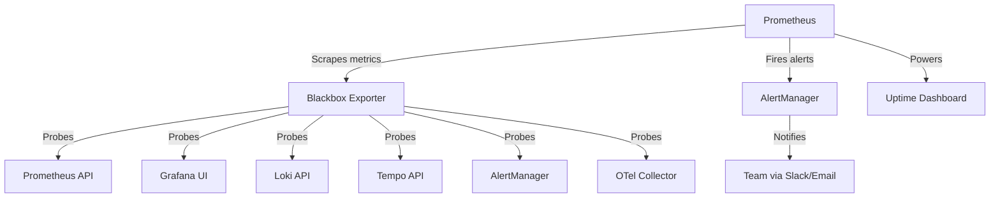

# Synthetic Monitoring with Blackbox Exporter

## Overview

Synthetic monitoring proactively tests service availability and performance by simulating user interactions from outside the system. The Blackbox Exporter enables Prometheus to probe HTTP, HTTPS, DNS, TCP, and ICMP endpoints to validate service health.

##

 Architecture



## Components

### 1. Blackbox Exporter

**Purpose:** HTTP/TCP/ICMP prober for black-box monitoring

**Configuration:** `blackbox.yml` defines probe modules:
- `http_2xx`: Basic HTTP 200 check
- `prometheus_api`: Validates Prometheus query API
- `grafana_dashboard`: Checks Grafana UI availability
- `loki_ready`: Tests Loki readiness endpoint
- `tempo_ready`: Tests Tempo readiness endpoint
- `alertmanager_api`: Validates AlertManager API
- `otel_collector_health`: Checks OTel Collector health

### 2. Probe Targets

**Configuration:** `prometheus-config.yaml` defines services to monitor:

| Service | Endpoint | Check | Severity |
|---------|----------|-------|----------|
| Prometheus | http://prometheus:9090 | HTTP availability | Critical |
| Prometheus API | http://prometheus:9090/api/v1/query | Query functionality | Critical |
| Grafana | http://grafana:3000 | UI availability | High |
| Loki | http://loki:3100/ready | Readiness | High |
| Tempo | http://tempo:3200/ready | Readiness | High |
| AlertManager | http://alertmanager:9093/-/healthy | Health check | Critical |
| OTel Collector | http://otel-collector:13133 | Health check | Critical |

### 3. Alert Rules

**Configuration:** `alert-rules.yaml` defines uptime alerts:

- **ServiceDown**: Service unreachable for 2 minutes
- **HighProbeFailureRate**: >10% probe failures over 5 minutes
- **SlowProbeResponse**: Probe duration > 5 seconds
- **SSLCertificateExpiringSoon**: Certificate expires within 30 days
- **SLAViolation**: Uptime < 99.9% over 24 hours

Component-specific alerts:
- **PrometheusUnavailable**: Critical (1 min threshold)
- **GrafanaUnavailable**: High (2 min threshold)
- **LokiUnavailable**: High (2 min threshold)
- **TempoUnavailable**: High (2 min threshold)
- **AlertManagerUnavailable**: Critical (1 min threshold)
- **OTelCollectorUnavailable**: Critical (2 min threshold)

### 4. Uptime Dashboard

**Grafana Dashboard:** `grafana-dashboard-uptime.json`

Panels:
1. **Overall Service Availability** - 24h uptime percentage (SLO: 99.9%)
2. **Service Availability by Component** - Bar gauge per service
3. **Current Service Status** - Real-time UP/DOWN table
4. **Probe Duration (P95)** - Response time trends
5. **Probe Failures** - Failure rate over time
6. **SSL Certificate Expiry** - Days until certificate expiration
7. **Uptime Trends** - 7-day heatmap

## Deployment

### Prerequisites

- Kubernetes cluster with observability namespace
- Prometheus deployed and configured
- Grafana deployed

### Step 1: Build Docker Image

```bash
cd infrastructure/docker/blackbox-exporter
docker build -t health-tracker/blackbox-exporter:0.24.0 .
```

### Step 2: Deploy to Kubernetes

```bash
cd infrastructure/kubernetes/blackbox-exporter
kubectl apply -f deployment.yaml
```

This creates:
- Deployment with 2 replicas (HA)
- Service exposing port 9115
- ServiceAccount
- ConfigMap with probe configurations

### Step 3: Configure Prometheus

Add scrape configuration to Prometheus ConfigMap:

```bash
# Edit prometheus-config ConfigMap
kubectl edit configmap prometheus-config -n observability

# Add contents from prometheus-scrape-config.yaml to scrape_configs section
```

Or apply the pre-configured targets:

```bash
kubectl apply -f prometheus-config.yaml
```

### Step 4: Load Alert Rules

```bash
kubectl apply -f alert-rules.yaml
```

Verify rules are loaded:

```bash
kubectl exec -n observability prometheus-0 -- \
  wget -q -O- http://localhost:9090/api/v1/rules | grep synthetic_monitoring
```

### Step 5: Import Grafana Dashboard

1. Open Grafana UI (http://grafana:3000)
2. Navigate to Dashboards → Import
3. Upload `grafana-dashboard-uptime.json`
4. Select Prometheus datasource
5. Click Import

### Step 6: Validate Deployment

Run the validation script:

```bash
chmod +x tests/validate-synthetic-monitoring.sh
./tests/validate-synthetic-monitoring.sh
```

Expected output:
```
========================================
Synthetic Monitoring Validation
========================================

Test 1: Checking Blackbox Exporter deployment... PASS (2 replicas ready)
Test 2: Checking Blackbox Exporter service... PASS
Test 3: Checking Blackbox Exporter health... PASS
Test 4: Checking configuration is loaded... PASS
Test 5: Testing HTTP probe module... PASS
Test 6: Checking Prometheus scrape configuration... PASS
Test 7: Checking probe metrics in Prometheus... PASS
Test 8: Checking synthetic monitoring alert rules... PASS
Test 9: Verifying critical service probes... PASS
Test 10: Testing probe failure detection... PASS

========================================
All validation tests passed!
========================================
```

## Usage

### Query Uptime Metrics

**Current status of all services:**
```promql
probe_success
```

**24-hour uptime by service:**
```promql
service:uptime:ratio_24h * 100
```

**Probe duration (95th percentile):**
```promql
histogram_quantile(0.95, sum(rate(probe_duration_seconds_bucket[5m])) by (le, service))
```

**Failed probes in last hour:**
```promql
sum by (service) (rate(probe_success{} == 0 [1h]))
```

### Add New Probe Target

Edit `prometheus-config.yaml` and add target to `blackbox-targets.yml`:

```yaml
- targets:
    - http://my-new-service:8080/health
  labels:
    service: my-new-service
    check: health
    severity: high
    module: http_2xx
```

Apply changes:

```bash
kubectl apply -f prometheus-config.yaml
kubectl rollout restart deployment/prometheus -n observability
```

### Test Probe Manually

```bash
# Get Blackbox Exporter pod
POD=$(kubectl get pods -n observability -l app=blackbox-exporter -o jsonpath='{.items[0].metadata.name}')

# Test HTTP probe
kubectl exec -n observability $POD -- \
  wget -q -O- "http://localhost:9115/probe?target=http://example.com&module=http_2xx"

# Check probe_success metric
# probe_success 1 = UP
# probe_success 0 = DOWN
```

### View Probe Metrics

```bash
# Port-forward Blackbox Exporter
kubectl port-forward -n observability svc/blackbox-exporter 9115:9115

# View metrics
curl http://localhost:9115/metrics | grep probe_
```

## Monitoring

### Key Metrics

| Metric | Description | Alert Threshold |
|--------|-------------|-----------------|
| `probe_success` | 1 if probe succeeded, 0 otherwise | 0 for >2 min |
| `probe_duration_seconds` | Time taken to complete probe | >5 seconds |
| `probe_ssl_earliest_cert_expiry` | Unix timestamp of SSL cert expiry | <30 days |
| `probe_http_status_code` | HTTP status code returned | != 200 |
| `probe_dns_lookup_time_seconds` | DNS resolution time | >1 second |

### Uptime SLA Tracking

Recording rules calculate uptime ratios:

- `service:uptime:ratio_5m` - 5-minute rolling uptime
- `service:uptime:ratio_1h` - 1-hour rolling uptime
- `service:uptime:ratio_24h` - 24-hour rolling uptime (SLA metric)

**SLA Target:** 99.9% (43.2 minutes downtime/month allowed)

### Alert Routing

Alerts are routed based on severity:

- **Critical** → Page on-call immediately
- **High** → Slack channel + email
- **Medium** → Slack channel only
- **Warning** → Aggregated daily digest

## Troubleshooting

### Probe Failures

**Symptom:** `probe_success` showing 0 for a service

**Investigation:**
1. Check target service is actually running:
   ```bash
   kubectl get pods -n observability -l app=<service>
   ```

2. Verify network connectivity:
   ```bash
   kubectl exec -n observability <blackbox-pod> -- wget -O- <target-url>
   ```

3. Check Blackbox Exporter logs:
   ```bash
   kubectl logs -n observability -l app=blackbox-exporter
   ```

4. Validate probe module configuration:
   ```bash
   kubectl exec -n observability <blackbox-pod> -- cat /etc/blackbox_exporter/config.yml
   ```

**Common Causes:**
- Target service is down
- Network policy blocking traffic
- Incorrect probe module (e.g., using http_2xx for endpoint returning 302)
- DNS resolution failure
- SSL certificate issues

### Slow Probes

**Symptom:** `probe_duration_seconds` consistently high

**Investigation:**
1. Check target service performance:
   ```bash
   kubectl exec -n observability <blackbox-pod> -- \
     time wget -O- <target-url>
   ```

2. Review target service metrics (CPU, memory, disk I/O)

3. Check network latency:
   ```bash
   kubectl exec -n observability <blackbox-pod> -- \
     ping -c 5 <target-host>
   ```

**Common Causes:**
- Target service under load
- Network congestion
- DNS resolution slow
- SSL handshake slow

### Missing Metrics

**Symptom:** Prometheus not showing `probe_*` metrics

**Investigation:**
1. Verify Blackbox Exporter is running:
   ```bash
   kubectl get pods -n observability -l app=blackbox-exporter
   ```

2. Check Prometheus scrape configuration:
   ```bash
   kubectl exec -n observability prometheus-0 -- \
     wget -q -O- http://localhost:9090/api/v1/targets | jq '.data.activeTargets[] | select(.labels.job=="blackbox-http")'
   ```

3. Test Blackbox Exporter metrics endpoint:
   ```bash
   kubectl port-forward -n observability svc/blackbox-exporter 9115:9115
   curl http://localhost:9115/metrics
   ```

**Common Causes:**
- Prometheus not configured to scrape Blackbox Exporter
- Service discovery not finding targets
- Network policy blocking Prometheus → Blackbox traffic

### Alert Not Firing

**Symptom:** Service is down but no alert fired

**Investigation:**
1. Check alert rule is loaded:
   ```bash
   kubectl exec -n observability prometheus-0 -- \
     wget -q -O- http://localhost:9090/api/v1/rules | jq '.data.groups[] | select(.name=="synthetic_monitoring")'
   ```

2. Verify alert is firing in Prometheus:
   ```bash
   kubectl exec -n observability prometheus-0 -- \
     wget -q -O- http://localhost:9090/api/v1/alerts | jq '.data.alerts[] | select(.labels.alertname=="ServiceDown")'
   ```

3. Check AlertManager received the alert:
   ```bash
   kubectl exec -n observability alertmanager-0 -- \
     wget -q -O- http://localhost:9093/api/v2/alerts
   ```

**Common Causes:**
- Alert rule `for` duration not yet met
- Alert inhibited by another alert
- AlertManager routing not configured
- Notification channel (Slack/email) misconfigured

## Performance

### Resource Usage

**Blackbox Exporter:**
- CPU: 100m request, 200m limit
- Memory: 128Mi request, 256Mi limit
- Disk: Minimal (no persistent storage)

**Per-Probe Overhead:**
- CPU: ~1-5ms
- Memory: ~1MB
- Network: ~1-10KB per probe

**Scaling:**
- 2 replicas handle 1000+ targets
- Probe frequency: 30s default (configurable)
- Add replicas for >2000 targets or <15s probe interval

### Optimization

**Reduce probe frequency for non-critical services:**
```yaml
scrape_interval: 60s  # Instead of default 30s
```

**Use lighter probe modules:**
- `tcp_connect` instead of `http_2xx` for TCP services
- `icmp` for basic connectivity checks

**Disable SSL verification for internal services:**
```yaml
http:
  fail_if_ssl: false
  fail_if_not_ssl: false
```

## Security

### Network Policies

Blackbox Exporter requires egress to probe targets:

```yaml
apiVersion: networking.k8s.io/v1
kind: NetworkPolicy
metadata:
  name: blackbox-exporter-egress
  namespace: observability
spec:
  podSelector:
    matchLabels:
      app: blackbox-exporter
  policyTypes:
  - Egress
  egress:
  - to:
    - namespaceSelector: {}  # Allow to all namespaces
    ports:
    - protocol: TCP
      port: 80
    - protocol: TCP
      port: 443
    - protocol: TCP
      port: 3000  # Grafana
    - protocol: TCP
      port: 9090  # Prometheus
```

### RBAC

Blackbox Exporter requires no special RBAC permissions (read-only).

### Secrets

No secrets required unless probing authenticated endpoints:

```yaml
http:
  headers:
    Authorization: "Bearer ${BEARER_TOKEN}"
```

Store tokens in Kubernetes secrets and inject as environment variables.

## Best Practices

1. **Start with critical services** - Don't probe everything initially
2. **Use appropriate probe modules** - Match module to service type
3. **Set realistic timeouts** - Balance between false positives and detection speed
4. **Configure alert thresholds** - `for: 2m` prevents flapping
5. **Monitor Blackbox Exporter itself** - Use Prometheus self-monitoring
6. **Test probes before deploying** - Use manual probe testing
7. **Document probe failures** - Add runbooks for common failure scenarios
8. **Review uptime trends** - Use 7-day heatmap to identify patterns

## References

- [Prometheus Blackbox Exporter Documentation](https://github.com/prometheus/blackbox_exporter)
- [Prometheus Configuration](https://prometheus.io/docs/prometheus/latest/configuration/configuration/)
- [Grafana Dashboard Best Practices](https://grafana.com/docs/grafana/latest/best-practices/)
- [Site Reliability Engineering (Google)](https://sre.google/sre-book/monitoring-distributed-systems/)

---

**Last Updated:** 2025-10-22
**Maintainer:** DevOps Team
**Status:** Production Ready
