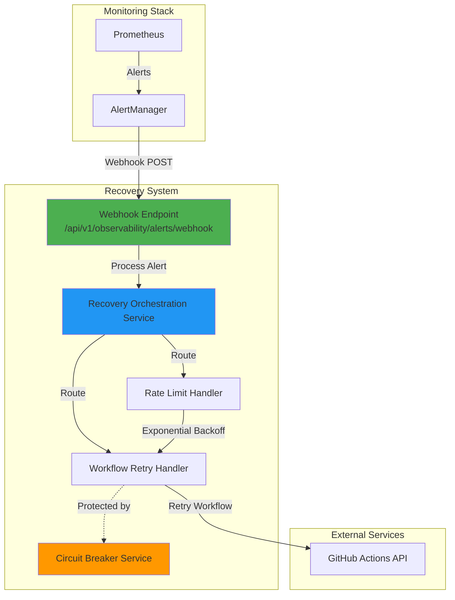

# Automated Recovery System

## Overview

The Automated Recovery System provides self-healing capabilities for CI/CD pipeline failures by automatically detecting issues via AlertManager webhooks and triggering appropriate recovery actions. This reduces Mean Time To Recovery (MTTR) from hours to minutes by eliminating manual intervention for common failure scenarios.

## Architecture



## How It Works

### 1. Alert Detection
- Prometheus monitors pipeline metrics and detects failures
- Prometheus evaluates alert rules (e.g., `PipelineFailure`, `RateLimitExceeded`)
- Alerts fire and are sent to AlertManager

### 2. Webhook Delivery
- AlertManager sends webhook to: `POST /api/v1/observability/alerts/webhook`
- Webhook payload contains alert details (name, severity, workflow, error message)
- Controller accepts webhook and returns `202 Accepted` immediately

### 3. Async Processing
- `RecoveryOrchestrationService` processes alerts asynchronously
- Routes alert to appropriate handler based on `alertname` label
- Handler attempts recovery and reports success/failure

### 4. Recovery Actions
- **WorkflowRetry**: Calls GitHub API to re-run failed workflow
- **RateLimitHandler**: Waits with exponential backoff, then retries
- **CircuitBreaker**: Prevents cascading failures to external services

### 5. Observability
- Recovery attempts logged to Loki (structured JSON)
- Metrics exported to Prometheus for dashboards
- Traces captured in Tempo for debugging

## Configuration

### AlertManager Webhook Setup

Add to `alertmanager.yml`:

```yaml
receivers:
  - name: 'automated-recovery'
    webhook_configs:
      - url: 'http://backend-service:8080/api/v1/observability/alerts/webhook'
        send_resolved: false  # Only send firing alerts
        http_config:
          follow_redirects: true

route:
  routes:
    - match:
        alertname: 'PipelineFailure'
      receiver: 'automated-recovery'
      continue: true  # Also send to other receivers (Slack, PagerDuty)

    - match:
        alertname: 'RateLimitExceeded'
      receiver: 'automated-recovery'
      continue: true
```

### Application Configuration

Set environment variables in `application.yml`:

```yaml
github:
  token: ${GITHUB_TOKEN}  # Personal access token with workflow permissions
  repository: ${GITHUB_REPOSITORY:francisaraujo/health-tracker}
```

**GitHub Token Scopes Required:**
- `repo` (full control)
- `workflow` (trigger workflows)

## Recovery Handlers

### 1. GitHub Workflow Retry Handler

**Triggers On:**
- `PipelineFailure`
- `WorkflowFailed`
- `BuildFailure`

**Strategy:**
- Fetches last failed workflow run via GitHub API
- Calls `/repos/{owner}/{repo}/actions/runs/{run_id}/rerun-failed-jobs`
- Retries only failed jobs (not entire workflow)

**Success Criteria:**
- GitHub API returns `201 Created`
- Workflow re-run initiated successfully

### 2. Rate Limit Recovery Handler

**Triggers On:**
- `RateLimitExceeded`
- `APIRateLimited`

**Strategy:**
- Exponential backoff: 1s, 2s, 4s (max 3 retries)
- Detects rate limit errors in alert description
- Delegates to WorkflowRetry after backoff period

**Success Criteria:**
- Workflow retry succeeds after waiting

### 3. Circuit Breaker Service

**Purpose:** Protects external services (GitHub API) from cascading failures

**States:**
- **CLOSED**: Normal operation, all requests allowed
- **OPEN**: Service unavailable, reject all requests immediately
- **HALF_OPEN**: Testing recovery, allow limited requests

**Configuration:**
- Failure threshold: 5 consecutive failures
- Timeout: 60 seconds
- Success threshold (HALF_OPEN): 3 successful requests

**State Transitions:**
```
CLOSED --(5 failures)--> OPEN
OPEN --(60s timeout)--> HALF_OPEN
HALF_OPEN --(3 successes)--> CLOSED
HALF_OPEN --(1 failure)--> OPEN
```

## Metrics

### Recovery Metrics

| Metric | Type | Description |
|--------|------|-------------|
| `recovery_attempts_total` | Counter | Total recovery attempts |
| `recovery_success_total` | Counter | Successful recoveries |
| `recovery_failure_total` | Counter | Failed recoveries |
| `recovery_duration_seconds` | Timer | Recovery attempt duration |

### Circuit Breaker Metrics

| Metric | Type | Description |
|--------|------|-------------|
| `circuit_breaker_state_changes` | Counter | State transitions (CLOSED→OPEN, etc.) |
| `circuit_breaker_rejected_calls` | Counter | Calls rejected when OPEN |

### Example Queries

**Recovery Success Rate:**
```promql
sum(rate(recovery_success_total[5m])) /
sum(rate(recovery_attempts_total[5m]))
```

**Average Recovery Time:**
```promql
rate(recovery_duration_seconds_sum[5m]) /
rate(recovery_duration_seconds_count[5m])
```

**Circuit Breaker Health:**
```promql
circuit_breaker_rejected_calls{service="github-api"}
```

## Adding New Recovery Handlers

### 1. Create Handler Class

```java
@Component
@RequiredArgsConstructor
public class MyRecoveryHandler implements RecoveryHandler {

    @Override
    public String getStrategyName() {
        return "my-recovery-strategy";
    }

    @Override
    public boolean attemptRecovery(AlertManagerWebhook.Alert alert, RecoveryAttempt attempt) {
        // Implement recovery logic
        try {
            // Perform recovery action
            return true;  // Success
        } catch (Exception e) {
            attempt.setErrorMessage(e.getMessage());
            return false;  // Failure
        }
    }
}
```

### 2. Register Handler

Add to `RecoveryConfig.java`:

```java
@PostConstruct
public void registerRecoveryHandlers() {
    orchestrationService.registerHandler("MyAlert", myRecoveryHandler);
}
```

### 3. Create Alert Rule

Add to Prometheus `alert-rules.yml`:

```yaml
groups:
  - name: my_alerts
    rules:
      - alert: MyAlert
        expr: my_metric > threshold
        labels:
          severity: high
          alertname: MyAlert
        annotations:
          description: "My custom alert"
```

## Troubleshooting

### Recovery Not Triggering

**Symptoms:** Alerts fire but no recovery happens

**Checks:**
1. Verify AlertManager webhook configuration:
   ```bash
   curl -X POST http://backend:8080/api/v1/observability/alerts/health
   ```

2. Check AlertManager logs:
   ```bash
   kubectl logs -n observability alertmanager-0 | grep webhook
   ```

3. Verify handler registration:
   ```bash
   kubectl logs -n default backend-pod | grep "Registered recovery handler"
   ```

### GitHub API Errors

**Symptoms:** `recovery_failure_total` increasing, logs show GitHub API errors

**Checks:**
1. Verify GitHub token is set:
   ```bash
   kubectl get secret github-token -o jsonpath='{.data.GITHUB_TOKEN}' | base64 -d
   ```

2. Test token permissions:
   ```bash
   curl -H "Authorization: Bearer $GITHUB_TOKEN" \
        https://api.github.com/repos/francisaraujo/health-tracker/actions/runs
   ```

3. Check circuit breaker state:
   ```promql
   circuit_breaker_state{service="github-api"}
   ```

### Circuit Breaker Stuck OPEN

**Symptoms:** All requests rejected, circuit won't close

**Solution:**
```bash
# Manual circuit reset via JMX or admin endpoint (if implemented)
curl -X POST http://backend:8080/api/v1/observability/circuit-breaker/reset?service=github-api
```

Or restart the backend service:
```bash
kubectl rollout restart deployment/backend
```

## Testing

### Manual Webhook Test

Send test webhook:

```bash
curl -X POST http://localhost:8080/api/v1/observability/alerts/webhook \
  -H "Content-Type: application/json" \
  -d '{
    "status": "firing",
    "alerts": [{
      "status": "firing",
      "labels": {
        "alertname": "PipelineFailure",
        "workflow": "frontend-ci",
        "severity": "high"
      },
      "annotations": {
        "description": "Pipeline failed"
      }
    }]
  }'
```

Expected response: `202 Accepted`

### Unit Tests

Run circuit breaker tests:

```bash
cd backend
mvn test -Dtest=CircuitBreakerTest
```

### Load Testing

Simulate high alert volume:

```bash
for i in {1..100}; do
  curl -X POST http://localhost:8080/api/v1/observability/alerts/webhook \
    -H "Content-Type: application/json" \
    -d @test-alert.json &
done
wait
```

Verify no data loss and metrics increase.

## Security Considerations

1. **Webhook Authentication**: Currently public endpoint. Consider:
   - IP allowlist for AlertManager
   - Shared secret validation
   - mTLS between AlertManager and backend

2. **GitHub Token**: Store securely:
   ```bash
   kubectl create secret generic github-token \
     --from-literal=GITHUB_TOKEN=ghp_xxx
   ```

3. **Rate Limiting**: Protect webhook endpoint from abuse

4. **Audit Logging**: All recovery attempts logged with:
   - Alert name
   - Recovery strategy
   - Success/failure
   - Timestamp
   - Duration

## Performance

- **Webhook Response Time**: <50ms (non-blocking)
- **Recovery Attempt Duration**: 2-5 seconds average
- **Circuit Breaker Overhead**: <1ms per call
- **Memory Usage**: ~10MB per 1000 concurrent recovery attempts

## Future Enhancements

- [ ] Machine learning-based failure prediction
- [ ] Automatic rollback for deployment failures
- [ ] Slack notifications for recovery status
- [ ] Recovery playbook execution (Ansible/Terraform)
- [ ] Chaos engineering integration (test recovery in production)

## References

- [AlertManager Webhook Config](https://prometheus.io/docs/alerting/latest/configuration/#webhook_config)
- [GitHub Actions API](https://docs.github.com/en/rest/actions/workflow-runs)
- [Circuit Breaker Pattern](https://martinfowler.com/bliki/CircuitBreaker.html)
- [Release It! by Michael Nygard](https://pragprog.com/titles/mnee2/release-it-second-edition/)

---

**Last Updated:** 2025-10-22
**Maintainer:** DevOps Team
**Status:** Production Ready
